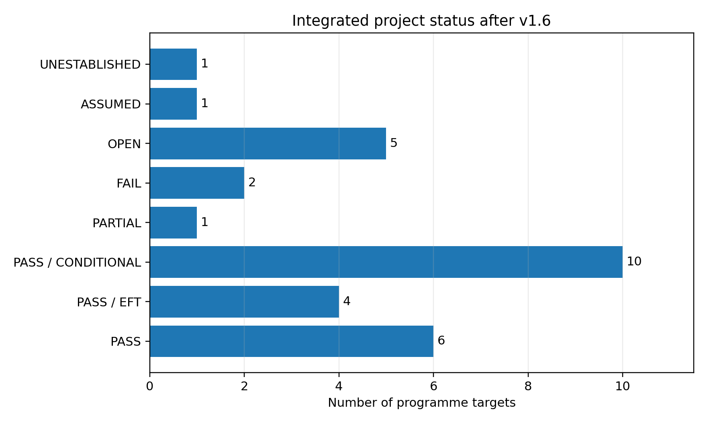

# Executive assessment

## Direct verdict

The work is **scientifically meaningful**. It has generated a coherent, falsifiable programme and, equally importantly, has killed several attractive but wrong formulations.

The work is **potentially important**, but its importance is not established. The project has not derived time, spacetime, or gravity from first principles. Its strongest defensible thesis is narrower:

$$
\boxed{
\text{causal structure may be primitive, while proper-duration calibration can be a field-generated spectral relation.}
}
$$

There is material worth sharing and publishing, but not as one grand paper titled "time emerges from photons." The project should now be split into focused papers with sharply bounded claims.

The current novelty verdict is:

$$
\boxed{
\text{individual ingredients are mostly established; the integrated formalism and several model-specific relations are candidate new contributions.}
}
$$

No priority claim is secure until an independent specialist literature audit, independent derivation, and external technical review are complete.

# What the project has actually accomplished

## It found and abandoned the wrong starting point

The initial photon-perspective intuition correctly exposed the absence of proper time along a null path, but a photon has no timelike observer frame. The first exact-null field theory also failed: its transverse quadratic principal symbol was rank deficient in $3+1$ dimensions. That failure was not cosmetic. It forced the project to separate null kinematics from the dynamics that generate scale.

The replacement soft-null two-phase EFT has a positive quadratic Hamiltonian and real subluminal modes in its declared regime. This is a genuine improvement over the original construction, not merely a change in rhetoric.

## It produced a precise operational criterion for metric time

Let clock transition $A$ have positive local frequency $\omega_A(x)$ of Weyl weight $-1$. One conformal representative calibrates every clock if and only if

$$
\boxed{
\omega_A(x)=c_A\chi(x)
\quad\text{for all }A,
}
$$

where $c_A$ is constant and $\chi$ is one shared local scale field. Equivalently,

$$
\boxed{
\mathcal S_{AB}
\equiv d\ln\frac{\omega_A}{\omega_B}=0
\quad\text{for every clock pair.}
}
$$

The one-forms $\mathcal S_{AB}$ were named **chronometric shear**. They are Weyl invariant: changing conformal frame cannot remove a real differential drift between clocks.

The associated clock-space result is

$$
\boxed{
\operatorname{rank}
\left[\delta\ln(\omega_A/\omega_B)\right]
\le r,
}
$$

when the spectra depend on $r$ independent non-universal fields. One mismatch scalar predicts a rank-one clock network; universal chronometry is rank zero.

The theorem is elementary once written down. Its possible value lies in the operational interpretation, quotient-space formulation, rank test, and connection to clock and equivalence-principle data. The clock-hypothesis, EPS, Weyl-geometry, and chronogeometry literatures are substantial, so this must be positioned as a refinement and synthesis, not an invention of physical chronogeometry.

## It turned the scale problem into a concrete particle-physics problem

The ordinary Standard Model Higgs is not sufficient as the sole universal scale because real clocks also depend on QCD, nuclear structure, dimensionless couplings, and the gravitational scale. The project therefore introduced a deeper field $\chi$ and attempted to lock

$$
\frac{h}{\chi},
\qquad
\frac{\Lambda_{\mathrm{QCD}}}{\chi},
\qquad
\frac{M_{\mathrm P}}{\chi}
$$

to constants.

A conventional two-derivative hidden gauge/scalar model provides a healthy EFT proof of principle. The optional Turok-36 interpretation remains only an ultraviolet hypothesis because the required Lorentzian unitarity and positive physical spectral density are unsettled.

## It found a calculable non-universal defect

The QCD threshold recursion gives, for one extra colour-fundamental Dirac fermion,

$$
\boxed{
d\ln\frac{\Lambda_3}{\chi}
=
\frac{2}{27}\,\varepsilon_\Psi\,d\theta
+\text{controlled corrections}.
}
$$

The coefficient $2/27$ is established QCD decoupling physics. The project-specific move is to interpret it as the transmission coefficient from a microscopic failure of universal scale locking to observable clock disagreement.

This leads to two falsifiable structures:

1. a rank-one pattern across dissimilar clocks;
2. a clock/free-fall consistency relation of the form

$$
\boxed{
\frac{\beta_{AB}}{\eta_{CD}}
=
-\frac{\Delta K_{AB}}
{\Delta Q_{\widehat m}^{\prime\,CD}}
}
$$

under the stated one-field, long-range, unscreened, QCD-dominated assumptions.

That is more publishable than the philosophical slogan because it can be wrong in a measurable way.

## It solved the radiative naturalness problem conditionally

A cyclic $Z_6$ orbit preserves an $O(\epsilon)$ visible QCD response while suppressing the vacuum mass to $O(\epsilon^6)$:

$$
\boxed{
m_a^2
=
\frac{27}{320\pi^2}
\frac{M^4}{f_a^2}\epsilon^6+
O(\epsilon^7),
}
$$

$$
\boxed{
d_g
=
\frac{2}{27}
\frac{M_{\mathrm P}}{f_a}\epsilon
+
O(\alpha_s\epsilon,\epsilon^2).
}
$$

The general discrete-Goldstone mechanism is established. The candidate contribution is the specific combination of a real vectorlike QCD threshold, the $2/27$ chronometric transmission, clock/free-fall observables, and state-selected cosmology.

The condition is severe: the microscopic $Z_6$ and continuous-shift spurion structure must be exact enough that lower harmonics are not reintroduced. A Wilson-line or collective-pNGB UV completion is therefore not optional decoration; it is part of the model's credibility.

## It tested environment, cosmology, reheating, and transport rather than assuming them away

The environmental analysis found that Earth, the Sun, and laboratory sources do not thin-shell screen the benchmark field. The cosmological analysis found a lower-$f_a$ attractor ridge on which the early Universe can select a nonzero branch. State-selected reheating stored the asymmetry in occupation numbers while retaining an exactly symmetric microscopic action.

Several failures were important:

- the original Planck-scale cosmological benchmark overclosed or failed to select a branch;
- the original direct bosonic inflaton portal was vulnerable to tachyonic/resonant preheating;
- the attractive instantaneous branching ratio $1/257$ did not survive the resolved causal decay cascade.

These were repaired with a lower-$f_a$ benchmark, a selector-gated fermionic parent, and a redshift-corrected branching fraction.

The closed-time-path analysis then showed, conditionally, that state or selector asymmetry can generate transient lower harmonics without leaving a permanent forbidden vacuum coefficient in the displayed interaction graph.

## It has now closed the leading kinetic objection

The complete collinear electroweak/Yukawa LPM calculation gave

$$
\frac{\overline\Gamma_{H,qD}^{\rm LPM,occ}}{T}
=
3.603\times10^{-4}.
$$

The v1.6 hard-cut calculation adds the leading gauge-assisted hard+soft $2\leftrightarrow2$ contribution,

$$
\frac{\overline\Gamma_{H,qD}^{\rm hard,occ}}{T}
=
7.983\times10^{-4},
$$

so the matched leading portal rate is

$$
\boxed{
\frac{\overline\Gamma_{H,qD}^{\rm total,occ}}{T}
=
1.1585\times10^{-3}.
}
$$

At the reheating benchmark,

$$
\boxed{
\frac{\overline\Gamma_{H,qD}^{\rm total,occ}}
{\Gamma_R}
=
7.85\times10^6.
}
$$

The hard channels are about $2.22$ times the LPM contribution and constitute about $68.9\%$ of the total. This strongly confirms that the plasma thermalises far faster than the cosmological source evolves.

# Is any of this new?

## Clearly not new

The following should not be advertised as original:

- null-tetrad algebra and reciprocal null scaling;
- timelike total momentum from nonparallel massless momenta;
- causal order or light rays determining conformal structure under suitable assumptions;
- clocks fixing or surveying metric scale;
- mimetic conformal transformations;
- two-superfluid entrainment;
- Higgs-dilaton and induced-scale models;
- dimensional transmutation;
- QCD threshold decoupling and the numerical coefficient $2/27$;
- cyclic $Z_N$ suppression of an ultralight potential;
- asymmetric reheating, finite-density potentials, Schwinger-Keldysh theory, AMY transport, and LPM resummation.

Recent work also explicitly describes massive particle Compton clocks and the Higgs mechanism as fixing the scale of an otherwise conformal geometry. That makes any broad claim that "mass or the Higgs creates metric scale" especially unsafe as a novelty claim.

## Plausibly new or at least under-developed elsewhere

The strongest candidate contributions are:

1. **Universal spectral factorisation as an exact integrability condition for one operational clock metric.**
2. **Chronometric shear as a Weyl-invariant obstruction and a clock-space quotient object.**
3. **The rank-$r$ clock-network prediction.**
4. **The organisation of QCD threshold recursion as transport of a scale-lock defect.**
5. **The clock/free-fall consistency line derived from the same defect.**
6. **The specific $Z_6$ model preserving the $2/27$ visible response while giving $m_a^2\propto d_g^6$.**
7. **The state-selected exact-action reheating architecture tied to that protected chronometric mode.**

Searches have not found an exact serious-physics use of the term "chronometric shear" in this sense, nor an exact indexed match for the complete conjunction. That is encouraging but not dispositive. New terminology is not the same as new physics, and several nearby literatures use different language.

# Publication assessment

## Paper 1: the formal core

**Working title:** *Universal Spectral Chronometry on Conformal Spacetimes*

**Core content:**

- factorisation theorem;
- uniqueness up to a global unit convention;
- chronometric shear;
- clock-space quotient and positive obstruction tensor;
- rank-$r$ response theorem;
- relation to EPS, Weyl geometry, clock hypothesis, varying constants, and chronogeometry.

**Assessment:** closest to a defensible preprint. It is mathematically clean and does not require the speculative cosmology. Its danger is that reviewers may regard the theorem as tautological unless the operational and experimental consequences are made precise.

**Before submission:** independent mathematical proof review; deep priority search in philosophy of physics and Weyl/chronogeometry; eliminate all claims that time itself has been derived.

## Paper 2: the phenomenological model

**Working title:** *QCD-Transmitted Chronometric Shear from a Protected Scale-Lock Defect*

**Core content:**

- all-orders threshold recursion;
- $2/27$ transmission;
- rank-one clock response;
- clock/free-fall consistency line;
- $Z_6$ radiative protection;
- environmental non-screening;
- viable cosmological branch.

**Assessment:** potentially the more important physics paper, but not ready. It needs a full two-loop scalar-sector stability/tunnelling analysis, updated clock and equivalence-principle likelihoods, a defensible UV-quality completion, and an independent calculation of the QCD and nuclear sensitivities.

## Paper 3: state-selected reheating

**Working title:** *Asymmetry in the State, Symmetry in the Action: Reheating a Cyclic Protected Sector*

**Core content:**

- transient one-hot selector;
- fermionic parent repair;
- exact-action asymmetric population;
- closed-time-path selection rule;
- transient three-loop matching;
- sparse adjacent-sector dark radiation.

**Assessment:** a possible later paper. It needs complete perturbation evolution, a permanent domain-wall/UV-symmetry solution, and a more microscopic reheaton sector.

## Thermal-field-theory result

The LPM and hard-cut work is useful technical validation. The integrated hard rate and group decomposition are worth including in Paper 3 or a methods appendix. It becomes a stronger standalone result only after an independent thermal-field-theory check and a truly pointwise hard+LPM retarded kernel.

## Paper that should not be submitted

A single manuscript claiming "time emerges from photons, the Higgs, QCD, $Z_6$, reheating, and cosmology" would be too broad and would invite rejection on the weakest speculative link. The monolith is useful as an internal research ledger, not as the first public paper.

# Importance assessment

The project would matter if it achieves one or more of the following:

- gives a useful invariant language for comparing heterogeneous clock networks;
- derives a model-independent connection between clock drift and equivalence-principle violation;
- identifies a protected scalar model with a distinctive correlated experimental signature;
- supplies a non-circular microscopic reason for all clock spectra to share one local scale.

At present, the first three are plausible. The fourth remains open. The project has therefore moved from an interesting philosophical question to a technically structured phenomenology programme, but not yet to a new foundation of spacetime.

# Recommended change in research strategy

The project should now stop expanding sideways.

The highest-value sequence is:

1. freeze the formal definitions and theorem;
2. commission an independent novelty and proof audit;
3. produce an independently coded replication of the QCD and thermal results;
4. split the work into the two papers above;
5. treat Turok-36, emergent gravity, and the full non-Abelian $3+1$D 2PI calculation as later branches, not prerequisites for the first publication.

The full 2PI/KB calculation is scientifically interesting, but it is no longer the gatekeeper for the cosmological hierarchy. The current kinetic margin is almost seven orders of magnitude.

# Updated programme status

{width=86%}

The machine-readable matrix is supplied separately as `integrated_acceptance_matrix_v1_6.csv`.

# References and overlap map

1. Ehlers, Pirani and Schild, constructive foundations of spacetime geometry.
2. Fletcher, *Light Clocks and the Clock Hypothesis*.
3. Menon, Linnemann and Read, *Clocks and Chronogeometry*.
4. Damour and Donoghue, dilaton charges and equivalence-principle tests.
5. Chetyrkin, Kniehl and Steinhauser, QCD decoupling and low-energy theorems.
6. Das and Hook; Brzeminski et al., cyclic/discrete-Goldstone protection.
7. Arnold, Moore and Yaffe, leading-order effective kinetic theory.
8. Bodeker and Schroder, complete leading-order right-handed-electron equilibration.
9. Besak and Bodeker, complete leading-order ultrarelativistic right-handed-neutrino production.
10. Volovich, *Gravitation and Spacetime: Emergent from Spinor Interactions - How?* (2026), which explicitly assigns geometric scale to massive-particle Compton clocks and Higgs breaking of conformal invariance.

# Bottom line

The honest answer is:

$$
\boxed{
\begin{gathered}
\text{Yes, the project has produced work worth sharing.}\\
\text{Yes, some of it may be publishable and original in combination.}\\
\text{No, we have not yet established a new theory of time or gravity.}\\
\text{The next professional step is independent validation and paper separation, not more conceptual sprawl.}
\end{gathered}
}
$$
