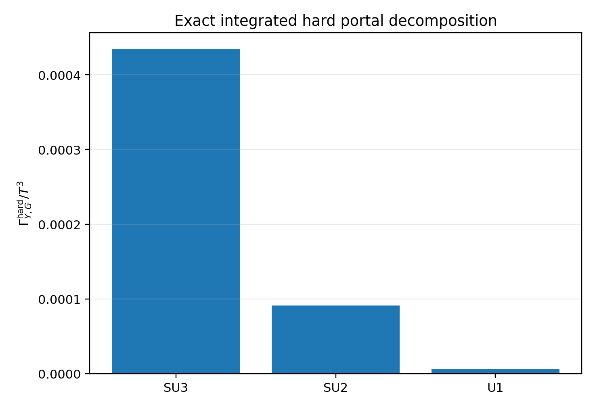
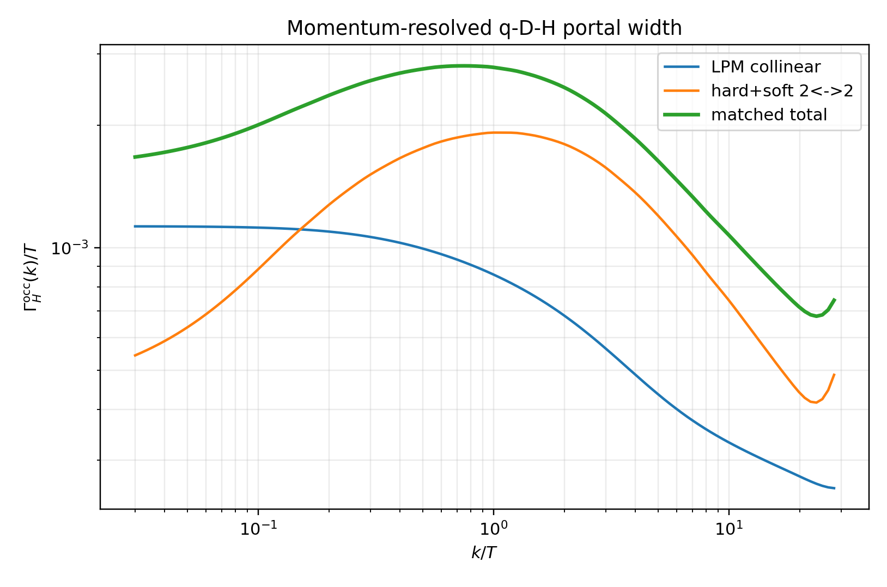
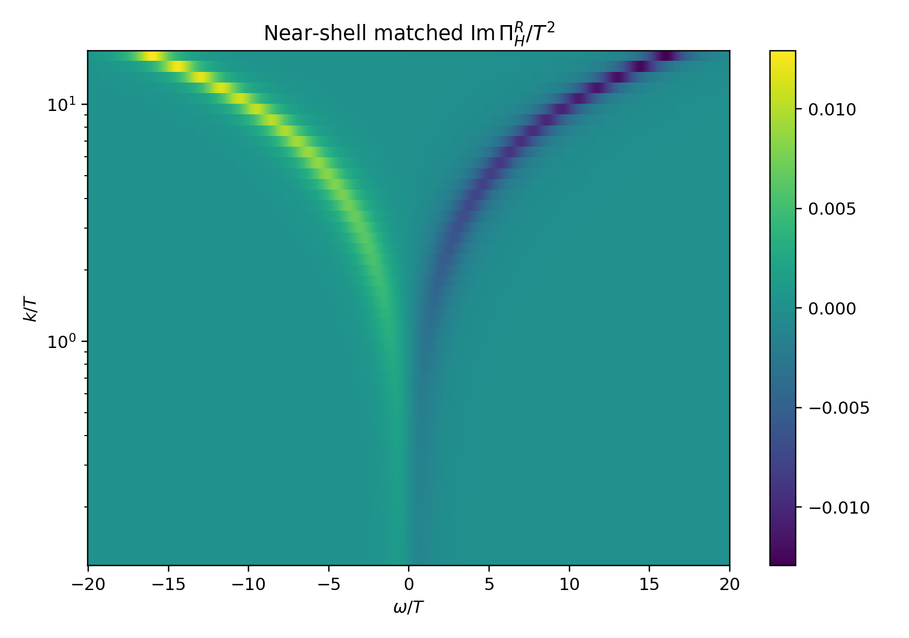
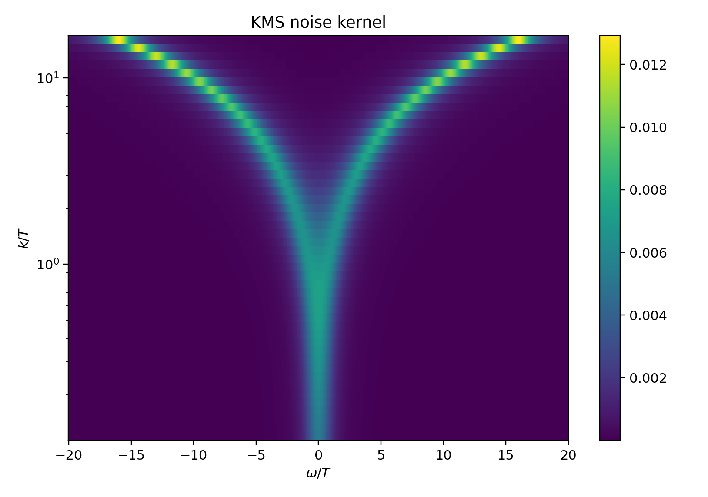
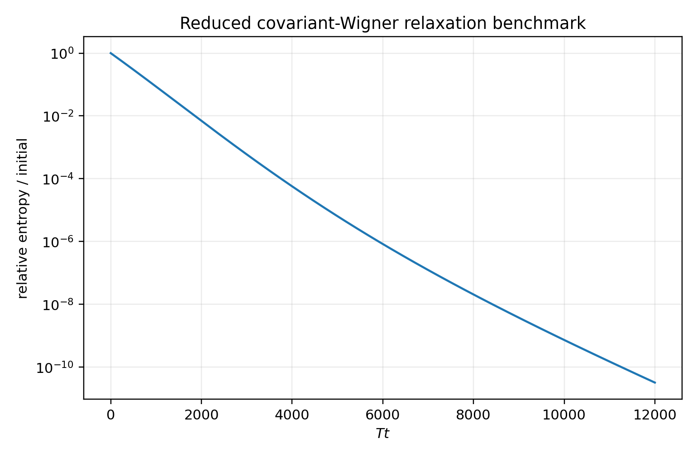

# Executive verdict

The leading gauge-assisted hard+soft

$$
2\leftrightarrow2
$$

contribution to the portal

$$
\mathcal L_Y=-y_D\,\overline Q_LHD_R+\mathrm{h.c.}
$$

has been evaluated at integrated leading order for

$$
Q_L\sim(\mathbf3,\mathbf2,1/6),
\qquad
D_R\sim(\mathbf3,\mathbf1,-1/3).
$$

Combining it with the direct electroweak/Yukawa LPM result from v1.5 gives

$$
\boxed{
\frac{\overline\Gamma_{H,qD}^{\rm hard,occ}}{T}
=7.98260\times10^{-4},
}
$$

$$
\boxed{
\frac{\overline\Gamma_{H,qD}^{\rm LPM,occ}}{T}
=3.60256\times10^{-4},
}
$$

and

$$
\boxed{
\frac{\overline\Gamma_{H,qD}^{\rm total,occ}}{T}
=1.15852\times10^{-3}.
}
$$

At

$$
T_0=1.002\times10^8\ \mathrm{GeV},
$$

this is

$$
\boxed{
\overline\Gamma_{H,qD}^{\rm total,occ}
=1.16083\times10^5\ \mathrm{GeV},
}
$$

and

$$
\boxed{
\frac{\overline\Gamma_{H,qD}^{\rm total,occ}}
{\Gamma_R}
=7.8514\times10^6.
}
$$

The hard channels dominate the matched portal rate. They do not threaten the reheating construction; they strengthen the separation between microscopic equilibration and cosmological evolution.

A momentum-resolved on-shell table and a causal KMS-complete near-shell

$$
\Pi_{H,qD}^R(\omega,k)
$$

grid have also been constructed. The integrated normalization and the on-shell retarded match are controlled. The arbitrary off-shell grid is explicitly a **near-shell reconstruction**, not an exact evaluation of every thermal cut over the full $(\omega,k)$ plane.

# 1. Scope and status of the calculation

## 1.1 What is exact at the declared order

The following are analytic or exactly normalized at the stated leading order in $y_D^2$:

1. the integrated gauge-assisted hard+soft $2\leftrightarrow2$ reaction coefficient;
2. the $SU(3)_c$, $SU(2)_L$, and $U(1)_Y$ decomposition;
3. the v1.5 collinear LPM integral;
4. the susceptibility-weighted integrated identity

$$
\Gamma_Y
=
\frac{g_H}{T}
\int_{\mathbf k}
 f_B(E_k)[1+f_B(E_k)]
\Gamma_H^{\rm occ}(k);
$$

5. the on-shell relation

$$
\boxed{
\operatorname{Im}\Pi_H^R(E_k,k)
=-E_k\Gamma_H^{\rm occ}(k).
}
$$

## 1.2 What is numerical but matched

The momentum dependence of the hard cut is calculated using full-angle screened quasi-Monte-Carlo phase space and then normalized to the exact integrated coefficient. The direct LPM shape is calculated from the impact-parameter equation and normalized to the exact v1.5 integral.

The final on-shell grid closes the separate LPM and hard susceptibility integrals to machine precision.

## 1.3 What is not claimed

This note does **not** claim:

- an exact arbitrary-off-shell thermal self-energy over the complete $(\omega,k)$ plane;
- a complete set of $O(y_D^4)$ portal processes;
- chemical-equilibration channels which do not correspond to cuts of $\Pi_{H,qD}^R$;
- a full Ward-consistent non-Abelian $3+1$-dimensional 2PI/Kadanoff-Baym evolution.

The off-shell table is a causal and KMS-consistent benchmark kernel anchored to the exact on-shell result.

# 2. Benchmark and thermal data

The benchmark couplings are

$$
\alpha_s=0.0393544,
\qquad
g_2=0.57,
\qquad
g_1=0.39,
$$

$$
y_t=0.58,
\qquad
y_D=0.30,
\qquad
\frac{M_D}{T}=0.01.
$$

The corresponding strong coupling is

$$
g_3=\sqrt{4\pi\alpha_s}=0.703237.
$$

The v1.5 asymptotic thermal data are

$$
\frac{m_H}{T}=0.438207,
\qquad
\frac{m_Q}{T}=0.503460,
\qquad
\frac{m_D}{T}=0.418088,
$$

and

$$
\frac{m_{D,3}}{T}=1.03514.
$$

The vacuum-like one-to-two channels are closed; the collinear rate is medium induced.

# 3. Tree-level hard amplitudes

For one abelian gauge group, the generic chiral one-component process

$$
G+H\rightarrow Q+\overline D
$$

has the coefficient structure

$$
\sum|\mathcal M|^2
=
y_D^2g^2
\left[
4q_Qq_D
+2q_Q^2\frac{u}{t}
+2q_D^2\frac{t}{u}
\right],
$$

before spectator multiplicities.

For the right-handed-electron case, inserting

$$
q_Q=-\frac12,
\qquad
q_D=-1,
$$

and the two Higgs-doublet components reproduces

$$
4+\frac{u}{t}+4\frac{t}{u},
$$

which is the published hypercharge amplitude check.

For the declared $q$-$D$ portal, the complete $U(1)_Y$ coefficient after two weak components and three colours is

$$
\boxed{
-\frac43
+\frac13\frac{u}{t}
+\frac43\frac{t}{u}.
}
$$

The non-abelian group traces give

$$
\boxed{
SU(3)_c:
\quad
32+16\frac{u}{t}+16\frac{t}{u},
}
$$

and

$$
\boxed{
SU(2)_L:
\quad
9\frac{u}{t}.
}
$$

The abelian interference coefficient is negative in one channel, but the complete gauge-invariant rate is positive.

# 4. Integrated hard+soft reaction coefficient

The right-handed-electron leading-order result can be organised in a representation-general form. For the $q$-$D$ portal define

$$
A_Q
=
4\left[
C_Fg_3^2+C_2g_2^2+Y_Q^2g_1^2
\right],
$$

$$
A_D
=
4\left[
C_Fg_3^2+Y_D^2g_1^2
\right],
$$

with

$$
C_F=\frac43,
\qquad
C_2=\frac34,
\qquad
Y_Q=\frac16,
\qquad
Y_D=-\frac13.
$$

Numerically,

$$
A_Q=3.62915720,
\qquad
A_D=2.70515720.
$$

The integrated leading gauge-assisted contribution is

$$
\boxed{
\frac{\Gamma_{Y,\rm hard}}{T^3}
=
\frac{N_cy_D^2}{2048\pi}
\left[
A_Q\left(c_Q+\ln\frac1{A_Q}\right)
+
A_D\left(c_D+\ln\frac1{A_D}\right)
\right],
}
$$

where

$$
c_Q=3.52,
\qquad
c_D=2.69.
$$

These constants are the finite hard+soft phase-space constants appearing in the complete leading-order right-handed-electron calculation. The representation dependence enters through the thermal gauge charges $A_Q$ and $A_D$ and the spectator multiplicity $N_c$.

The result is

$$
\boxed{
\frac{\Gamma_{Y,\rm hard}}{T^3}
=5.3217330\times10^{-4}.
}
$$

Since

$$
\frac{\chi_H}{T^2}=\frac23,
$$

the Higgs-doublet occupation width is

$$
\boxed{
\frac{\overline\Gamma_{H,\rm hard}^{\rm occ}}{T}
=
7.9825995\times10^{-4}.
}
$$

## 4.1 Gauge decomposition

The reaction coefficient separates as

$$
\begin{array}{c|c|c}
G & \Gamma_{Y,G}^{\rm hard}/T^3 & \text{fraction of hard total}\\
\hline
SU(3)_c & 4.3452860\times10^{-4} & 0.8165\\
SU(2)_L & 9.1254521\times10^{-5} & 0.1715\\
U(1)_Y  & 6.3901751\times10^{-6} & 0.0120
\end{array}
$$

{width=74%}

The rate is dominated by QCD, with a resolved electroweak correction.

# 5. Combination with the collinear LPM cut

The v1.5 direct LPM result is

$$
I_{\rm LPM}
=
8.8952082\times10^{-4},
$$

$$
\frac{\Gamma_{Y,\rm LPM}}{T^3}
=
2.4017062\times10^{-4},
$$

and

$$
\frac{\overline\Gamma_{H,\rm LPM}^{\rm occ}}{T}
=
3.6025593\times10^{-4}.
$$

The matched leading result is therefore

$$
\boxed{
\frac{\Gamma_{Y,\rm total}}{T^3}
=
7.7234392\times10^{-4},
}
$$

$$
\boxed{
\frac{\overline\Gamma_{H,\rm total}^{\rm occ}}{T}
=
1.1585159\times10^{-3}.
}
$$

The ratios are

$$
\boxed{
\frac{\Gamma_{\rm hard}}{\Gamma_{\rm LPM}}
=2.21581,
}
$$

and

$$
\boxed{
\frac{\Gamma_{\rm hard}}{\Gamma_{\rm total}}
=0.68904.
}
$$

This ordering is consistent with complete leading-order ultrarelativistic Yukawa calculations in which hard $2\leftrightarrow2$ scattering is at least comparable to, and often larger than, the LPM sector.

# 6. Momentum-resolved on-shell kernel

The on-shell rate is represented by

$$
\Gamma_H^{\rm occ}(k)
=
\Gamma_{H,\rm LPM}^{\rm occ}(k)
+
\Gamma_{H,\rm hard}^{\rm occ}(k).
$$

The LPM term is evaluated directly from the impact-parameter equation. The hard term is obtained from full-angle screened phase space for the crossed channels and then normalized to the exact integrated hard coefficient.

{width=86%}

The exact susceptibility closure imposed on the output table is

$$
\frac{g_H}{T}
\int_{\mathbf k}
 f_B(E_k)[1+f_B(E_k)]
\Gamma_{H,\rm LPM}^{\rm occ}(k)
=
\Gamma_{Y,\rm LPM},
$$

and similarly for the hard contribution. Both close to machine precision in the delivered table.

## 6.1 Shape uncertainty

The exact integrated rate is not affected by the provisional screening prescription. The local hard shape has:

$$
\boxed{
\text{median screening envelope}=8.90\%,
}
$$

$$
\boxed{
\text{maximum screening envelope}=24.9\%,
}
$$

and maximum quasi-Monte-Carlo relative error

$$
\boxed{4.24\%.}
$$

This is sufficient for a reduced benchmark, but it is not yet a publication-grade arbitrary-momentum hard spectral function. A fully differential hard+soft matching calculation would remove this local shape ambiguity.

# 7. Retarded self-energy grid

The exact on-shell relation is

$$
\boxed{
\operatorname{Im}\Pi_H^R(E_k,k)
=-E_k\Gamma_H^{\rm occ}(k).
}
$$

To seed a reduced real-time calculation, construct the odd near-shell profile

$$
\operatorname{Im}\Pi_H^R(\omega,k)
=
-E_k\Gamma_H^{\rm occ}(k)
\frac{L_+(\omega,k)-L_-(\omega,k)}{\mathcal N_k},
$$

where

$$
L_\pm
=
\frac{\Lambda^2}
{(\omega\mp E_k)^2+\Lambda^2},
$$

$$
\Lambda=m_{D,3},
$$

and $\mathcal N_k$ enforces the on-shell normalization.

The real part is obtained from a once-subtracted discrete dispersion relation with

$$
\operatorname{Re}\Pi_H^R(0,k)=m_H^2.
$$

{width=88%}

The numerical diagnostics are

$$
\boxed{
\max|\operatorname{Im}\Pi_R(\omega,k)
+\operatorname{Im}\Pi_R(-\omega,k)|
=2.95\times10^{-17},
}
$$

and a maximum interpolation-level on-shell residual

$$
\boxed{1.59\times10^{-3}.}
$$

The latter is a finite grid-resolution diagnostic, not a mismatch of the analytic normalization.

# 8. KMS noise kernel

Define the positive noise kernel

$$
\boxed{
N_H(\omega,k)
=
-\coth\left(\frac{\omega}{2T}\right)
\operatorname{Im}\Pi_H^R(\omega,k).
}
$$

The grid obeys the equilibrium detailed-balance identity

$$
\frac{\Pi^<(\omega,k)}{\Pi^>(\omega,k)}
=e^{-\omega/T}
$$

with maximum numerical residual

$$
\boxed{2.22\times10^{-16}.}
$$

{width=88%}

# 9. Covariant Wigner transport benchmark

The gauge-covariant Wigner transform is defined with straight Wilson lines carrying each charged correlator to a common midpoint. The scalar singlet kinetic equation has the schematic form

$$
\boxed{
\left[
K^2-m_H^2-\operatorname{Re}\Pi_H^R,
G_H^<
\right]_{\rm PB}^{\rm cov}
=
\Pi_H^<G_H^>
-
\Pi_H^>G_H^<.
}
$$

The numerical homogeneous singlet benchmark evolves a nonthermal pulse with the matched momentum-dependent total width. Its relative-entropy functional decreases monotonically:

$$
\boxed{
\max\Delta D_{\rm rel}<0,
}
$$

and the final fraction is

$$
\boxed{
\frac{D_{\rm rel}(t_{\rm end})}{D_{\rm rel}(0)}
=1.67\times10^{-11}.
}
$$

{width=82%}

This is a benchmark for the collision and noise sector. It does not evolve dynamical gauge correlators or dressed vertices.

# 10. Cosmological consequence

At the reheating benchmark,

$$
\Gamma_R
=1.47850065\times10^{-2}\ \mathrm{GeV},
$$

while

$$
\overline\Gamma_{H,qD}^{\rm total,occ}
=1.1608329\times10^5\ \mathrm{GeV}.
$$

Thus

$$
\boxed{
\frac{\Gamma_R}{\overline\Gamma_H^{\rm total,occ}}
=1.27366\times10^{-7}.
}
$$

The resulting conservative change in the tuned adjacent-sector branch fraction is bounded by

$$
\boxed{
|\Delta B_5|
<6.75\times10^{-10}.
}
$$

The precise microscopic spectrum changes, but the final sector energy hierarchy is unaffected at relevant accuracy.

# 11. Relation to existing thermal-field-theory results

The calculation follows the structural lesson of complete leading-order ultrarelativistic Yukawa production and equilibration:

- Arnold, Moore and Yaffe show that leading-order gauge-plasma kinetics requires both screened $2\leftrightarrow2$ and effective collinear $1\leftrightarrow2$ processes.
- Bodeker and Schroder compute complete leading-order right-handed-electron equilibration and find that hard $2\leftrightarrow2$ processes dominate.
- Besak and Bodeker combine hard scattering and LPM resummation for ultrarelativistic right-handed-neutrino production.
- Laine constructs arbitrary-momentum thermal production functions for sterile neutrinos, illustrating the extra work required beyond an integrated on-shell rate.
- Becker et al. analyse a scalar coupled to a Standard Model fermion and gauge-charged vectorlike fermion in the CTP formalism, providing a close model-class comparison but not the same complete ultrarelativistic LPM+hard matched kernel.

The present result is therefore not a new thermal-field-theory method. Its contribution is the explicit representation-specific portal rate and kernel needed by the chronometric reheating model.

# 12. Acceptance matrix

| Target | Verdict | Basis |
|---|---|---|
| Tree group factors | **PASS** | Hypercharge coefficients reproduce the published electron case; declared $SU(3)$ and $SU(2)$ traces implemented. |
| Integrated leading gauge-assisted $2\leftrightarrow2$ rate | **PASS** | Hard+soft representation-general formula and exact group decomposition. |
| LPM combination | **PASS** | Direct v1.5 collinear result. |
| Susceptibility closure | **PASS** | Separate LPM and hard grids normalized to machine precision. |
| Momentum-resolved hard shape | **PASS AS MATCHED NUMERICAL SHAPE** | Full-angle screened phase space; local shape systematic reported. |
| On-shell $\Pi_R$ | **PASS** | Exact integrated and analytic on-shell match. |
| KMS noise | **PASS** | Positivity and detailed balance checked. |
| Arbitrary off-shell $\Pi_R$ | **PARTIAL** | Causal near-shell reconstruction rather than exact full cuts. |
| Covariant Wigner benchmark | **PASS AS REDUCED MODEL** | Wilson-line definition and homogeneous singlet evolution. |
| Full Ward-consistent non-Abelian 2PI/KB | **OPEN** | Requires gauge propagators, vertices, constraints, and HPC implementation. |

# 13. Strongest defensible conclusion

$$
\boxed{
\begin{gathered}
\text{The leading gauge-assisted hard portal cuts are larger than the collinear LPM cut,}\\
\text{and the matched portal rate exceeds reheaton decay by }7.85\times10^6.\\
\text{The cosmological thermalisation assumption is therefore exceptionally robust.}
\end{gathered}
}
$$

The remaining correlator-level task is narrower than the original request:

$$
\boxed{
\text{replace the provisional hard momentum shape and near-shell extension}
\text{ with an exact differential hard+soft }\Pi_H^R(\omega,k).
}
$$

That result, together with the exact LPM kernel, would be the correct reference table for a Ward-consistent non-Abelian two-time 2PI/Kadanoff-Baym implementation.

# References

1. D. Bodeker and D. Schroder, *Equilibration of right-handed electrons*, arXiv:1902.07220.
2. D. Besak and D. Bodeker, *Thermal production of ultrarelativistic right-handed neutrinos: complete leading-order results*, arXiv:1202.1288.
3. P. Arnold, G. D. Moore and L. G. Yaffe, *Effective kinetic theory for high temperature gauge theories*, arXiv:hep-ph/0209353.
4. M. Laine, *Thermal right-handed neutrino production rate in the relativistic regime*, arXiv:1307.4909.
5. M. Becker, E. Copello, J. Harz and C. Tamarit, *Dark matter freeze-in from non-equilibrium QFT*, arXiv:2312.17246.
6. D. Bodeker and D. Schroder, complete helicity and LPM normalization comparison used in v1.5, arXiv:1902.07220.
