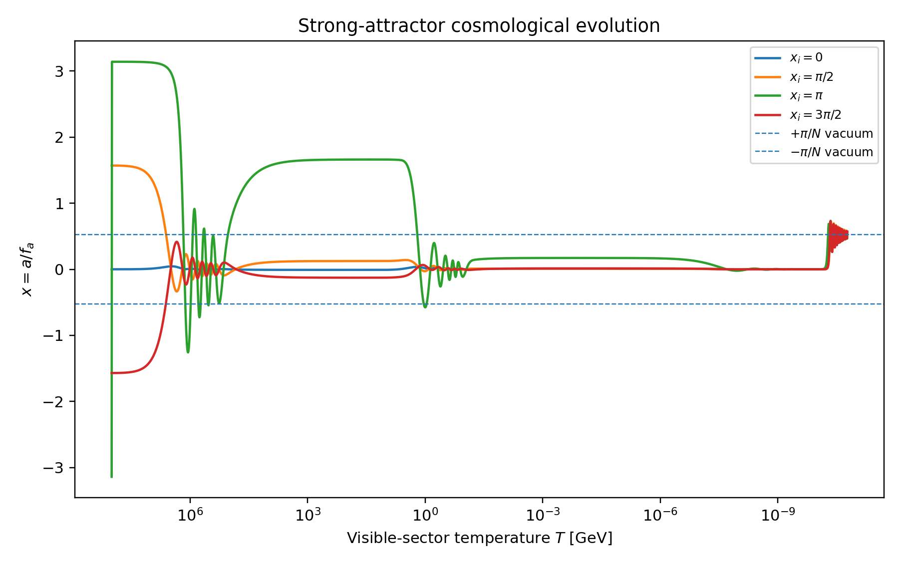
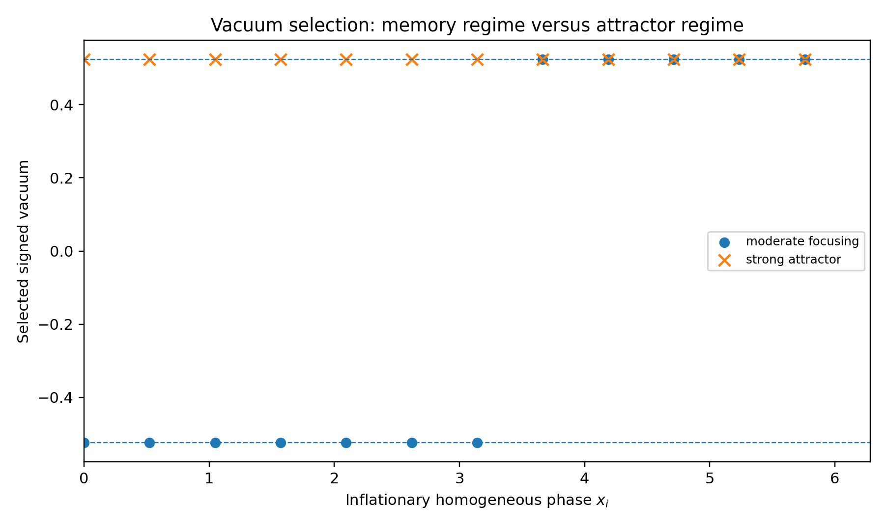
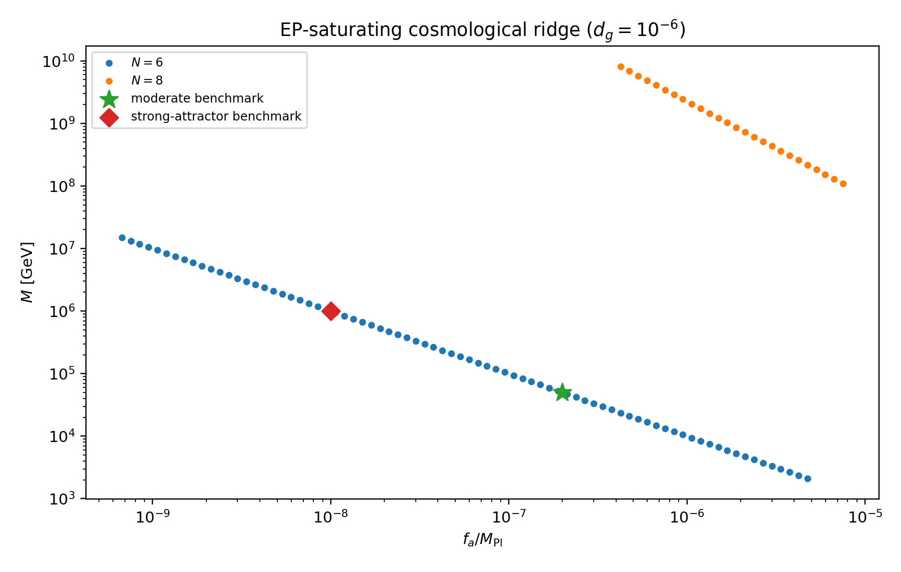
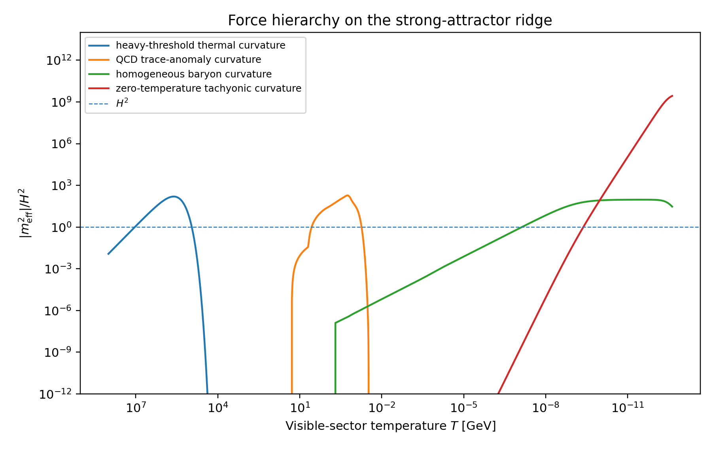

# Executive result

The cosmological calculation changes the preferred parameter region, but does not kill the model.

The old local-screening benchmark,

\[
N=6,\qquad M=10\ {\rm TeV},\qquad f_a=M_{\rm Pl},\qquad \epsilon=10^{-6},
\]

has negligible thermal response:

\[
\eta_{\Psi,\max}=2.27\times10^{-7},\qquad
\eta_{\rm QCD,\max}=2.81\times10^{-7}.
\]

The early Universe therefore cannot select its vacuum. With a generic displacement of order \(\pi/6\), its constant-mass misalignment estimate is

\[
\Omega_a h^2\simeq 1.6\times10^2.
\]

That benchmark remains useful for local Earth-Sun screening, but it is not a satisfactory generic cosmological benchmark.

A viable cosmological region instead lies on a lower-\(f_a\), smaller-\(\epsilon\) ridge. The strongest fully evolved benchmark found here is

\[
\boxed{
N=6,\quad
f_a=2.435\times10^{10}\ {\rm GeV},\quad
\epsilon=2.70\times10^{-13},\quad
M=1.002\times10^6\ {\rm GeV}
}
\]

with

\[
T_R=100M=1.002\times10^8\ {\rm GeV},\qquad
m_a=7.5\times10^{-29}\ {\rm eV},\qquad
d_g=10^{-6}.
\]

One adjacent replica is populated at reheating with temperature ratio

\[
\xi\equiv T_5/T_0=0.25.
\]

This gives

\[
\Delta N_{\rm eff}\simeq0.0289,
\]

below the current 95% upper limit \(\Delta N_{\rm eff}<0.107\). The heavy threshold and QCD crossover both dominate Hubble friction,

\[
\eta_{\Psi,\max}=612,
\qquad
\eta_{\rm QCD,\max}=759,
\]

and all 12 evenly spaced homogeneous initial phases tested numerically converge to the same adjacent vacuum,

\[
\boxed{x_v=\frac{\pi}{6}},\qquad x\equiv a/f_a.
\]

The misalignment abundance is negligible,

\[
\Omega_a h^2\simeq2.3\times10^{-18}.
\]

The maximum generic chronometric signal is not set by cosmology. It remains limited by equivalence-principle constraints. Taking the conservative working value \(d_g=10^{-6}\), the predicted solar annual peak-to-peak clock modulation is

\[
\boxed{
\left|\Delta\ln\frac{\nu_A}{\nu_B}\right|_{\rm yr}
\simeq 6.58\times10^{-22}\,|K_{AB}|.
}
\]

For an ordinary atomic sensitivity \(|K_{AB}|\sim1\), this is remote. For the provisional nuclear sensitivity \(|K|\sim10^4\) used in recent thorium-229 analyses, it becomes \(6.6\times10^{-18}\), although the nuclear matrix-element uncertainty is substantial.

The main conceptual result is:

\[
\boxed{
\text{cosmology can select the sign and branch of chronometric shear,}
\text{ but it does not raise its allowed magnitude above the EP bound.}
}
\]

# Model

## Zero-temperature protected potential

The compact ratio mode is

\[
x=\frac{a}{f_a}.
\]

The replicated vectorlike thresholds are

\[
M_k(x)=M\left[1-\epsilon\cos\left(x+\frac{2\pi k}{N}\right)\right],
\qquad k=0,\ldots,N-1.
\]

The cyclic orbit cancels all lower harmonics in the vacuum effective potential. For \(N>4\),

\[
V_0(x)=\frac{m_a^2f_a^2}{N^2}\left(1+\cos Nx\right),
\]

where

\[
m_a^2=
\frac{N_cN^2F_N}{8\pi^2}
\frac{M^4}{f_a^2}\epsilon^N,
\]

and

\[
F_N=
\frac{24\,2^{1-N}}
{(N-1)(N-2)(N-3)(N-4)}.
\]

The minima are

\[
x_v=\frac{(2j+1)\pi}{N}.
\]

The visible QCD threshold transmits the ratio-mode response as

\[
\mathrm d\ln\frac{\Lambda_3}{\chi}
=
\left[\frac{2}{27}+O(\alpha_s)\right]
\mathrm d\ln\frac{M_0}{\chi}.
\]

At a selected vacuum,

\[
d_g=
\frac{2}{27}\frac{M_{\rm Pl}}{f_a}
\frac{\epsilon\sin x_v}{1-\epsilon\cos x_v}.
\]

## Cosmological equation

The homogeneous field obeys

\[
\ddot x+3H\dot x+\frac{1}{f_a^2}\frac{\partial V_{\rm eff}}{\partial x}=0,
\]

with

\[
V_{\rm eff}=V_0+V_{\Psi,T}+V_{{\rm QCD},T}+V_b.
\]

The numerical evolution includes visible and hidden radiation, standard matter, and a cosmological constant in \(H\).

# Reheating and the heavy-threshold thermal potential

For a Dirac colour triplet with \(g_\Psi=12\), the exact one-loop thermal free-energy contribution is

\[
V_{\Psi,k}(T_k,x)
=-\frac{g_\Psi T_k^4}{2\pi^2}
\int_0^\infty dq\,q^2
\ln\left[1+e^{-\sqrt{q^2+M_k^2(x)/T_k^2}}\right].
\]

At leading order in \(\epsilon\),

\[
V_{\Psi,T}^{(1)}
=-\sum_k A_\Psi(T_k)
\cos\left(x+\frac{2\pi k}{N}\right),
\]

where

\[
A_\Psi(T)=
\epsilon M\frac{\partial V_\Psi(T,M)}{\partial M}.
\]

For \(T\gg M\),

\[
A_\Psi(T)\longrightarrow
\frac{g_\Psi}{24}\epsilon M^2T^2.
\]

Each decoupled replica conserves entropy independently:

\[
T_k g_{*s}^{1/3}(T_k)
=\xi_k T_0 g_{*s}^{1/3}(T_0).
\]

At high temperature, define the thermal phasor

\[
W_2=\sum_k\xi_k^2e^{2\pi ik/N}.
\]

Then

\[
V_{\Psi,T}^{(1)}\propto-\operatorname{Re}\left(e^{ix}W_2\right),
\qquad
x_T=-\arg W_2.
\]

For the benchmark population,

\[
\xi_0=1,\qquad \xi_5=0.25,
\]

and all other replicas are empty. Therefore

\[
W_2=1+0.25^2e^{-i\pi/3},
\qquad
\boxed{x_T=0.0524383}.
\]

This is a useful economy: the branch-selecting phase scales as \(\xi^2\), while the dark-radiation cost scales as \(\xi^4\).

For a complete hidden Standard Model copy with its standard internal neutrino-photon entropy history,

\[
\Delta N_{\rm eff}\simeq7.403\,\xi^4.
\]

Thus \(\xi=0.25\) gives

\[
\Delta N_{\rm eff}=0.0289.
\]

Only one adjacent copy can be populated at this level: five copies at \(\xi=0.25\) would give \(\Delta N_{\rm eff}\simeq0.145\), above the current bound.

# QCD crossover

For QCD pressure written as

\[
p(T,\Lambda)=T^4P(T/\Lambda),
\]

the thermodynamic identity

\[
\frac{\partial F}{\partial\ln\Lambda}\bigg|_T
=\rho-3p\equiv\Theta(T)
\]

follows directly from dimensional analysis.

The threshold relation gives

\[
\Lambda_k(x)=\Lambda_0
\left[1-\epsilon\cos\left(x+\frac{2\pi k}{N}\right)\right]^{2/27}.
\]

The leading lock-defect contribution is therefore

\[
V_{{\rm QCD},k}(T_k,x)
=\frac{2}{27}\Theta(T_k)
\ln\left[1-\epsilon\cos\left(x+\frac{2\pi k}{N}\right)\right].
\]

The evolution uses the \(2+1+1\)-flavour lattice trace-anomaly fit

\[
\frac{\Theta(T)}{T^4}
=e^{-h_1/t-h_2/t^2}
\left[
 h_0+f_0
 \frac{\tanh(f_1t+f_2)+1}
 {1+g_1t+g_2t^2}
\right],
\qquad t=\frac{T}{0.2\ {\rm GeV}},
\]

with

\[
(h_0,h_1,h_2,f_0,f_1,f_2,g_1,g_2)
=(0.353,-1.04,0.534,1.75,6.80,-5.18,0.525,0.160).
\]

For the strong benchmark, the QCD focusing measure peaks at

\[
T\simeq0.179\ {\rm GeV},
\qquad
\eta_{\rm QCD}\equiv\frac{4m_{T,{\rm QCD}}^2}{H^2}=759.
\]

The hidden sector crosses its own QCD region at a different visible temperature. This produces a time-dependent phasor rather than a single fixed thermal minimum.

# Matter domination

Nonrelativistic visible baryons contribute

\[
V_b(x,a)=\rho_b(a)
\left(1-\epsilon\cos x\right)^{p_b},
\qquad p_b\simeq\frac{2}{27}.
\]

Near the even-\(N\) thermal maximum \(x=0\), this gives a positive curvature

\[
m_b^2(a)=\frac{\rho_b(a)p_b\epsilon}{f_a^2}.
\]

The zero-temperature potential gives a tachyonic curvature \(-m_a^2\). The homogeneous branch is released when

\[
m_b^2(a)=m_a^2.
\]

Thus

\[
1+z_{\rm inst}=
\left[
\frac{m_a^2f_a^2}
{\rho_{b0}p_b\epsilon}
\right]^{1/3}.
\]

For the moderate and strong benchmarks,

\[
z_{\rm inst}=1224,
\qquad
z_{\rm inst}=450,
\]

respectively. Baryons do not screen the scalar in finite bodies, as shown in v0.7, but the homogeneous cosmic baryon background can delay the roll and alter the selected branch.

# Vacuum selection

{width=95%}

## Moderate-focusing regime

The moderate point is

\[
f_a=4.87\times10^{11}\ {\rm GeV},\quad
\epsilon=5.40\times10^{-12},\quad
M=5.01\times10^4\ {\rm GeV}.
\]

It has

\[
\eta_{\Psi,\max}=30.6,
\qquad
\eta_{\rm QCD,\max}=38.0.
\]

Nevertheless, a 12-point scan over the inflationary homogeneous phase gives five trajectories in \(+\pi/6\) and seven in \(-\pi/6\). The sudden disappearance of thermal curvature and subsequent QCD and matter-era phase evolution preserve information about the initial zero mode.

## Strong-attractor regime

The strong point is

\[
f_a=2.435\times10^{10}\ {\rm GeV},\quad
\epsilon=2.70\times10^{-13},\quad
M=1.002\times10^6\ {\rm GeV}.
\]

It has

\[
\eta_{\Psi,\max}=612,
\qquad
\eta_{\rm QCD,\max}=759.
\]

All 12 evenly spaced homogeneous initial phases tested converge to \(+\pi/6\). The largest residual distance from that vacuum at the numerical stopping surface is 0.049 rad.

{width=95%}

This is a numerical existence result, not a theorem that every point with smaller \(f_a\) is a global attractor. Branch selection is phase-sensitive and can form islands in parameter space.

## Domain-wall condition

The exact zero-temperature theory retains \(Z_6\)-degenerate vacua. The clean cosmology therefore requires:

1. the approximate \(U(1)\) to break before or during inflation;
2. no post-inflation restoration, conservatively \(T_R<f_a\);
3. inflationary phase fluctuations smaller than the reheating bias.

Since

\[
\delta x_{\rm inf}\simeq\frac{H_{\rm inf}}{2\pi f_a},
\]

a useful sufficient condition is

\[
H_{\rm inf}\ll2\pi f_a x_T.
\]

For the strong benchmark,

\[
2\pi f_ax_T=8.0\times10^9\ {\rm GeV}.
\]

If the symmetry is restored after inflation, an additional technically safe permanent bias is required to remove strings and stable domain walls. The transient reheating asymmetry alone is not a permanent wall-lifting term.

# Why N=6 is preferred

Visible-dominated reheating with even \(N\) focuses the field near a zero-temperature maximum. The nearest minima are

\[
x_v=\pm\frac{\pi}{N}.
\]

For \(\epsilon\ll1\),

\[
d_g\simeq
\frac{2}{27}\frac{\epsilon}{y}
\sin\frac{\pi}{N},
\qquad y\equiv\frac{f_a}{M_{\rm Pl}}.
\]

At fixed \(d_g\),

\[
\epsilon=
\frac{27}{2}
\frac{d_g y}{\sin(\pi/N)}.
\]

The smallest even \(N>4\) is \(N=6\), which simultaneously gives:

- the largest adjacent-vacuum slope among allowed even \(N\);
- the fewest replicated sectors;
- the lowest heavy threshold required for a chosen \(m_a\);
- the least severe reheating architecture.

For \(N=6\),

\[
\boxed{\epsilon=27d_gy}.
\]

The exact coloured-fermion thermal function gives

\[
\eta_{\Psi,\max}
\simeq0.22673\frac{\epsilon}{y^2}
=6.12\times10^{-6}
\left(\frac{d_g}{10^{-6}}\right)\frac1y.
\]

Thus thermal selection becomes stronger as \(f_a\) decreases, even though \(\epsilon\) decreases.

# EP-saturating parameter ridge

The optimization uses the conservative working cap

\[
d_g=10^{-6},
\]

motivated by a leading pure-QCD recast of MICROSCOPE. It is not a substitute for a complete likelihood including all dilaton charges and finite-range effects.

The scan fixes

\[
m_a=7.5\times10^{-29}\ {\rm eV}
\]

as a representative late-roll mass and imposes

\[
T_R=100M<f_a,
\qquad
M>2.6\ {\rm TeV},
\qquad
M<10^{12}\ {\rm GeV},
\qquad
\eta_{\Psi,\max}>1.
\]

For \(N=6\), the mass relation reduces numerically to

\[
M\simeq
\frac{1.002\times10^{-2}\ {\rm GeV}}{y}
\left(\frac{m_a}{7.5\times10^{-29}\ {\rm eV}}\right)^{1/2}
\left(\frac{10^{-6}}{d_g}\right)^{3/2}.
\]

The viable scan interval is approximately

\[
6.4\times10^{-10}\lesssim y\lesssim3.9\times10^{-6},
\]

or

\[
1.6\times10^9\ {\rm GeV}\lesssim f_a\lesssim9.4\times10^{12}\ {\rm GeV},
\]

with

\[
2.6\times10^3\ {\rm GeV}\lesssim M\lesssim1.6\times10^7\ {\rm GeV}.
\]

The \(N=8\) scan survives only at much higher threshold masses,

\[
4.2\times10^{-7}\lesssim y\lesssim7.5\times10^{-6},
\]

\[
1.1\times10^8\ {\rm GeV}\lesssim M\lesssim8.2\times10^9\ {\rm GeV}.
\]

No \(N=10\) point survives the same \(M<10^{12}\) GeV, reheating, collider, and focusing cuts.

{width=95%}

# Force hierarchy and chronology

{width=95%}

The sequence is:

\[
\boxed{
\text{reheating}
\rightarrow
\text{heavy-threshold focusing}
\rightarrow
\text{QCD refocusing}
\rightarrow
\text{baryon locking}
\rightarrow
\text{late tachyonic release}
\rightarrow
x_v=\pm\pi/6.
}
\]

The QCD crossover is dynamically important even though the final linear coupling is generated by the zero-temperature threshold. It acts as a second environmental lens for the same ratio mode.

# Chronometric shear

For two clocks,

\[
\mathcal S_{AB}=\mathrm d\ln\frac{\nu_A}{\nu_B}.
\]

In the pure-QCD benchmark,

\[
\mathcal S_{AB}
\simeq K_{AB}\,d_g\,\mathrm d\varphi,
\]

where \(K_{AB}\) is the difference in QCD/nuclear sensitivity and \(\varphi=a/M_{\rm Pl}\).

A source with scalar charge approximately \(d_g\) produces

\[
\frac{a_{\rm source}}{M_{\rm Pl}}
\simeq-2d_g\Phi_N.
\]

For the annual peak-to-peak change of the solar potential,

\[
\Delta\Phi_\odot=3.29\times10^{-10},
\]

and \(m_a\ll {\rm AU}^{-1}\),

\[
\boxed{
\left|\Delta\ln\frac{\nu_A}{\nu_B}\right|_{\rm yr}
=2|K_{AB}|d_g^2\Delta\Phi_\odot.
}
\]

At \(d_g=10^{-6}\),

\[
\left|\Delta\ln\frac{\nu_A}{\nu_B}\right|_{\rm yr}
=6.58\times10^{-22}|K_{AB}|.
\]

Recent thorium-229 work uses provisional strong-sector sensitivity factors \(|K_g|,|K_{\hat m}|=10^4\) and \(10^5\), while emphasizing that reliable ab-initio coefficients are not yet available. Taking \(10^4\) only as an illustrative benchmark gives

\[
6.58\times10^{-18}.
\]

This is a source-induced annual signal, not an oscillating-dark-matter signal: the scalar abundance on the optimized ridge is negligible.

The clock/EP consistency relation derived in v0.5 remains

\[
\frac{\beta_{AB}}{\eta_{CD}}
=-\frac{\Delta K_{AB}}
{\Delta Q_{\hat m}^{\prime\,CD}},
\]

under the one-scalar, unscreened, QCD-dominated assumptions. Cosmological vacuum selection fixes the sign of \(d_g\), but the ratio above is independent of its magnitude.

# Abundance and cosmological consistency

For a constant mass that begins oscillating in radiation domination,

\[
\Omega_a h^2\propto f_a^2m_a^{1/2}\theta_i^2.
\]

The old Planck-scale benchmark gives \(\Omega_a h^2\simeq164\) for \(\theta_i=\pi/6\). The moderate and strong ridge points give

\[
9.2\times10^{-16},
\qquad
2.3\times10^{-18},
\]

respectively. The ratio mode is therefore not the dark matter in the optimized chronometric model.

The strong benchmark also satisfies

\[
\frac{T_R}{f_a}=4.11\times10^{-3},
\]

which is compatible with avoiding radial-symmetry restoration for order-one thermal couplings, although the actual restoration temperature depends on the UV completion.

Outstanding cosmological requirements are:

- an explicit reheaton producing \(\xi_0=1\), \(\xi_5=0.25\), and negligible temperatures in the other replicas;
- prompt decays or acceptable relic abundances for the heavy vectorlike thresholds;
- a perturbation/isocurvature calculation rather than only homogeneous evolution;
- proof that the chosen reheating hierarchy is stable under portals between replicas;
- a permanent domain-wall cure if pre-inflation symmetry breaking is not imposed.

# Novelty boundary

The following ingredients are established:

- nonlinearly realized \(Z_N\) protection of a light pseudo-Goldstone potential;
- replicated-sector finite-temperature scalar cosmology;
- lattice QCD thermodynamics;
- dilaton equivalence-principle charges;
- clock searches for gluon and quark-mass couplings.

The candidate new package is narrower:

\[
\boxed{
\begin{gathered}
\text{protected real vectorlike-QCD threshold}
+\frac{2}{27}\text{ transmission}
+\text{entropy-asymmetric reheating phasor}
\\
+\text{lattice trace-anomaly evolution}
+\text{baryon locking}
+\text{chronometric shear/EP ridge}.
\end{gathered}
}
\]

The most important new negative result is also useful: moderate thermal focusing does not guarantee unique vacuum selection. The system can retain the inflationary homogeneous phase through threshold decoupling and later environmental kicks. A strong-attractor island exists, but it must be demonstrated rather than inferred from \(m_T/H>1\) alone.

# Current verdict

| Target | Verdict |
|---|---|
| Heavy-threshold thermal evolution | Pass |
| Independent replica entropy histories | Pass within decoupled-sector approximation |
| QCD crossover | Pass at leading lock defect |
| Matter domination | Pass |
| Local Earth/Sun screening | Pass from v0.7: unscreened |
| Unique branch at moderate focusing | Fail |
| Unique branch at strong benchmark | Pass for 12 tested homogeneous phases |
| Dark-radiation bound | Pass for one adjacent copy at \(\xi=0.25\) |
| Misalignment abundance | Pass; negligible |
| Maximum nonzero chronometric shear | EP-limited at working \(d_g\sim10^{-6}\) |
| Permanent domain-wall solution | Conditional/open |
| Full reheating UV completion | Open |
| Absolute priority claim | Not yet established |

The preferred cosmological statement is now:

\[
\boxed{
\text{N=6 admits a low-}f_a\text{ attractor ridge on which the Universe}
\text{ selects a nonzero QCD chronometric-shear vacuum.}
}
\]

It is not the origin of causal order. It is a concrete mechanism by which cosmological history selects which small, non-universal spectral mismatch survives after a universal clock scale has formed.

# References

1. S. Das and A. Hook, *Non-linearly realized discrete symmetries*, arXiv:2006.10767.
2. D. Brzeminski, Z. Chacko, A. Dev and A. Hook, *A Time-Varying Fine Structure Constant from Naturally Ultralight Dark Matter*, arXiv:2012.02787.
3. S. Borsanyi et al., *Lattice QCD for Cosmology*, arXiv:1606.07494.
4. S. Goldstein and J. C. Hill, *A 2% determination of N_eff from primordial element abundance, CMB and BAO measurements*, arXiv:2603.13226.
5. P. Touboul et al., *MICROSCOPE mission: final results of the test of the Equivalence Principle*, arXiv:2209.15487.
6. T. Damour and J. F. Donoghue, *Equivalence Principle Violations and Couplings of a Light Dilaton*, arXiv:1007.2792.
7. J. Arakawa et al., *Probing Ultralight Dark Matter at the Mega-Planck Scale with the Thorium Nuclear Clock*, arXiv:2602.16804.
