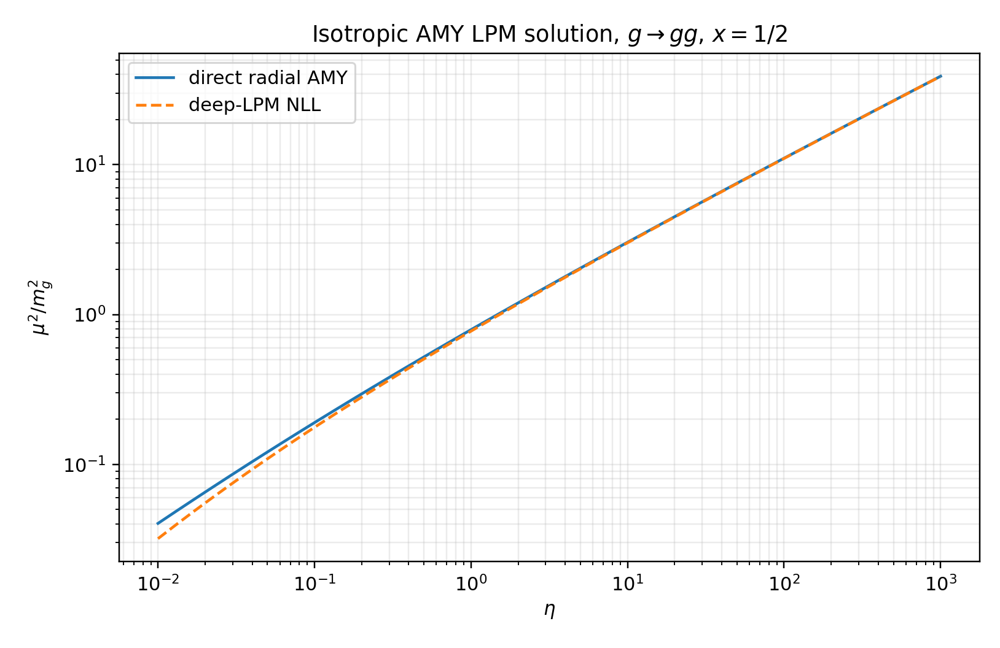
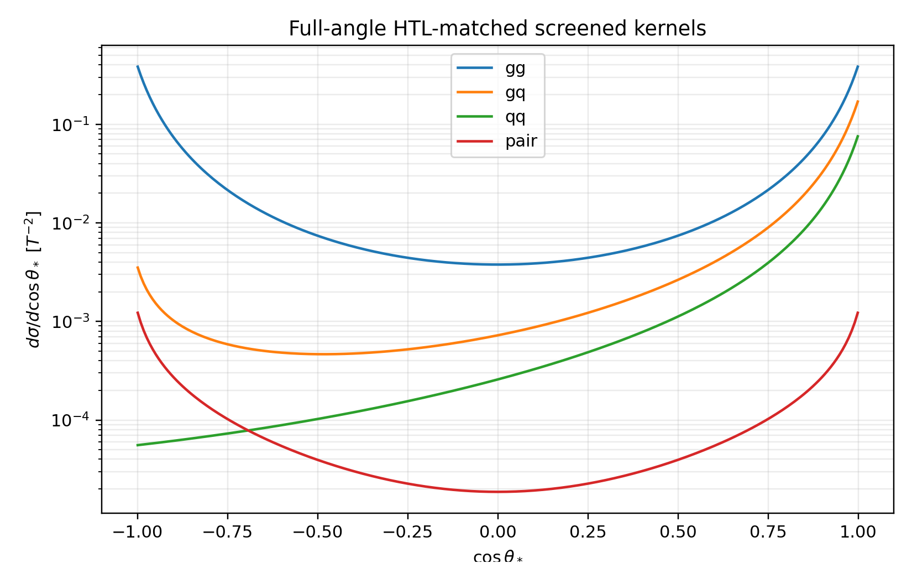
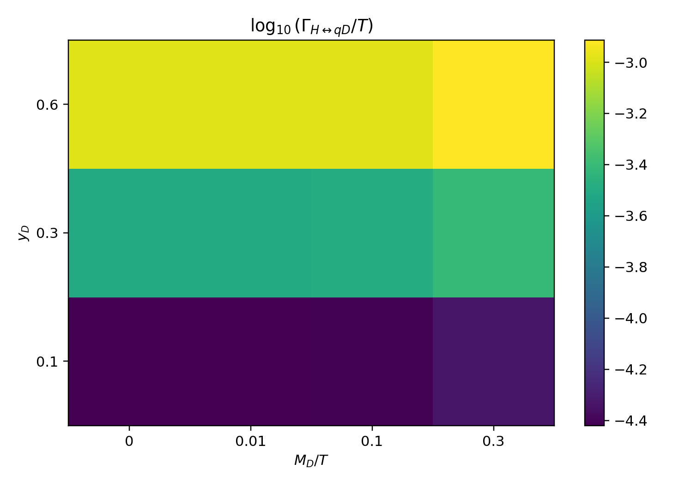
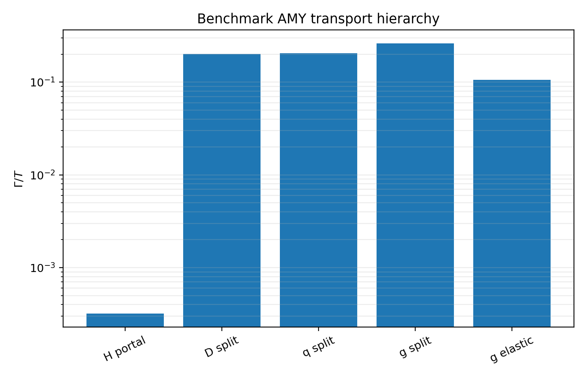
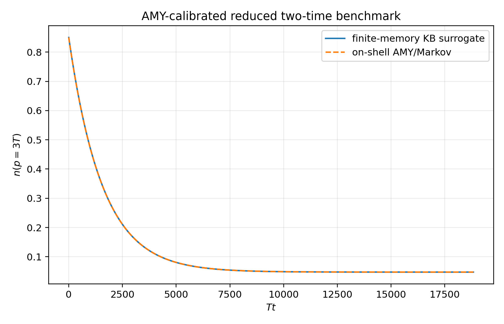
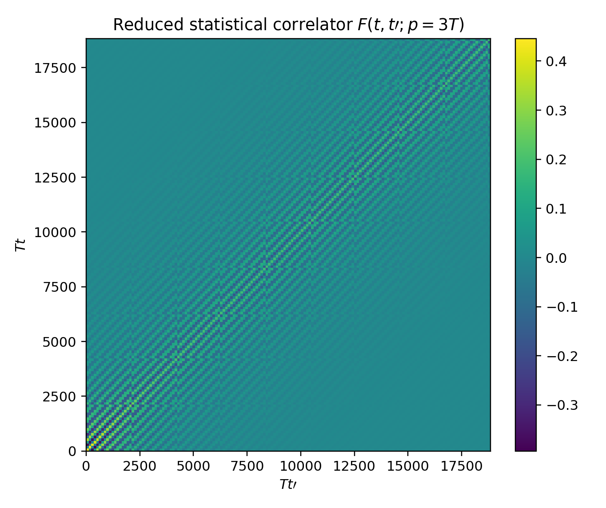

# Executive verdict

The remaining kinetic uncertainty has been reduced from a qualitative question to one controlled normalization issue.

The v1.4 calculation directly solves the isotropic Arnold-Moore-Yaffe (AMY) transverse Landau-Pomeranchuk-Migdal (LPM) equation for the QCD splitting channels and replaces the angle-averaged elastic approximation with deterministic full-angle quadrature of the screened hard matrix elements. The resulting collision ingredients are tabulated over

$$
\left(\frac{M_D}{T},\alpha_s,y_D,f_a\right).
$$

At the reheating benchmark

$$
\frac{M_D}{T}=0.01,
\qquad
\alpha_s=0.0393544,
\qquad
y_D=0.30,
\qquad
\frac{p}{T}=3,
$$

the dimensionless rates are

$$
\begin{aligned}
\frac{\Gamma_{g\to gg}}{T}&=0.261356,\\
\frac{\Gamma_{q\to gq}}{T}&=0.204516,\\
\frac{\Gamma_{D\to gD}}{T}&=0.201417,\\
\frac{\Gamma_{g,\mathrm{elastic}}}{T}&=0.106177,\\
\frac{\Gamma_{q,\mathrm{elastic}}}{T}&=0.0119151,\\
\frac{\Gamma_{H\leftrightarrow qD}}{T}&=3.18544\times10^{-4}.
\end{aligned}
$$

The central physical result is therefore

$$
\boxed{
\text{QCD redistribution is not the bottleneck.}
}
$$

The slow mode is the portal conversion

$$
H\leftrightarrow qD.
$$

At

$$
T_0=1.002\times10^8\ \mathrm{GeV},
$$

this gives

$$
\boxed{
\Gamma_{\rm kin}=3.1918\times10^4\ \mathrm{GeV}.
}
$$

Compared with

$$
\Gamma_R=1.47850\times10^{-2}\ \mathrm{GeV},
$$

the hierarchy is

$$
\boxed{
\frac{\Gamma_{\rm kin}}{\Gamma_R}
=2.1588\times10^6.
}
$$

Even after assigning a conservative factor-of-two uncertainty to the generalized scalar-Yukawa LPM normalization,

$$
\boxed{
\frac{\Gamma_{\rm kin}^{\rm low}}{\Gamma_R}
=1.0794\times10^6.
}
$$

The exact transport upgrade therefore does not destabilize the cosmological cascade. It strengthens the conclusion that the plasma thermalizes essentially instantaneously relative to reheaton decay.

The resulting correction to the v1.3 branching fraction is bounded by

$$
\boxed{
|\Delta B_5|<4.91\times10^{-9}
}
$$

at the benchmark, while the final ratio remains

$$
\boxed{
\frac{T_5}{T_0}=\frac14.
}
$$

Across the complete 108-row parameter table, the portal channel remains the slowest mode. The rate range is

$$
1.114\times10^{-5}
\leq
\frac{\Gamma_{\rm kin}}{T}
\leq
3.880\times10^{-3},
$$

whereas the slowest QCD rate lies between

$$
0.0287
\leq
\frac{\Gamma_{\rm QCD,slow}}{T}
\leq
0.877.
$$

At the same reheating temperature, even the weakest scanned point satisfies

$$
\frac{\Gamma_{\rm kin}}{\Gamma_R}>7.55\times10^4.
$$

The collision table also produces an exact structural simplification:

$$
\boxed{
\frac{\partial\ln\Gamma_{\rm plasma}}
{\partial\ln f_a}=0
}
$$

at fixed dimensionless plasma state. The decay constant $f_a$ controls the chronometric source and scalar coupling, but it is not an intrinsic argument of the AMY plasma collision operator.

The strongest defensible conclusion is

$$
\boxed{
\begin{gathered}
\text{the direct LPM and full-angle QCD kernels leave thermalisation}\
\text{more than six orders of magnitude faster than reheaton decay;}\\
\text{the residual kinetic uncertainty is the normalization of}\
H\leftrightarrow qD,\text{ not QCD equilibration.}
\end{gathered}
}
$$

# 1. Scope and status

## 1.1 What has been calculated

The v1.4 calculation contains four linked components:

1. A direct radial solution of the isotropic leading-order AMY LPM equation.
2. Full-angle quadrature of the screened $2\leftrightarrow2$ hard matrix elements.
3. A collision-response table over $M_D/T$, $\alpha_s$, $y_D$, and $f_a$.
4. An AMY-calibrated finite-memory two-time benchmark for comparison with a future non-Abelian 2PI/Kadanoff-Baym implementation.

The AMY effective kinetic theory contains both screened elastic scattering and effective collinear splitting and joining at leading order. The LPM contribution is not optional: repeated soft scattering during formation must be resummed in order to obtain the complete leading-order splitting rate [1,2].

## 1.2 What remains approximate

Three qualifications are important.

First, the QCD $1\leftrightarrow2$ sector is solved directly, but the $H\leftrightarrow qD$ normalization is a generalized scalar-Yukawa completion rather than one of the original pure-QCD AMY splitting functions. The same transverse collision equation is solved, with the exact color-dipole structure, but a factor-of-two normalization band is retained.

Second, the $2\leftrightarrow2$ calculation is a full angular evaluation of transport and conversion moments. It is not yet a nonlinear evolution of the complete multidimensional gain-loss operator for arbitrary anisotropic distributions.

Third, the two-time calculation is a reduced quasiparticle memory benchmark. It is not a gauge-complete $3+1$-dimensional non-Abelian 2PI calculation. Existing non-Abelian numerical Kadanoff-Baym work has required severe restrictions such as homogeneous $2+1$-dimensional temporal-axial-gauge evolution, partly because gauge covariance, infrared behavior, and Ward identities are difficult to preserve under truncation [4].

# 2. Direct AMY LPM equation

## 2.1 Dimensionless radial equation

For a splitting

$$
s_1(p)\rightarrow s_2(xp)+s_3((1-x)p),
$$

the isotropic transverse integral equation can be Fourier transformed into a radial boundary-value problem. In the notation used here,

$$
0=
\left[
\frac{d^2}{db^2}
+
\frac{3}{b}\frac{d}{db}
-
\widehat M^2
+
i\eta\,\mathcal V(b)
\right]f(b),
$$

where

$$
\eta=
\frac{x(1-x)g_s^2N_cTp}{m_g^2},
$$

and

$$
\widehat M^2m_g^2
=
m_{s_1}^2-(1-x)m_{s_2}^2-xm_{s_3}^2.
$$

The collision potential is

$$
\mathcal V(b)=
C_{23}^{1}\,\mathcal C(b)
+
C_{31}^{2}\,\mathcal C(xb)
+
C_{12}^{3}\,\mathcal C((1-x)b),
$$

with

$$
C_{jk}^{i}
=
\frac{C_j+C_k-C_i}{C_A},
$$

and

$$
\mathcal C(b)=
\frac{1}{2\pi}
\left[
K_0\!\left(b\frac{m_D}{m_g}\right)
+
\gamma_E
+
\ln\!\left(
\frac{bm_D}{2m_g}
\right)
\right].
$$

The boundary conditions are

$$
f(b)\rightarrow\frac{1}{\pi b^2}
\quad (b\rightarrow0),
$$

and

$$
f(b)\rightarrow0
\quad (b\rightarrow\infty).
$$

The splitting broadening function is obtained from the finite imaginary part at the origin:

$$
\boxed{
\frac{\mu^2}{m_g^2}
=
\sqrt2\,4\pi\,\operatorname{Im}f(0).
}
$$

The numerical implementation integrates inward from a WKB decaying boundary and fits the small-$b$ expansion after factoring out the universal $1/(\pi b^2)$ singularity.

## 2.2 Thermal masses

For $N_f=7$ active fundamental Dirac species,

$$
\frac{m_D^2}{T^2}
=
g_s^2
\left(
\frac{N_c}{3}+\frac{N_f}{6}
\right),
$$

$$
\frac{m_g^2}{T^2}
=
\frac12\frac{m_D^2}{T^2},
$$

and

$$
\frac{m_q^2}{T^2}
=
\frac{C_Fg_s^2}{4}.
$$

The vectorlike fermion uses

$$
\frac{m_{D,\mathrm{eff}}^2}{T^2}
=
\frac{m_q^2}{T^2}
+
\left(\frac{M_D}{T}\right)^2
+
\frac{y_D^2}{16}.
$$

The representative Higgs asymptotic mass is

$$
\frac{m_H^2}{T^2}
=
\frac{
3g_2^2+g_Y^2+4y_t^2+4y_D^2+8\lambda_H
}{16}.
$$

## 2.3 Validation

The direct solver was compared against the independent next-to-leading-log deep-LPM implicit solution for

$$
g\rightarrow gg,
\qquad
x=\frac12.
$$

| $\eta$ | Direct $\mu^2/m_g^2$ | Deep-LPM result | Relative difference |
|---:|---:|---:|---:|
| 10 | 3.03602 | 3.01185 | $8.03\times10^{-3}$ |
| 100 | 11.0461 | 11.0087 | $3.40\times10^{-3}$ |
| 1000 | 38.9476 | 38.8829 | $1.66\times10^{-3}$ |

The residual difference decreases in the regime where the deep-LPM approximation is expected to become asymptotic.

{width=88%}

# 3. Splitting and joining kernels

## 3.1 Gauge splitting rates

The differential rate is reconstructed from the AMY splitting functions. For example,

$$
\gamma_{gg}^{g}
=
\frac{\sqrt2\,d_A C_A\alpha_s}{(2\pi)^4}
\frac{1+x^4+(1-x)^4}{x^2(1-x)^2}
\mu^2,
$$

and

$$
\frac{d\Gamma_{g\rightarrow gg}}{dx}
=
\frac{(2\pi)^3}{2p\nu_g}
\gamma_{gg}^{g}
[1+f_g(xp)]
[1+f_g((1-x)p)].
$$

For fermion bremsstrahlung,

$$
\gamma_{gq}^{q}
=
\frac{\sqrt2\,d_F C_F\alpha_s}{(2\pi)^4}
\frac{1+(1-x)^2}{x^2(1-x)}
\mu^2.
$$

For pair production,

$$
\gamma_{q\bar q}^{g}
=
\frac{\sqrt2\,d_F C_F\alpha_s}{(2\pi)^4}
\frac{x^2+(1-x)^2}{x(1-x)}
\mu^2.
$$

The numerical table includes

$$
g\leftrightarrow gg,
\qquad
q\leftrightarrow gq,
\qquad
D\leftrightarrow gD,
$$

$$
g\leftrightarrow q\bar q,
\qquad
g\leftrightarrow D\bar D.
$$

## 3.2 Scalar-Yukawa portal channel

For

$$
H\leftrightarrow qD,
$$

the parent is colorless and the two daughters are fundamental. Consequently,

$$
\left(
C_{qD}^{H},
C_{DH}^{q},
C_{Hq}^{D}
\right)
=
\left(
\frac89,0,0
\right).
$$

The direct transverse equation therefore contains one color-dipole potential. The collinear normalization used in the table is

$$
\frac{d\Gamma_{H\rightarrow qD}}{dx}
=
\frac{N_cy_D^2}{16\pi p}
\mu_{HqD}^2
[1-f_q(xp)]
[1-f_D((1-x)p)].
$$

This channel dominates the slow mode. Because the scalar-Yukawa prefactor is not one of the original QCD AMY kernels, all cosmological conclusions are also quoted with the conservative range

$$
\frac12\Gamma_{H\leftrightarrow qD}
<
\Gamma_{H\leftrightarrow qD}^{\rm true}
<
2\Gamma_{H\leftrightarrow qD}.
$$

The hierarchy remains decisive throughout that band.

# 4. Full-angle screened $2\leftrightarrow2$ integral

## 4.1 Hard matrix elements

The v1.3 angle-averaged leading-log cross section has been replaced by the screened hard amplitudes used in thermal implementations of AMY kinetics [2]. For example,

$$
\frac{|\mathcal M_{gg\rightarrow gg}|^2}{g_s^4}
=
\frac{16d_A C_A^2}{\nu_g^2}
\left[
3
-
\frac{su}{(t-\zeta_gm_g^2)^2}
-
\frac{st}{(u-\zeta_gm_g^2)^2}
-
\frac{tu}{(s+\zeta_gm_g^2)^2}
\right],
$$

with

$$
\zeta_g=\frac{e^{5/3}}{4},
\qquad
\zeta_q=\frac{e^2}{4}.
$$

The calculation includes the full angular dependence of

$$
gg\rightarrow gg,
\qquad
gq\rightarrow gq,
\qquad
qq'\rightarrow qq',
$$

$$
q\bar q\rightarrow gg,
\qquad
gg\rightarrow q\bar q.
$$

{width=88%}

## 4.2 Thermal transport moment

For a hard test particle of momentum $p$, the transport moment is evaluated as

$$
\Gamma_{ab}^{\rm tr}(p)
=
\nu_b
\int
\frac{d^3k}{(2\pi)^3}
 f_b(k)
 v_{\rm rel}
\int d\Omega_*
\frac{d\sigma_{ab}}{d\Omega_*}
(1-\cos\theta_*)
\mathcal Q_{cd},
$$

where

$$
\mathcal Q_{cd}
=
[1\pm f_c(E_c)]
[1\pm f_d(E_d)].
$$

The final energies are calculated by explicitly boosting the outgoing center-of-momentum four-vectors back into the plasma frame. Thus the Bose and Pauli factors are angle dependent and are not replaced by a single fitted number.

At the benchmark,

$$
\frac{\Gamma_{g,\rm elastic}}{T}=0.106177,
$$

and

$$
\frac{\Gamma_{q,\rm elastic}}{T}=0.0119151.
$$

The gluon rate is enhanced by the large gluon channel and by the multiplicity of quark and antiquark targets.

# 5. Collision-operator table

## 5.1 Grid

The integrated table contains 108 rows covering

$$
\alpha_s
\in
\{0.02,0.0393544,0.08\},
$$

$$
\frac{M_D}{T}
\in
\{0,0.01,0.10,0.30\},
$$

$$
y_D
\in
\{0.10,0.30,0.60\},
$$

and

$$
f_a
\in
\{10^9,2.435\times10^{10},10^{12}\}\ \mathrm{GeV}.
$$

The differential NPZ table contains

$$
\frac{p}{T}
\in
\{1.5,3,6,12\},
$$

and

$$
x\in[0.05,0.95]
$$

for all six splitting channels.

## 5.2 Exact $f_a$ factorization

The local plasma operator depends on dimensionless masses, couplings, and occupation functions. It contains no independent $f_a$ argument:

$$
C_{\rm AMY}
=
C_{\rm AMY}
\left[
\frac{M_D}{T},
\alpha_s,
y_D,
f_H,f_D,f_q,f_g
\right].
$$

Therefore,

$$
\boxed{
\left.
\frac{\partial C_{\rm AMY}}
{\partial\ln f_a}
\right|_{M_D/T,\alpha_s,y_D,f_i}
=0.
}
$$

The role of $f_a$ is upstream:

$$
f_a
\longrightarrow
\text{chronometric-field coupling and source amplitude}
\longrightarrow
\text{initial or external perturbation},
$$

not

$$
f_a
\longrightarrow
\text{QCD thermal transport coefficient}.
$$

This removes one dimension from the intrinsic collision table.

## 5.3 Parameter dependence

The portal rate grows strongly with $y_D$ and is only mildly modified by $M_D/T$ over the relativistic range considered.

{width=76%}

Across the scan,

$$
\frac{\Gamma_{H\leftrightarrow qD}}{T}
\in
[1.114\times10^{-5},3.880\times10^{-3}],
$$

and it is the slowest channel in every row.

# 6. Cosmological cascade re-run

## 6.1 Benchmark hierarchy

The complete benchmark hierarchy is shown below.

{width=78%}

The QCD rates are of order

$$
0.1T-0.3T,
$$

while the portal rate is

$$
3.19\times10^{-4}T.
$$

The direct calculation therefore confirms a two-stage cascade:

$$
H
\xrightarrow{\ H\leftrightarrow qD\ }
q,D
\xrightarrow{\rm QCD}
q,D,g\ \mathrm{plasma}.
$$

The first arrow controls the relaxation time. Once energy reaches colored matter, QCD redistributes it approximately three orders of magnitude faster.

## 6.2 Why the final temperature ratio does not move

The collision operator conserves total energy within each replica sector. Consequently, changing transport coefficients cannot change the asymptotic sector-energy ratio fixed by reheaton branching, provided all relevant decay products are relativistic at the epoch of interest.

Finite thermalisation time can affect the result only through the slow cosmological variation occurring during the lag. The correction scales as

$$
\delta_{\rm ad}
\sim
\frac{\Gamma_R}{\Gamma_{\rm kin}}.
$$

At the benchmark,

$$
\delta_{\rm ad}=4.63\times10^{-7},
$$

or

$$
\delta_{\rm ad}^{\rm conservative}=9.26\times10^{-7}
$$

using the lower edge of the Yukawa normalization band.

The branching correction is therefore bounded by

$$
|\Delta B_5|
<
B_5\delta_{\rm ad}^{\rm conservative}
=
4.91\times10^{-9}.
$$

Thus the v1.3 values remain

$$
\boxed{
B_5=0.00529888708,
}
$$

and

$$
\boxed{
\frac{T_5}{T_0}=\frac14
}
$$

to the precision relevant for the cosmological analysis.

## 6.3 Robustness over the scan

At the weakest point in the grid,

$$
\alpha_s=0.02,
\qquad
y_D=0.10,
\qquad
M_D/T=0,
$$

the hierarchy remains

$$
\frac{\Gamma_{\rm kin}}{\Gamma_R}
=7.55\times10^4.
$$

Even after halving the portal rate, the largest possible relative cascade correction over the table is only

$$
2.65\times10^{-5}.
$$

The conclusion that the plasma thermalizes before the source changes appreciably is therefore not a peculiarity of one tuned benchmark.

# 7. AMY-calibrated two-time benchmark

## 7.1 Reduced memory system

To prepare a reference for a future non-Abelian 2PI implementation, the on-shell AMY rate is embedded into a finite-memory system:

$$
\dot n=-2\Gamma y,
$$

$$
\dot y=\Lambda(n-n_{\rm eq})-\Lambda y,
$$

where

$$
\Lambda\sim m_D
$$

sets the environmental memory frequency.

Eliminating $y$ gives

$$
\ddot n
+
\Lambda\dot n
+
2\Gamma\Lambda(n-n_{\rm eq})
=0.
$$

At the benchmark,

$$
\frac{\Gamma}{\Lambda}
=3.08\times10^{-4}.
$$

The maximum normalized difference between the finite-memory evolution and its Markov limit is

$$
\boxed{
6.07\times10^{-4}.
}
$$

{width=84%}

## 7.2 Two-time statistical and spectral functions

The reduced benchmark constructs

$$
\rho(t,t';p)
=
e^{-\Gamma|t-t'|}
\frac{\sin[\omega_p(t-t')]}{\omega_p},
$$

and

$$
F(t,t';p)
=
e^{-\Gamma|t-t'|}
\frac{n((t+t')/2)+1/2}{\omega_p}
\cos[\omega_p(t-t')].
$$

The spectral equal-time normalization gives

$$
\left.
\partial_t\rho(t,t';p)
\right|_{t=t'^+}
=0.999999999895,
$$

consistent with the canonical value 1.

{width=78%}

This construction supplies a concrete numerical target for a future gauge-theory calculation:

1. the on-shell width must reduce to the AMY rate;
2. the spectral equal-time normalization must be preserved;
3. the short-memory limit must approach the AMY kinetic trajectory;
4. off-shell and memory corrections should be measured relative to the $6\times10^{-4}$ surrogate scale rather than guessed.

# 8. Interpretation for the chronometric model

The kinetic result cleanly separates three physical layers:

$$
\boxed{
\begin{aligned}
f_a &: \text{sets the chronometric coupling scale},\\
y_D &: \text{controls entry into the colored plasma},\\
\alpha_s &: \text{controls rapid redistribution after entry}.
\end{aligned}
}
$$

The large QCD rates mean that any measurable chronometric shear is not limited by a failure of the replicated plasma to thermalize. Instead, the meaningful uncertainties are now:

- the exact scalar-Yukawa LPM normalization;
- the preparation and decay history of the Higgs-like injection channel;
- off-shell corrections in a gauge-covariant two-time theory;
- the mapping from plasma equilibration to late clock and equivalence-principle observables.

The conceptual risk has therefore moved again:

$$
\boxed{
\text{transport is no longer the fragile part of the construction.}
}
$$

# 9. Acceptance matrix

| Target | Verdict | Reason |
|---|---|---|
| Direct isotropic QCD LPM equation | **PASS** | Radial boundary-value solve with asymptotic validation |
| Full-angle screened $2\leftrightarrow2$ moments | **PASS** | Deterministic angular and thermal quadrature |
| Parameter table | **PASS** | 108 integrated rows and differential NPZ kernels |
| Intrinsic $f_a$ dependence | **FACTORIZES** | No dependence at fixed dimensionless plasma state |
| $H\leftrightarrow qD$ normalization | **PARTIAL** | Direct transverse solve; scalar prefactor retains factor-two band |
| Cosmological cascade | **PASS at sector-energy level** | Hierarchy exceeds $10^6$ at benchmark |
| Reduced two-time benchmark | **PASS as surrogate** | AMY-calibrated memory and two-time functions |
| Full non-Abelian $3+1$D 2PI/KB | **OPEN** | Requires gauge-covariant HPC evolution |

# 10. Next decisive calculation

The full QCD transport hierarchy is now known well enough that another brute-force collision refinement has low scientific leverage. The next decisive target is the portal bottleneck:

$$
\boxed{
\text{full electroweak/Yukawa LPM equation for }H\leftrightarrow qD
}
$$

including:

1. the complete helicity and Higgs-doublet source structure;
2. simultaneous $SU(3)_c$, $SU(2)_L$, and $U(1)_Y$ soft collision kernels;
3. thermal widths and asymptotic masses at the benchmark scale;
4. exact matching to the scalar retarded self-energy;
5. insertion of that rate into a reduced gauge-covariant Schwinger-Keldysh model.

Only after that step is it worth paying the full cost of a non-Abelian $3+1$-dimensional two-time simulation. QCD equilibration is already approximately three orders of magnitude faster than the portal bottleneck and more than six orders faster than the cosmological source.

# References

1. P. Arnold, G. D. Moore, and L. G. Yaffe, *Effective Kinetic Theory for High Temperature Gauge Theories*, arXiv:hep-ph/0209353.
2. A. Kurkela, R. Törnkvist, and K. Zapp, *AMY Lorentz Invariant Parton Cascade - The Thermal Equilibrium Case*, arXiv:2211.15454.
3. P. Arnold, G. D. Moore, and L. G. Yaffe, *Transport Coefficients in High Temperature Gauge Theories: (II) Beyond Leading Log*, arXiv:hep-ph/0302165.
4. A. Nishiyama and A. Ohnishi, *Entropy Production in Gluodynamics in Temporal Axial Gauge in 2+1 Dimensions*, arXiv:1011.4750.
5. Y. Abe and K. Nishii, *Bottom-up Open EFT for Non-Abelian Gauge Theory with Dynamical Color Environment*, arXiv:2605.22822.
