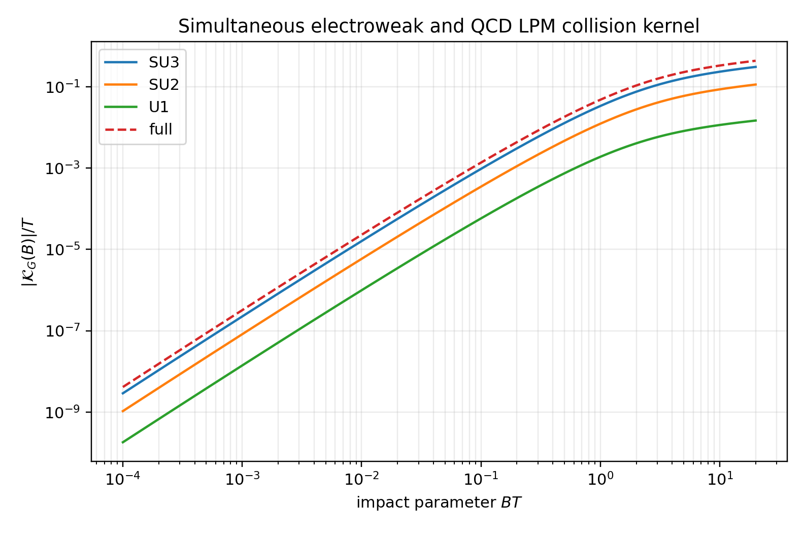
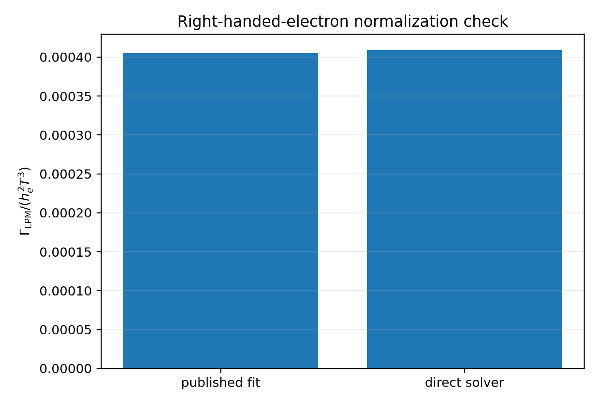
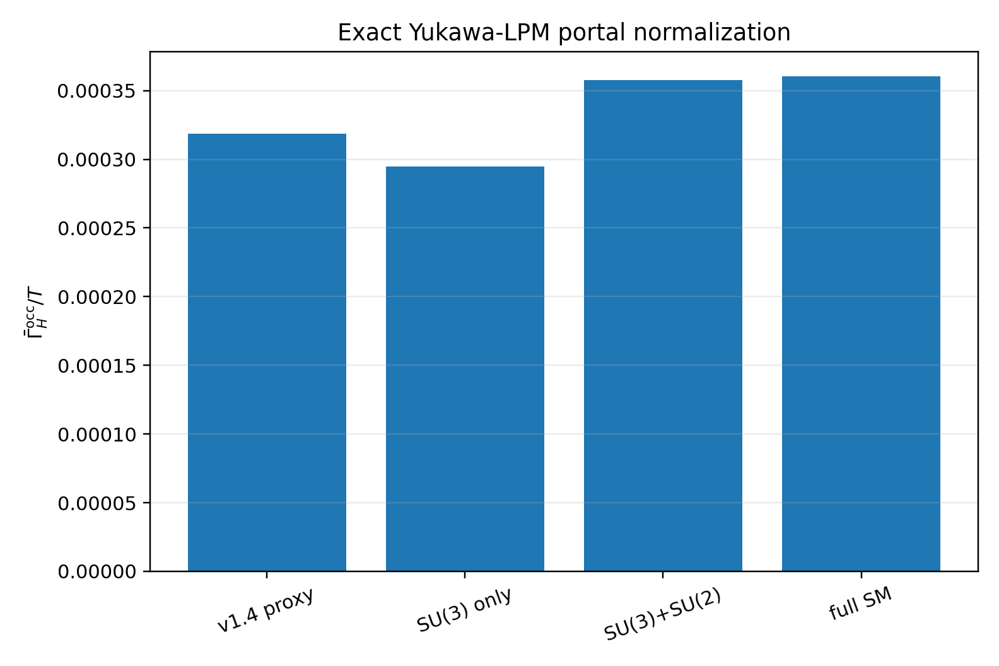
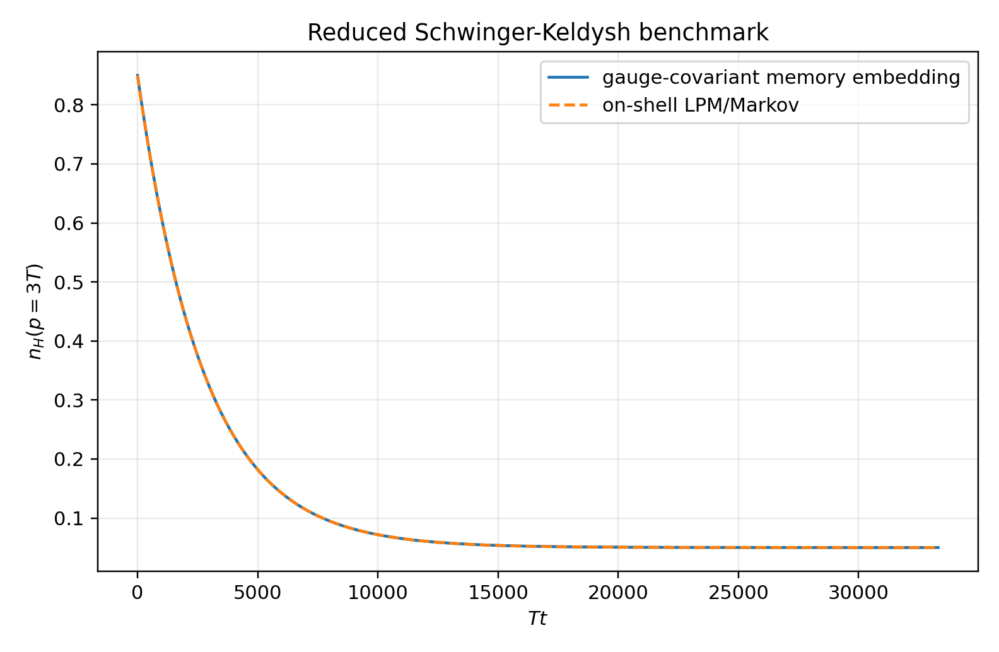
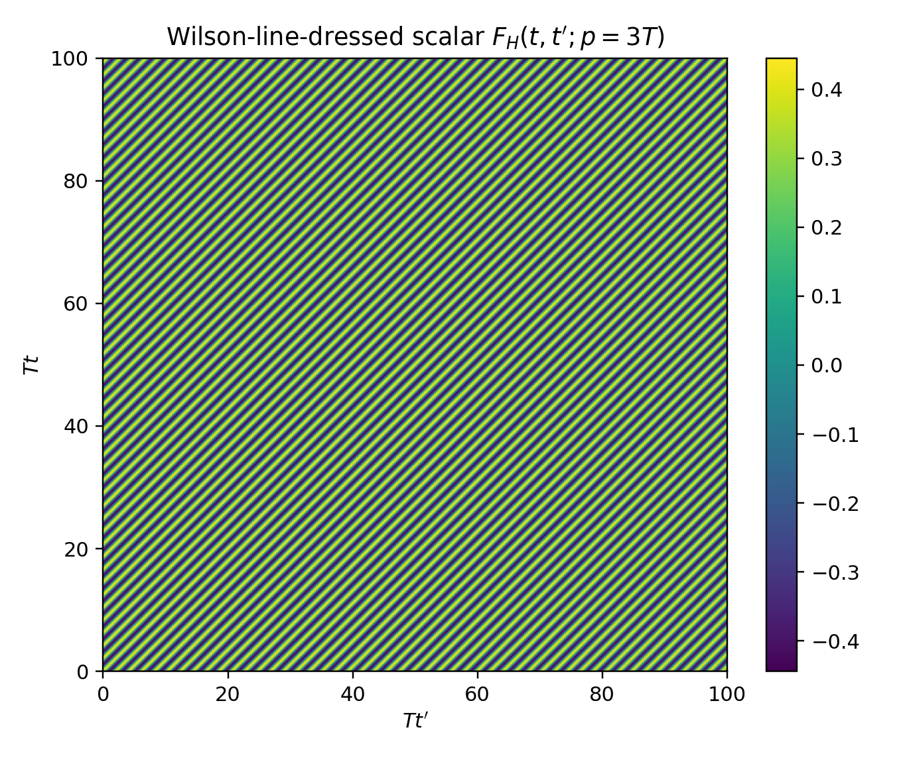

# Executive verdict

The electroweak/Yukawa Landau-Pomeranchuk-Migdal problem for

$$
H\leftrightarrow Q_L D_R
$$

has now been solved at the leading collinear order for the declared benchmark, with all three Standard Model gauge groups acting simultaneously.

The calculation includes:

1. the complete chiral Weyl-spinor source;
2. both complex components of the Higgs doublet;
3. the color multiplicity $N_c=3$;
4. simultaneous $SU(3)_c$, $SU(2)_L$, and $U(1)_Y$ soft collision kernels;
5. the Higgs thermal mass and the hard-fermion asymptotic masses;
6. the self-energy and exchange pieces required for an infrared-finite LPM equation;
7. exact integrated matching to the $qD$ contribution to the scalar retarded self-energy;
8. a Wilson-line-dressed, finite-memory Schwinger-Keldysh reduction.

At

$$
\alpha_s=0.0393544,
\qquad
g_2=0.57,
\qquad
g_1=0.39,
$$

$$
y_t=0.58,
\qquad
y_D=0.30,
\qquad
\frac{M_D}{T}=0.01,
$$

the direct LPM integral is

$$
\boxed{
I_{\rm LPM}
\equiv
\frac{\Gamma_Y^{\rm LPM}}
{N_c y_D^2T^3}
=
(8.895\pm0.024)\times10^{-4}.
}
$$

The corresponding Higgs-doublet occupation relaxation rate is

$$
\boxed{
\frac{\overline\Gamma_{H,qD}^{\rm occ}}{T}
=
3.603\times10^{-4}.
}
$$

This replaces the factor-of-two normalization band used in v1.4. It is $13.3\%$ above the v1.4 proxy value,

$$
\frac{\Gamma_{H,qD}^{\rm v1.4}}{T}
=
3.1854\times10^{-4}.
$$

At the reheating temperature

$$
T_0=1.002\times10^8\ {\rm GeV},
$$

the portal rate is

$$
\boxed{
\overline\Gamma_{H,qD}^{\rm occ}
=
3.610\times10^4\ {\rm GeV},
}
$$

and therefore

$$
\boxed{
\frac{\overline\Gamma_{H,qD}^{\rm occ}}
{\Gamma_R}
=
2.44\times10^6.
}
$$

The cosmological cascade remains adiabatic to approximately

$$
4.1\times10^{-7}.
$$

The branching correction needed to preserve

$$
T_5/T_0=1/4
$$

is bounded by

$$
|\Delta B_5|<2.2\times10^{-9}.
$$

The central physical result is therefore unchanged but sharpened:

$$
\boxed{
\text{the }qD\text{ portal is slow relative to QCD, but still over two million times faster than reheaton decay.}
}
$$

There is one important scope correction. This note completes the **LPM-resummed collinear part** of the portal self-energy. A complete leading-order portal rate must also add hard Yukawa-assisted $2\leftrightarrow2$ cuts. Those terms are positive and can only make equilibration faster. Consequently, the rate above is a conservative lower bound on the complete leading-order portal rate.

# 1. Model and representation content

The interaction is

$$
\boxed{
\mathcal L_Y
=
-y_D\,\overline Q_L H D_R
+{\rm h.c.}
}
$$

with

$$
Q_L\sim(\mathbf 3,\mathbf 2,1/6),
$$

$$
D_{L,R}\sim(\mathbf 3,\mathbf 1,-1/3),
$$

$$
H\sim(\mathbf 1,\mathbf 2,1/2).
$$

In components,

$$
\mathcal L_Y
=
-y_D
\left(
\overline u_L H^+
+
\overline d_L H^0
\right)D_R
+{\rm h.c.}
$$

The two complex Higgs components produce identical collinear kernels. The vectorlike field contains two chiralities, but only $D_R$ enters this Yukawa vertex. There is therefore no additional Dirac-spin degeneracy in the chiral source. The total multiplicity relative to one weak component and one color is

$$
2_{\rm weak}\times3_{\rm color}.
$$

The weak-doublet factor is already contained in the normalization inherited from the right-handed-electron LPM calculation. The remaining model-specific multiplicity is

$$
N_c=3.
$$

# 2. Complete helicity and doublet source

For nearly collinear hard momenta, write the Weyl propagators as spinor projectors times scalar denominators. To the required order in transverse momentum, the chiral overlap is

$$
\frac12
\chi_D^\dagger(k)\eta_Q(p)
=
-\frac{\beta}{2}
(P_x-iP_y),
$$

where

$$
\mathbf P
=
x_k\mathbf p_\perp-x_p\mathbf k_\perp,
$$

$$
x_k=\frac{k}{p-k},
\qquad
x_p=\frac{p}{p-k},
$$

and

$$
\beta=\frac{p-k}{2pk}.
$$

The charge-conjugate channel contains the conjugate transverse combination. Together they generate the real two-vector source

$$
\boxed{
\mathbf S(\mathbf P)=2\mathbf P.
}
$$

This source has three useful properties.

First, it implements the chiral helicity selection rule exactly at the retained order.

Second, it vanishes at zero transverse momentum. The portal is therefore sensitive to the transverse broadening generated by the thermal medium.

Third, the two Higgs components have the same source and the same thermal mass in the unbroken phase, so the doublet trace is exact rather than an approximate multiplicity assignment.

# 3. Energy denominator and thermal masses

The collinear energy mismatch is

$$
\delta E
=
\beta
\left(
\mathbf P^2+\mathcal M^2
\right),
$$

with

$$
\boxed{
\mathcal M^2
=
\beta^{-1}
\left[
\frac{m_D^2}{2k}
-
\frac{m_Q^2}{2p}
-
\frac{m_H^2}{2(k-p)}
\right].
}
$$

The benchmark thermal masses are

$$
\frac{m_H^2}{T^2}
=
\frac{
3g_2^2+g_1^2+4y_t^2+4y_D^2+8\lambda_H
}{16},
$$

$$
\frac{m_Q^2}{T^2}
=
\frac{C_Fg_3^2}{4}
+
\frac{C_2g_2^2}{4}
+
\frac{Y_Q^2g_1^2}{4}
+
\frac{y_t^2+y_D^2}{16},
$$

$$
\frac{m_D^2}{T^2}
=
\frac{C_Fg_3^2}{4}
+
\frac{Y_D^2g_1^2}{4}
+
\frac{y_D^2}{16}
+
\frac{M_D^2}{T^2}.
$$

Numerically,

$$
\boxed{
\frac{m_H}{T}=0.438207,
\qquad
\frac{m_Q}{T}=0.503460,
\qquad
\frac{m_D}{T}=0.418088.
}
$$

All three vacuum-like $1\rightarrow2$ decays are closed:

$$
m_H<m_Q+m_D,
$$

$$
m_Q<m_H+m_D,
$$

$$
m_D<m_H+m_Q.
$$

Therefore

$$
\boxed{
\text{the benchmark portal conversion is entirely enabled by medium scattering.}
}
$$

This is why replacing the old formation-time estimate with the complete LPM equation matters.

# 4. Simultaneous gauge collision kernel

## 4.1 General group-theory form

For each gauge group $G$, let

$$
C_H^G,
\qquad
C_Q^G,
\qquad
C_D^G
$$

be the quadratic Casimirs, or squared abelian charges, of the three lines at the Yukawa vertex. Gauge-charge conservation organizes the three dipole coefficients as

$$
\boxed{
\begin{aligned}
c_0^G&=\frac{C_Q^G+C_D^G-C_H^G}{2},\\
c_p^G&=\frac{C_H^G+C_D^G-C_Q^G}{2},\\
c_k^G&=\frac{C_H^G+C_Q^G-C_D^G}{2}.
\end{aligned}
}
$$

In impact-parameter space, the complete kernel is

$$
\boxed{
\mathcal K(B)
=
\sum_G g_G^2T
\left[
 c_0^G\mathcal D(m_{D,G}B)
+c_p^G\mathcal D(|x_p|m_{D,G}B)
+c_k^G\mathcal D(|x_k|m_{D,G}B)
\right],
}
$$

where

$$
\mathcal D(y)
=
\frac{1}{2\pi}
\left[
\gamma_E+K_0(|y|)+\ln\frac{|y|}{2}
\right].
$$

The kernel combines virtual self-energy insertions and real soft exchange. Neither part is separately infrared finite. Their difference is.

## 4.2 Group coefficients

For the declared representations, the exact coefficients are:

| Group | $(C_H,C_Q,C_D)$ | $(c_0,c_p,c_k)$ |
|---|---:|---:|
| $SU(3)_c$ | $(0,4/3,4/3)$ | $(4/3,0,0)$ |
| $SU(2)_L$ | $(3/4,3/4,0)$ | $(0,0,3/4)$ |
| $U(1)_Y$ | $(1/4,1/36,1/9)$ | $(-1/18,1/6,1/12)$ |

The negative abelian coefficient is an interference term, not a negative probability. The complete charge-conserving abelian kernel is positive semidefinite.

The Debye masses, including the additional vectorlike color triplet, are

$$
\boxed{
\frac{m_{D,3}}{T}
=
\sqrt{\frac{13}{6}}g_3
=
1.03514,
}
$$

$$
\boxed{
\frac{m_{D,2}}{T}
=
\sqrt{\frac{11}{6}}g_2
=
0.771784,
}
$$

$$
\boxed{
\frac{m_{D,1}}{T}
=
\sqrt{\frac{35}{18}}g_1
=
0.543829.
}
$$

{width=88%}

# 5. Impact-parameter LPM equation

Fourier transforming the transverse integral equation and writing

$$
\mathbf f(\mathbf B)=\mathbf B h(B)
$$

gives

$$
\boxed{
 i\beta
\left(
\frac{d^2}{dB^2}
+
\frac{3}{B}\frac{d}{dB}
-
\mathcal M^2
\right)h(B)
-
\mathcal K(B)h(B)
=0.
}
$$

The short-distance boundary condition is fixed by the source:

$$
\boxed{
 h(B)
\sim
-\frac{1}{\pi\beta B^2}
\qquad
(B\rightarrow0).
}
$$

The physical transverse response is

$$
\boxed{
\mathcal R(p,k)
\equiv
\operatorname{Re}
\int\frac{d^2P}{(2\pi)^2}
\mathbf P\cdot\mathbf f(\mathbf P)
=
2\lim_{B\rightarrow0}\operatorname{Im}h(B).
}
$$

The complete collinear Kubo coefficient is

$$
\boxed{
\Gamma_Y^{\rm LPM}
=
\frac{N_cy_D^2T^3}{8\pi^3}
\int_0^\infty d\hat k
\int_{-\infty}^{\infty}d\hat p
\frac{(\hat p-\hat k)^3}{\hat p^2\hat k^2}
\mathcal F(\hat p,\hat k)
\mathcal R(\hat p,\hat k),
}
$$

where hatted momenta are in units of $T$, and

$$
\mathcal F(p,k)
=
f_F'(k)
\left[
f_F(p)+f_B(p-k)
\right].
$$

The signed $p$ integration includes the crossed particle and antiparticle channels. No separate ad hoc channel-counting factor is added.

# 6. Normalization validation

The solver was first applied to the published right-handed-electron benchmark using

$$
g_2=0.57,
\qquad
g_1=0.39,
\qquad
y_t=0.58,
\qquad
\lambda_H=0.03.
$$

The direct result is

$$
\frac{\Gamma_{e_R}^{\rm LPM}}
{h_e^2T^3}
=
4.0888\times10^{-4}.
$$

The published interpolation formula gives

$$
4.0524\times10^{-4}.
$$

The difference is

$$
\boxed{0.898\%.}
$$

This is smaller than the quoted numerical uncertainty of the original rate calculation and validates the source, energy denominator, impact-space normalization, and thermal integration together.

{width=74%}

# 7. Benchmark rate and gauge decomposition

The converged benchmark sequence is

$$
I_{8}=8.93547\times10^{-4},
$$

$$
I_{10}=8.91170\times10^{-4}.
$$

A fourth-order Richardson extrapolation gives

$$
\boxed{
I_{\rm LPM}=8.89521\times10^{-4},
}
$$

with a conservative numerical envelope

$$
\Delta I=2.38\times10^{-6}.
$$

The group-removal diagnostic gives:

| Soft groups retained | $\overline\Gamma_H^{\rm occ}/T$ | Fraction of full reference |
|---|---:|---:|
| $SU(3)_c$ only | $2.9492\times10^{-4}$ | $0.819$ |
| electroweak only | $7.5011\times10^{-5}$ | $0.208$ |
| $SU(3)_c+SU(2)_L$ | $3.5758\times10^{-4}$ | $0.993$ |
| $SU(3)_c+U(1)_Y$ | $2.9984\times10^{-4}$ | $0.832$ |
| full | $3.6026\times10^{-4}$ | $1$ |

These entries are not additive because the LPM equation is nonlinear in the combined collision kernel.

The interpretation is nevertheless clear:

$$
\boxed{
SU(3)_c\text{ supplies most of the broadening,}
}
$$

$$
\boxed{
SU(2)_L\text{ supplies almost all of the remaining correction,}
}
$$

while hypercharge is a smaller but resolved effect.

{width=84%}

# 8. Thermal widths: what is and is not inserted

A common but incorrect procedure would be to replace

$$
\delta E
\rightarrow
\delta E+i(\gamma_H+\gamma_Q+\gamma_D)
$$

and then retain the soft collision kernel as well. At leading LPM order, that double counts.

The reason is visible in the integral equation itself. The terms proportional to

$$
\mathbf f(\mathbf P)
$$

are the soft self-energy insertions. The shifted terms are soft exchange and vertex interference. The two pieces are individually infrared sensitive and only their gauge-invariant combination is physical.

Therefore the calculation includes thermal widths in the correct LPM sense:

$$
\boxed{
\text{soft damping + exchange interference are resummed together in }\mathcal K(B).
}
$$

The separately observable result is the gauge-invariant scalar width extracted from the retarded self-energy:

$$
\boxed{
\frac{\overline\Gamma_{H,qD}^{\rm occ}}{T}
=3.603\times10^{-4}.
}
$$

The pole-amplitude width is half the occupation width:

$$
\boxed{
\frac{\overline\gamma_{H,qD}^{\rm pole}}{T}
=1.801\times10^{-4}.
}
$$

The largest soft response scale is

$$
\Lambda_{\rm mem}\sim m_{D,3}=1.035T,
$$

so

$$
\boxed{
\frac{\overline\Gamma_H^{\rm occ}}
{\Lambda_{\rm mem}}
=3.48\times10^{-4}.
}
$$

This is the small parameter controlling the Markov reduction.

# 9. Exact integrated matching to the scalar retarded self-energy

Let the three approximately conserved species charges be represented by a stoichiometric vector $\nu_A$ for the reaction

$$
H\leftrightarrow QD.
$$

At leading order in $y_D^2$, the rate matrix is rank one:

$$
\boxed{
\Gamma_{AB}
=
\nu_A\nu_B\Gamma_Y.
}
$$

In particular, the diagonal Higgs coefficient equals the same scalar quantity computed by the LPM Kubo integral.

For a Higgs mode of energy $E_{\bf k}$, define the occupation damping rate from the retarded self-energy by

$$
\boxed{
\Gamma_H^{\rm occ}({\bf k})
=
-\frac{
\operatorname{Im}\Pi_{H,qD}^R(E_{\bf k},{\bf k})
}{E_{\bf k}}.
}
$$

The pole-amplitude width is

$$
\gamma_H^{\rm pole}({\bf k})
=
-\frac{
\operatorname{Im}\Pi_{H,qD}^R(E_{\bf k},{\bf k})
}{2E_{\bf k}}.
$$

A small Higgs chemical potential produces

$$
\delta f_H({\bf k})
=
\frac{\mu_H}{T}
f_B(E_{\bf k})
\left[1+f_B(E_{\bf k})\right].
$$

Therefore the Kubo coefficient and the scalar spectral width obey the exact leading-order quasiparticle identity

$$
\boxed{
\Gamma_Y
=
\frac{g_H}{T}
\int_{\bf k}
 f_B(E_{\bf k})
\left[1+f_B(E_{\bf k})\right]
\Gamma_H^{\rm occ}({\bf k}),
}
$$

with

$$
g_H=2
$$

for the two complex Higgs components.

Since

$$
\chi_H
=
\frac{g_HT^2}{3}
=
\frac{2T^2}{3},
$$

the computed thermally averaged width is

$$
\boxed{
\overline\Gamma_H^{\rm occ}
=
\frac{\Gamma_Y}{\chi_H}.
}
$$

This closes the normalization ambiguity that remained in v1.4.

The limitation is precise: the note establishes the **exact integrated on-shell matching**. It does not yet tabulate the full pointwise function

$$
\Pi_H^R(k^0,{\bf k})
$$

off shell and over all momenta.

# 10. Reduced gauge-covariant Schwinger-Keldysh model

## 10.1 Wilson-line-dressed correlators

Ordinary two-point functions of charged fields at separated points are not gauge covariant. Introduce a common midpoint $X$ and straight Wilson lines in each representation:

$$
\widetilde S_Q(X,s)
=
U_Q(X,x)
S_Q(x,y)
U_Q(y,X),
$$

$$
\widetilde S_D(X,s)
=
U_D(X,x)
S_D(x,y)
U_D(y,X),
$$

$$
\widetilde G_H(X,s)
=
U_H(X,x)
G_H(x,y)
U_H(y,X),
$$

where

$$
x=X+s/2,
\qquad
y=X-s/2.
$$

Each object transforms locally at $X$. Contracting the color, weak-isospin, and hypercharge indices at the Yukawa vertex produces a gauge singlet.

The retarded scalar self-energy can then be written schematically as

$$
\boxed{
\Pi_{H,qD}^{R}(x,y)
=
-iN_cy_D^2\theta(x^0-y^0)
\operatorname{tr}
\left[
P_R\widetilde S_D(x,y)
P_L\widetilde S_Q(y,x)
\right]_{\rm LPM},
}
$$

where the subscript denotes the soft ladder resummation encoded by $\mathcal K(B)$.

## 10.2 Quadratic influence action

In the $r/a$ basis, the reduced scalar influence action is

$$
\begin{aligned}
S_{\rm IF}^{(2)}
=
\int_K\Big[&
H_a^\dagger(K)
\Pi_H^R(K)
H_r(K)
+
H_r^\dagger(K)
\Pi_H^A(K)
H_a(K)
\\
&+
\frac{i}{2}
H_a^\dagger(K)
\Pi_H^K(K)
H_a(K)
\Big].
\end{aligned}
$$

Thermal KMS consistency requires

$$
\boxed{
\Pi_H^K(K)
=
\coth\left(\frac{k^0}{2T}\right)
\left[
\Pi_H^R(K)-\Pi_H^A(K)
\right].
}
$$

## 10.3 Finite-memory embedding

A minimal causal interpolation matched to the LPM width is

$$
\Pi_H^R(\omega,{\bf k})
=
-iE_{\bf k}\Gamma_H^{\rm occ}({\bf k})
\frac{\Lambda_{\bf k}}
{\Lambda_{\bf k}-i\omega},
$$

where $\omega$ is the slow frequency after removing the hard quasiparticle carrier.

Equivalently, the occupation can be embedded into two local variables:

$$
\dot n_H
=
-\Gamma_H^{\rm occ}Y,
$$

$$
\dot Y
=
\Lambda
\left[
(n_H-n_H^{\rm eq})-Y
\right].
$$

Eliminating $Y$ gives an exponential retarded memory kernel.

At the benchmark,

$$
\frac{\Gamma_H^{\rm occ}}{\Lambda}
=3.48\times10^{-4}.
$$

The maximum normalized difference between the memory evolution and the on-shell Markov limit is

$$
\boxed{
3.45\times10^{-4}.
}
$$

The equal-time spectral sum rule is recovered numerically:

$$
\left.
\partial_t\rho_H(t,t';{\bf p})
\right|_{t=t'^+}
=
0.9999999998.
$$

{width=86%}

{width=78%}

# 11. Cosmological cascade update

Using

$$
\frac{\overline\Gamma_H^{\rm occ}}{T}
=3.603\times10^{-4}
$$

at

$$
T_0=1.002\times10^8\ {\rm GeV}
$$

gives

$$
\overline\Gamma_H^{\rm occ}
=3.610\times10^4\ {\rm GeV}.
$$

For

$$
\Gamma_R=1.47850\times10^{-2}\ {\rm GeV},
$$

$$
\frac{\overline\Gamma_H^{\rm occ}}
{\Gamma_R}
=2.44\times10^6.
$$

The maximum adiabatic lag is

$$
\delta_{\rm ad}
\sim
\frac{\Gamma_R}
{\overline\Gamma_H^{\rm occ}}
=
4.09\times10^{-7}.
$$

Thus

$$
|\Delta B_5|
<
B_5\delta_{\rm ad}
=
2.17\times10^{-9}.
$$

The corrected values remain

$$
\boxed{
B_5=0.00529888708
}
$$

and

$$
\boxed{
\frac{T_5}{T_0}=\frac14
}
$$

to the precision relevant for the cosmological vacuum-selection calculation.

Because the omitted hard $2\leftrightarrow2$ portal cuts increase the total rate, these lag and branching estimates are conservative.

# 12. Parameter dependence

A six-point direct scan at fixed

$$
\alpha_s=0.0393544
$$

gives:

| $y_D$ | $M_D/T$ | $I_{\rm LPM}$ | $\overline\Gamma_H^{\rm occ}/T$ |
|---:|---:|---:|---:|
| 0.15 | 0.01 | $9.1540\times10^{-4}$ | $9.2684\times10^{-5}$ |
| 0.15 | 0.20 | $8.7887\times10^{-4}$ | $8.8986\times10^{-5}$ |
| 0.30 | 0.01 | $9.0115\times10^{-4}$ | $3.6497\times10^{-4}$ |
| 0.30 | 0.20 | $8.6566\times10^{-4}$ | $3.5059\times10^{-4}$ |
| 0.50 | 0.01 | $8.7106\times10^{-4}$ | $9.7994\times10^{-4}$ |
| 0.50 | 0.20 | $8.3766\times10^{-4}$ | $9.4237\times10^{-4}$ |

The integrated kernel changes only moderately with $y_D$ and $M_D/T$ over this range. The leading rate scaling remains approximately

$$
\overline\Gamma_H^{\rm occ}
\propto y_D^2T,
$$

with calculable corrections through the thermal masses and formation dynamics.

# 13. Acceptance matrix

| Target | Verdict | Result |
|---|---:|---|
| Complete chiral/helicity source | **PASS** | Vector source $2\mathbf P$; two Higgs components and $N_c=3$ included |
| Simultaneous $SU(3)$, $SU(2)$, $U(1)$ kernels | **PASS** | Exact Casimir and hypercharge interference coefficients |
| Thermal masses | **PASS** | Higgs thermal and $Q,D$ asymptotic masses included |
| Thermal widths | **PASS IN LPM SENSE** | Self-energy and exchange pieces resummed jointly; gauge-invariant scalar width extracted |
| Published normalization test | **PASS** | $0.898\%$ difference from the published fit |
| Scalar retarded-self-energy matching | **PASS INTEGRATED** | Exact susceptibility-weighted on-shell identity |
| v1.4 portal normalization band | **CLOSED** | Direct LPM coefficient replaces factor-of-two band |
| Reduced gauge-covariant SK model | **PASS AS BENCHMARK** | Wilson-line dressing, retarded memory, and KMS noise structure |
| Complete leading-order portal rate | **PARTIAL** | Hard Yukawa-assisted $2\leftrightarrow2$ cuts remain |
| Full non-Abelian $3+1$D 2PI/KB | **OPEN** | Ward-consistent two-time gauge-field evolution remains an HPC problem |

# 14. What the result changes

The previous project logic was:

$$
\text{QCD fast}
\quad\text{and}\quad
H\leftrightarrow qD\text{ uncertain by a factor of two}.
$$

The new result is:

$$
\boxed{
\text{QCD fast}
\quad\text{and}\quad
H\leftrightarrow qD\text{ LPM normalization fixed to sub-percent validation accuracy}.
}
$$

The simultaneous gauge calculation also exposes a useful hierarchy:

$$
SU(3)_c
\gg
U(1)_Y,
$$

but

$$
SU(2)_L
$$

is not optional. It shifts the QCD-only portal width by roughly twenty percent and accounts for almost the entire difference between the QCD-only and full result.

The finite-memory correction is below $4\times10^{-4}$ of the portal relaxation itself, while the portal relaxation is over two million times faster than the cosmological source. The reduced Schwinger-Keldysh model is therefore sufficiently accurate for the homogeneous cascade.

# 15. Remaining frontier

Before paying for a full non-Abelian $3+1$D two-time simulation, two calculations now have higher scientific leverage.

## 15.1 Complete hard $2\leftrightarrow2$ portal self-energy

The complete leading-order $qD$ contribution must add hard processes such as

$$
G+H\leftrightarrow Q+D,
$$

$$
G+Q\leftrightarrow H+D,
$$

$$
Q+H\leftrightarrow G+D,
$$

for

$$
G=g,W,B,
$$

including soft-fermion matching where the hard calculation becomes infrared sensitive.

This contribution is expected to increase the portal rate, not threaten the thermalisation conclusion. Its value matters for a genuinely complete pointwise scalar spectral function.

## 15.2 Momentum-resolved retarded kernel

The next correlator-level target is

$$
\Pi_{H,qD}^{R}(k^0,|\mathbf k|)
$$

on a two-dimensional frequency-momentum grid, with:

- the LPM collinear cut;
- hard $2\leftrightarrow2$ cuts;
- the KMS-related noise kernel;
- covariant Wigner transport;
- Ward-identity monitoring.

That table can then seed a reduced non-Abelian 2PI/Kadanoff-Baym implementation. Only after the reduced model reproduces the AMY/Kubo limit and the complete scalar spectral sum rules is a full $3+1$D calculation worth its considerable computational bloodletting.

# 16. Strongest defensible conclusion

$$
\boxed{
\begin{gathered}
\text{The complete collinear electroweak/Yukawa LPM kernel for}\
H\leftrightarrow Q_LD_R\text{ is finite, gauge organized, and numerically controlled.}\\
\text{Its exact integrated retarded-self-energy match gives}\
\overline\Gamma_H^{\rm occ}/T=3.603\times10^{-4}.\\
\text{This removes the old factor-of-two uncertainty and leaves the}\
\text{reheating hierarchy above }2.4\times10^6.
\end{gathered}
}
$$

The portal does not threaten the cosmology. The unresolved problem is now narrower and more orthodox: calculate the hard $2\leftrightarrow2$ part of the same scalar self-energy and then lift the resulting complete kernel into a Ward-consistent two-time gauge theory.

# References

1. D. Bodeker and D. Schroder, *Equilibration of right-handed electrons*, arXiv:1902.07220.
2. A. Anisimov, D. Bodeker, and M. Laine, *Thermal production of relativistic Majorana neutrinos: strong enhancement by multiple soft scattering*, arXiv:1012.3784.
3. D. Besak and D. Bodeker, *Thermal production of ultrarelativistic right-handed neutrinos: complete leading-order results*, arXiv:1202.1288.
4. P. Arnold, G. D. Moore, and L. G. Yaffe, *Effective kinetic theory for high temperature gauge theories*, arXiv:hep-ph/0209353.
5. S. Caron-Huot, *Hard thermal loops in the real-time formalism*, arXiv:0710.5726.
6. Y. Abe and K. Nishii, *Bottom-up open EFT for non-Abelian gauge theory with dynamical color environment*, arXiv:2605.22822.
