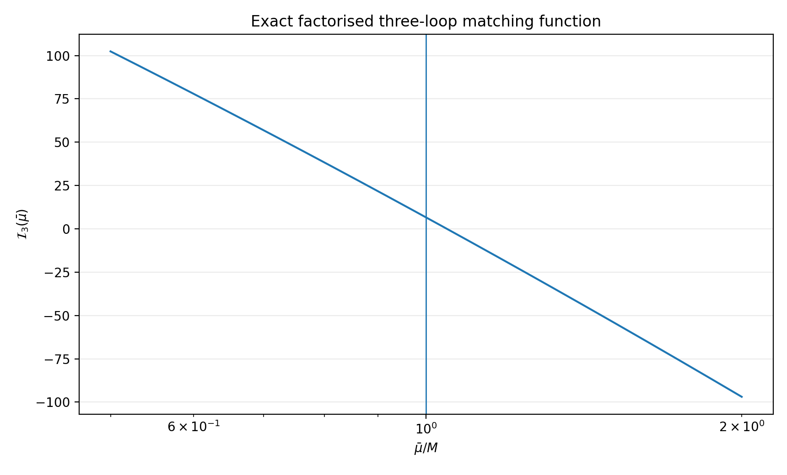
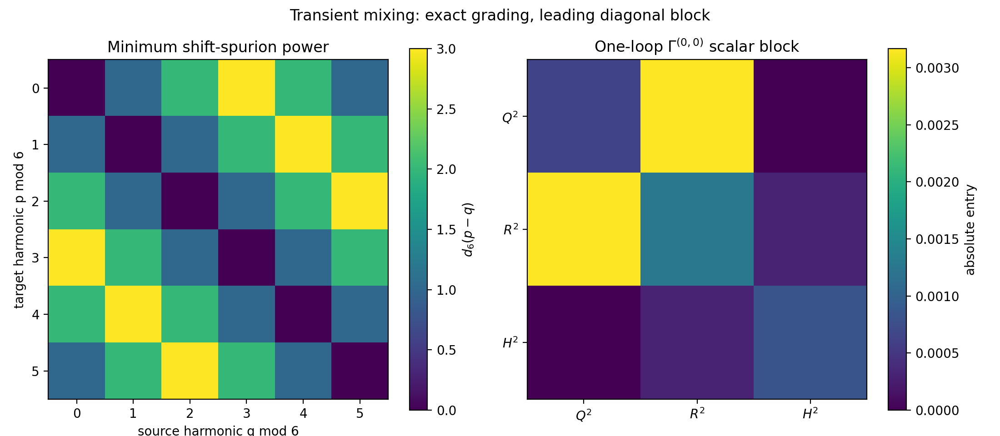
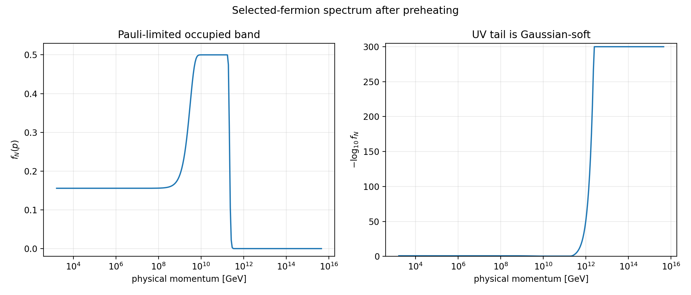
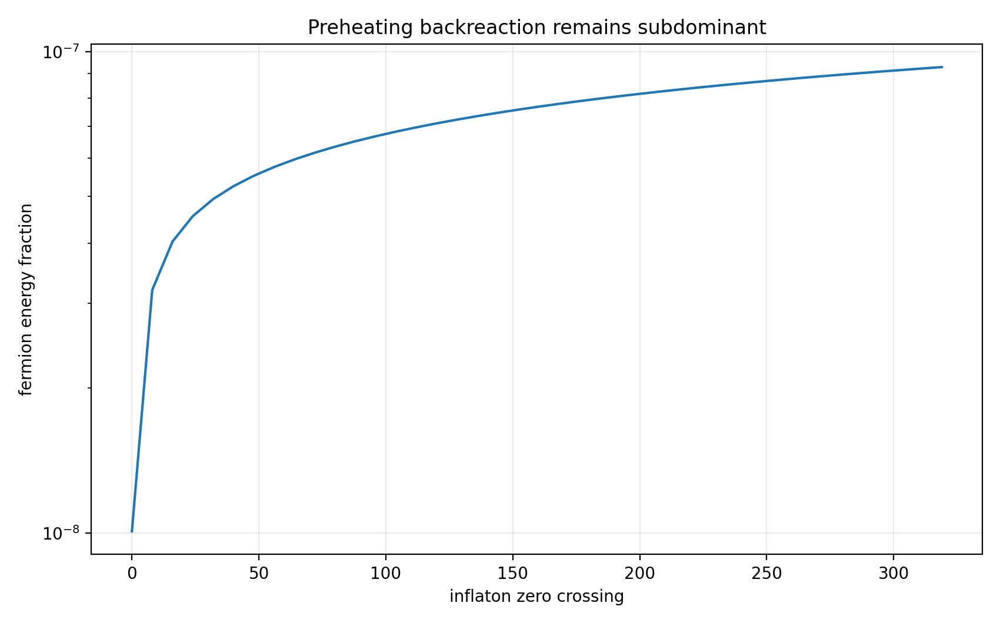
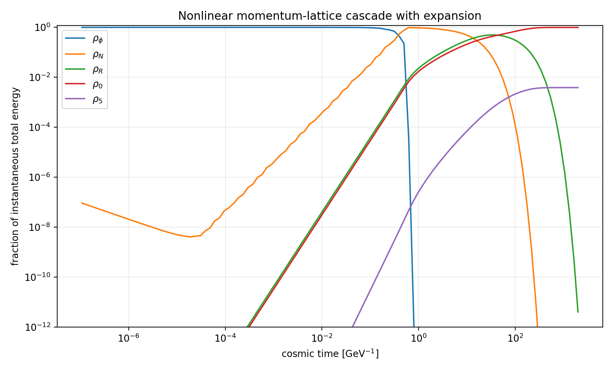
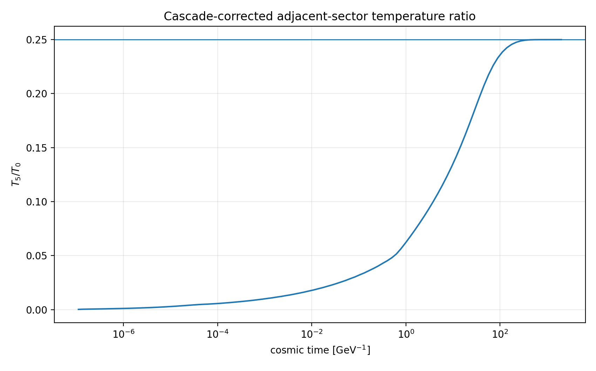
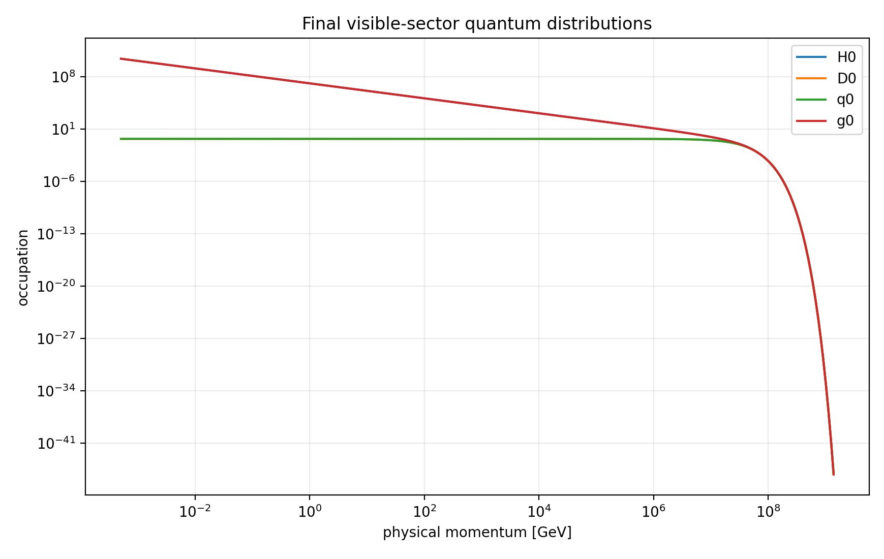
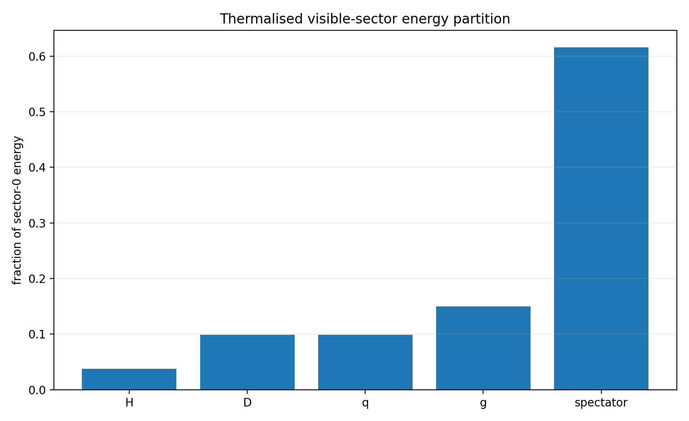

# Executive verdict

The v1.2 calculation gives a **pass for the factorised matching problem**, a **qualified pass for the transient operator renormalisation problem**, and a **pass for the nonlinear radial momentum-lattice benchmark**. It does not yet constitute a full non-Abelian, two-time, $3+1$-dimensional Kadanoff-Baym simulation.

The first selector-threshold graph identified in v1.1 is three-loop and one-particle irreducible, but it is two-particle reducible. That fact is decisive: its zero-external-momentum matching coefficient does not require an unknown generic three-loop master integral. It factorises into:

1. a finite one-loop selector-reheaton-Higgs kernel; and
2. a mixed mass derivative of the known two-loop fermion-fermion-scalar effective-potential function.

In the explicitly normalised scalar proxy used here,

$$
\boxed{
\mathcal I_3(\bar\mu)
=
2m_R^2K_{RRH}(m_R^2,m_h^2)
D_{FFS}(M^2,m_h^2;\bar\mu)
}
$$

and at the natural hard matching scale $\bar\mu=M$,

$$
\boxed{
\mathcal I_3(M)=6.57973508149
\simeq
\frac{2\pi^2}{3}.
}
$$

The resulting transient selector-phase potential has benchmark amplitude

$$
\boxed{
|\Delta V_{Qa}^{(3)}|
=2.1723\times10^3\ {\rm GeV}^4,
}
$$

which is only

$$
\boxed{
1.546\times10^{-12}
}
$$

of the intended finite-density reheating force. The first mixed vacuum correction is therefore negligible in the benchmark.

The anomalous-dimension audit also corrects one overstatement in v1.1. Exact $Z_6$ symmetry **does not by itself make the complete invariant transient-operator basis block diagonal to all orders**. The correct statement is:

$$
\boxed{
\gamma_{(A,p)(B,q)}
=
\sum_{r,s\ge0}
\delta_{p-q,r-s}\,
\epsilon^{r+s}
\Gamma_{AB}^{(r,s)},
}
$$

with replica Fourier charge conserved modulo six. It is block diagonal at order $\epsilon^0$; changing harmonic $q\to p$ requires the corresponding number of shift-breaking spurion insertions. For the cosmological benchmark $\epsilon=2.7\times10^{-13}$, the first cross-harmonic entries are consequently negligible, but the finite gauge/Yukawa tensors $\Gamma_{AB}^{(r,s)}$ remain model-dependent and have not all been computed.

The nonlinear momentum-lattice evolution resolves the chain

$$
\phi
\longrightarrow
N_0\bar N_0
\longrightarrow
R_0\nu_0
\longrightarrow
H_0,H_5
\longrightarrow
D_k,q_k,g_k
$$

with expansion, Pauli blocking, time-dilated two-body decays, exact isotropic decay kinematics on a radial momentum grid, and an energy-conserving quantum-BGK thermalisation closure.

It finds:

$$
\boxed{
\frac{\rho_N}{\rho_{\rm tot}}\bigg|_{\rm preheat}
=9.2845\times10^{-8},
\qquad
\max f_N=0.999929,
}
$$

and an unselected-replica production bound of approximately

$$
\log_{10}P_{N_h}<-8562.6.
$$

The cascade exposes one mandatory correction to v0.9-v1.1. The decay $N_0\to R_0\nu_0$ deposits the energetic $\nu_0$ daughter into sector 0 before $R_0$ decays. The old choice $\tan\theta=1/16$, equivalent to $B_5=1/257$, therefore does **not** produce $T_5/T_0=1/4$. The full lattice gives the redshift-corrected branch

$$
\boxed{
B_5=0.00527437084,
\qquad
\tan\theta=0.0728196,
}
$$

and

$$
\boxed{
\frac{T_5}{T_0}=0.250000001.
}
$$

The maximum two-body kinematic energy residual is $5.59\times10^{-16}$ and the maximum collision-step energy residual is $1.73\times10^{-16}$.

The strongest defensible conclusion is therefore:

$$
\boxed{
\begin{gathered}
\text{the first mixed selector-threshold correction is calculable and tiny,}\\
\text{the state-selected fermionic cascade preserves the desired replica hierarchy,}\\
\text{and no radiative or nonlinear failure appears at the resolved level.}
\end{gathered}
}
$$

The remaining frontier is not an unidentified $\mathcal I_3$. It is the full RG-improved operator basis and the replacement of the BGK plasma closure by genuine non-Abelian collision or 2PI/Kadanoff-Baym kernels.

# 1. Model and matching normalisation

## 1.1 Scalar proxy for the mixed topology

The calculation isolates the selector-threshold topology with the interaction normalisation

$$
\begin{aligned}
\mathcal L_{\rm proxy}\supset{}&
-\frac12
\left(m_R^2+\lambda_{QR}\mathcal Q\right)R^2
-\frac{\mu_H}{2}Rh^2
-y_Dh\bar qD
-M(a)\bar DD,
\end{aligned}
$$

where

$$
x\equiv\frac a{f_a},
\qquad
M(a)=M\left[1-\epsilon\cos x\right],
$$

so that, to first order in $\epsilon$,

$$
\delta M^2(a)=-2\epsilon M^2\cos x.
$$

The selector Fourier composite carrying the compensating $Z_6$ charge is denoted schematically by $\mathcal Q$. On the one-hot branch used in cosmology, $\mathcal Q\to v_Q^2$ up to its phase convention.

This proxy deliberately does not claim every Standard Model Higgs-doublet, colour, gauge, and chiral multiplicity. It fixes the scalar normalisation in which the factorisation and benchmark coefficient are exact. A complete model matching can be obtained by restoring the appropriate group-theory and field-multiplicity factors.

## 1.2 Why the graph factorises

The microscopic graph contains:

- one selector insertion in an $R$ propagator;
- two $Rhh$ vertices;
- two Yukawa vertices joining $h$, $q$, and $D$;
- one phase-dependent insertion in the heavy $D$ mass.

Its graph count is

$$
I=8,
\qquad
V=6,
\qquad
L=I-V+1=3.
$$

It is 1PI but two-particle reducible. At zero external momentum, cutting the two Higgs lines separates the selector-reheaton loop from the two-loop $FFS$ vacuum skeleton. The matching therefore takes the form

$$
\Delta V_{Qa}^{(3)}
=
\frac{N_cy_D^2}{(16\pi^2)^2}
\frac{\partial^2f_{FFS}}{\partial M^2\partial m_h^2}
\delta M^2(a)\,
\delta m_h^2(\mathcal Q),
$$

where the selector-generated Higgs mass insertion is

$$
\delta m_h^2(\mathcal Q)
=
\frac{\lambda_{QR}\mu_H^2}{16\pi^2}
K_{RRH}(m_R^2,m_h^2)\mathcal Q.
$$

Generic three-loop vacuum diagrams with arbitrary masses require integration-by-parts reduction to a master basis and numerical tools such as 3VIL. The topology here is simpler because its 2PR structure exposes the factorisation before such a reduction is required.

# 2. Exact factorised three-loop coefficient

## 2.1 One-loop selector kernel

The finite Euclidean kernel, with the overall $1/(16\pi^2)$ removed, is

$$
\boxed{
K_{RRH}(A,B)
=
\frac{A-B-B\ln(A/B)}{(A-B)^2}.
}
$$

It corresponds to

$$
\int\frac{d^4p}{(2\pi)^4}
\frac{1}{(p^2+A)^2(p^2+B)}.
$$

The equal-mass limit is smooth:

$$
K_{RRH}(A,A)=\frac{1}{2A}.
$$

For the benchmark hierarchy $m_R\gg m_h$,

$$
m_R^2K_{RRH}(m_R^2,m_h^2)
=0.999999999999517.
$$

## 2.2 Mixed derivative of the two-loop FFS function

In Martin's two-loop effective-potential notation,

$$
f_{FFS}(x,0,z)
=-J(x,z)+(x-z)I(0,x,z).
$$

Taking the exact mixed derivative gives

$$
\boxed{
\begin{aligned}
D_{FFS}(x,z;\bar\mu)
\equiv{}&
\frac{\partial^2f_{FFS}(x,0,z)}{\partial x\partial z}
\\[1mm]
={}&
2\ln\frac{x}{z}
\ln\frac{x-z}{\bar\mu^2}
-
\ln^2\frac{x}{\bar\mu^2}
-
2\operatorname{Li}_2\left(\frac zx\right)
+
\frac{\pi^2}{3}.
\end{aligned}
}
$$

The symbolic residual between this expression and the derivative of the full $I(0,x,z)$ representation is exactly zero.

At the hard scale $\bar\mu=M$ and for $z/x\to0$,

$$
D_{FFS}\longrightarrow\frac{\pi^2}{3}.
$$

The benchmark gives

$$
D_{FFS}(M^2,m_h^2;M)=3.28986754075,
$$

with a 70-digit independent derivative check agreeing to relative error

$$
4.05\times10^{-16}.
$$

## 2.3 Exact matching function

Combining the two factors defines

$$
\boxed{
\mathcal I_3(\bar\mu)
=
2m_R^2
K_{RRH}(m_R^2,m_h^2)
D_{FFS}(M^2,m_h^2;\bar\mu).
}
$$

The three-loop Wilson coefficient is

$$
\boxed{
C_3^{\overline{\rm MS}}(\bar\mu)
=
\frac{N_c\lambda_{QR}y_D^2}{(16\pi^2)^3}
\frac{\mu_H^2M^2}{m_R^2}
\mathcal I_3(\bar\mu).
}
$$

The transient operator is then

$$
\Delta V_{Qa}^{(3)}
=
\epsilon C_3^{\overline{\rm MS}}
\operatorname{Re}\left[e^{ix}\mathcal Q_{-1}\right]
+O(\epsilon^2).
$$

For

$$
\begin{gathered}
N_c=3,
\quad
\lambda_{QR}=0.50,
\quad
y_D=0.30,
\quad
\mu_H=1.8848\times10^4\ {\rm GeV},\\
M=1.002\times10^6\ {\rm GeV},
\quad
m_R=10^9\ {\rm GeV},
\quad
m_h=125.25\ {\rm GeV},
\end{gathered}
$$

one obtains

$$
\mathcal I_3(M)=6.57973508149,
$$

$$
C_3(M)=8.04542\times10^{-5}\ {\rm GeV}^2.
$$

With

$$
\epsilon=2.70\times10^{-13},
\qquad
v_Q=10^{10}\ {\rm GeV},
$$

this gives

$$
|\Delta V_{Qa}^{(3)}|
=2.1723\times10^3\ {\rm GeV}^4.
$$

The intended state-dependent thermal focusing potential is approximately

$$
V_{\rm thermal}=1.4053\times10^{15}\ {\rm GeV}^4,
$$

hence

$$
\frac{|\Delta V_{Qa}^{(3)}|}{V_{\rm thermal}}
=1.5458\times10^{-12}.
$$

{width=86%}

## 2.4 Scale dependence and what remains to be matched

The fixed-order values are

$$
\mathcal I_3(M/2)=102.4073,
\qquad
\mathcal I_3(M)=6.57974,
\qquad
\mathcal I_3(2M)=-96.9351.
$$

This large scale variation reflects the hierarchy $m_R\gg M\gg m_h$ and the absence of RG improvement in the displayed coefficient. It must not be interpreted as a physical uncertainty band. A complete calculation should:

1. match at the heavy scales;
2. evolve the transient operator basis between $m_R$, $M$, and $m_h$;
3. include finite gauge, chiral, and Higgs-doublet multiplicities; and
4. verify cancellation of $\bar\mu$ dependence in the physical focusing force.

The exact result delivered here is the hard zero-momentum matching function in the scalar proxy.

# 3. Transient anomalous dimensions

## 3.1 Combined symmetry and operator basis

Let the exact generator act as

$$
z:
\quad
x\to x+\frac{2\pi}{6},
\qquad
k\to k+1.
$$

For a replica Fourier composite

$$
\mathcal X_{A,p}
=
\sum_{k=0}^{5}
X_{A,k}\,e^{-2\pi ipk/6},
$$

one has

$$
\mathcal X_{A,p}\to e^{2\pi ip/6}\mathcal X_{A,p}.
$$

A transient invariant can therefore be written as

$$
\mathcal O_{A,p}
=
e^{ipx}\mathcal X_{A,-p}.
$$

Every $\mathcal O_{A,p}$ is invariant under the exact combined $Z_6$. Consequently, $Z_6$ invariance alone does not distinguish different $p$ values inside the invariant basis.

The additional grading comes from the restored continuous shift symmetry in the limit $\epsilon\to0$. Let a positive and negative shift-breaking insertion carry charges $+1$ and $-1$. Renormalising harmonic $q$ into harmonic $p$ requires integers $r,s\ge0$ satisfying

$$
r-s=p-q.
$$

Therefore the exact spurion expansion is

$$
\boxed{
\gamma_{(A,p)(B,q)}
=
\sum_{r,s\ge0}
\delta_{p-q,r-s}
\epsilon^{r+s}
\Gamma_{AB}^{(r,s)},
}
$$

with the corresponding replica charge conserved modulo six.

At leading order,

$$
\boxed{
\gamma_{(A,p)(B,q)}
=
\delta_{pq}
\left[
\Gamma_{\rm quad}^{T}
+p\gamma_\epsilon\mathbf1
\right]
+O(\epsilon).
}
$$

The earlier claim of exact all-orders block diagonality was therefore too strong. The corrected statement is stronger physically and weaker algebraically:

$$
\boxed{
q\to p\text{ mixing begins at the minimum permitted power of }\epsilon.
}
$$

For sectors folded modulo six, the minimum power is

$$
d_6(p-q)=\min\left(|p-q|,6-|p-q|\right).
$$

Integer harmonic grading must still be retained: the neutral vacuum harmonic $p=6$ begins at $\epsilon^6$, even though $6\equiv0\pmod6$.

## 3.2 Explicit one-loop scalar block

For real scalar variables with convention

$$
V_4
=
\sum_i\frac{\lambda_i}{4!}X_i^4
+
\sum_{i<j}\frac{\lambda_{ij}}4X_i^2X_j^2,
$$

the one-loop bilinear block before gauge and Yukawa additions is

$$
\Gamma_{\rm quad}^{(0,0)}
=
\frac1{16\pi^2}
\begin{pmatrix}
\lambda_Q&\lambda_{QR}&\lambda_{QH}\\
\lambda_{QR}&\lambda_R&\lambda_{RH}\\
\lambda_{QH}&\lambda_{RH}&\lambda_H
\end{pmatrix}.
$$

For the diagnostic couplings

$$
(\lambda_Q,\lambda_R,\lambda_H)
=(0.10,0.20,0.13),
$$

$$
(\lambda_{QR},\lambda_{QH},\lambda_{RH})
=(0.50,0,0.05),
$$

this is

$$
\Gamma_{\rm quad}^{(0,0)}
=
\begin{pmatrix}
6.3326\times10^{-4}&3.1663\times10^{-3}&0\\
3.1663\times10^{-3}&1.2665\times10^{-3}&3.1663\times10^{-4}\\
0&3.1663\times10^{-4}&8.2323\times10^{-4}
\end{pmatrix}.
$$

At $\epsilon=2.7\times10^{-13}$, a nearest-harmonic entry with a coefficient comparable to the largest scalar-block entry is at most of order

$$
8.55\times10^{-16}.
$$

{width=98%}

## 3.3 Local operators versus state harmonics

The local Wilson coefficients obey

$$
\mu\frac{dC_{A,p}}{d\mu}
=
\sum_{B,q}
\gamma_{(A,p)(B,q)}C_{B,q}.
$$

The occupation harmonics

$$
\mathcal N_p(t,\mathbf k)
=
\sum_k n_k(t,\mathbf k)e^{-2\pi ipk/6}
$$

are not governed by this local anomalous-dimension matrix. Their evolution is determined by Kadanoff-Baym or collision kernels. Confusing these two kinds of evolution would conflate vacuum renormalisation with finite-density transport.

The full finite $\Gamma_{AB}^{(r,s)}$ tensors involving gauge, Yukawa, fermion bilinear, and gluonic operators remain an open calculation. The symmetry-imposed power structure is exact; the complete coefficients are not yet known.

# 4. Fermionic preheating stage

## 4.1 Successive zero-crossing map

The selected fermionic parent has

$$
\mathcal L\supset-y_\phi\phi\bar N_0N_0,
$$

with benchmark

$$
m_\phi=10^{10}\ {\rm GeV},
\quad
\Phi_{\rm end}=5.96\times10^{16}\ {\rm GeV},
\quad
m_{N_0}=3\times10^9\ {\rm GeV},
$$

$$
y_\phi=7.006\times10^{-4}.
$$

At each inflaton zero crossing, the Landau-Zener probability is represented by

$$
P_p
=
\exp\left[
-\pi\frac{p^2+m_N^2}{y_\phi m_\phi\Phi}
\right].
$$

The stochastic Pauli-limited update is

$$
\boxed{
f_N^{j+1}(p)
=
P_p+
\left(1-2P_p\right)f_N^j(p),
}
$$

followed by expansion and energy backreaction on the inflaton condensate. This preserves

$$
0\le f_N\le1.
$$

Fermionic preheating is nonperturbative but differs sharply from bosonic resonance because Pauli blocking prevents unbounded occupation growth.

## 4.2 Numerical result

The calculation uses 320 zero crossings and a 280-bin logarithmic comoving momentum grid. It finds

$$
\max f_N=0.999929,
$$

but only

$$
\boxed{
\frac{\rho_N}{\rho_\phi+\rho_N}
=9.2845\times10^{-8}
}
$$

at the end of the preheating stage. The early nonperturbative component is therefore dynamically negligible compared with the subsequent perturbative decay.

The hidden parent mass is

$$
m_{N_h}=5\times10^{13}\ {\rm GeV}.
$$

Its smallest Landau-Zener exponent during the evolution is

$$
\pi\frac{m_{N_h}^2}{y_\phi m_\phi\Phi}
=1.9716\times10^4,
$$

implying

$$
\boxed{
\log_{10}P_{N_h}<-8562.6.
}
$$

The unselected replica parents are not populated at any relevant level.

A fit to the populated high-momentum tail gives

$$
\ln f_N\simeq A-
1.2213\times10^{-22}p^2,
$$

with

$$
R^2=0.999992.
$$

The benchmark initial state is consequently Gaussian-soft in the ultraviolet rather than carrying the $k^{-4}$ tail of an abrupt quench.

{width=98%}

{width=82%}

# 5. Nonlinear radial momentum-lattice cascade

## 5.1 Resolved chain

The perturbative and plasma stages are

$$
\phi
\xrightarrow{\Gamma_\phi}
N_0\bar N_0,
$$

$$
N_0
\xrightarrow{\Gamma_N}
R_0+\nu_0,
$$

$$
R_0
\xrightarrow{\Gamma_R}
H_0H_0
\quad\text{or}\quad
H_5H_5,
$$

followed by the sector-local processes represented schematically by

$$
H_k+q_k\leftrightarrow D_k,
\qquad
D_k,q_k,g_k\leftrightarrow\text{plasma}_k.
$$

The benchmark rates are

$$
\Gamma_\phi=100\ {\rm GeV},
\quad
\Gamma_Q=1\ {\rm GeV},
\quad
\Gamma_N=0.10\ {\rm GeV},
$$

$$
\Gamma_R=1.4135\times10^{-2}\ {\rm GeV},
\quad
\Gamma_{\rm th}=0.25\ {\rm GeV}.
$$

The momentum lattice evolves the radial distributions in an expanding FRW background. For an unstable particle of mass $m$ and energy $E(p)$, the decay fraction over $dt$ is

$$
1-
\exp\left[-\Gamma\frac{m}{E(p)}dt\right].
$$

Each two-body decay is deposited using the exact rest-frame momentum

$$
p_*
=
\frac{
\sqrt{[m_P^2-(m_1+m_2)^2][m_P^2-(m_1-m_2)^2]}
}{2m_P},
$$

boosted over an isotropic angular quadrature into daughter momentum bins.

## 5.2 Quantum-BGK plasma closure

The unresolved sector-local scattering network is represented by

$$
\left(\partial_t-Hp\partial_p\right)f_i
=
-\Gamma_{\rm th}
\left[f_i-f_i^{\rm eq}(T_k)\right],
$$

with Bose-Einstein or Fermi-Dirac targets as appropriate. The temperature is solved from the instantaneous sector energy density. A spectator bath carries degrees of freedom not explicitly resolved on the four tracked distributions $H,D,q,g$.

After each collision step, the spectator energy is corrected by the numerical quadrature residual, making the closure energy conserving to machine precision. This is a controlled kinetic surrogate, not a derivation of the QCD collision kernel.

Quantum multi-species BGK models can be built to share the conservation laws and $H$-theorem of the corresponding quantum Boltzmann system. The present implementation uses that conservation logic while retaining the actual expanding momentum lattice and decay kernels.

## 5.3 Energy flow

{width=90%}

The evolution displays the intended sequence:

1. inflaton domination;
2. transfer into $N_0$;
3. delayed population of $R_0$ and sector-0 radiation from $\nu_0$;
4. decay of $R_0$ into sectors 0 and 5;
5. thermalisation into the two replica plasmas.

The selector charge has decayed to zero by the final state. The final $N_0$ and $R_0$ energy densities are negligible.

# 6. Cascade-corrected replica branch

## 6.1 Why $B_5=1/257$ fails

For

$$
m_N=3\times10^9\ {\rm GeV},
\qquad
m_R=10^9\ {\rm GeV},
$$

the fraction of the parent energy carried by $R$ in its rest frame is

$$
\boxed{
f_R
=
\frac{m_N^2+m_R^2}{2m_N^2}
=
\frac59.
}
$$

The massless $\nu_0$ carries the remaining $4/9$ into sector 0. It is injected on the timescale $\Gamma_N^{-1}$, while the $R$ energy is released later on the timescale $\Gamma_R^{-1}$. The two contributions therefore experience different redshift histories.

If the entire parent energy had been released by $R$ at one time, the old relation

$$
B_5=\frac1{257}
$$

would give $E_5/E_0=1/256$. Once the $\nu_0$ daughter is included, this branch gives dynamically

$$
\frac{T_5}{T_0}=0.231634.
$$

Correcting only for the instantaneous rest-frame fraction would suggest

$$
B_5^{\rm inst}
=
\frac{1}{257f_R}
=0.00700389,
$$

but the full evolution then gives

$$
\frac{T_5}{T_0}=0.268455.
$$

It overshoots because the early $\nu_0$ radiation has redshifted more strongly by the time the $R$ decay products dominate.

## 6.2 Exact branch reconstruction from the lattice response

Because the two replica sectors have identical post-injection dynamics, the final sector energies are linear in the $R$ branch. Let

$$
E_R^{(1)}
$$

be the final redshifted energy that would arise if all $R$ decays fed one sector, and let

$$
E_\nu
$$

be the final redshifted sector-0 energy from the earlier $\nu_0$ injection. The simulation gives

$$
\boxed{
\mathcal R_\nu
\equiv
\frac{E_\nu}{E_R^{(1)}}
=0.35551328.
}
$$

For branch $B_5$,

$$
E_5=B_5E_R^{(1)},
$$

$$
E_0=E_\nu+(1-B_5)E_R^{(1)}.
$$

Imposing

$$
\frac{E_5}{E_0}=\frac1{256}
$$

gives

$$
\boxed{
B_5^*
=
\frac{1+\mathcal R_\nu}{257}
=0.00527437074.
}
$$

The value used in the final run is

$$
B_5=0.00527437084,
$$

whose independently reconstructed value differs by only

$$
1.97\times10^{-8}
$$

relatively. The corresponding reheaton mixing is

$$
\boxed{
\tan\theta
=
\sqrt{\frac{B_5}{1-B_5}}
=0.0728196.
}
$$

The final result is

$$
\boxed{
\frac{E_5}{E_0}=0.00390625008,
\qquad
\frac{T_5}{T_0}=0.250000001.
}
$$

{width=84%}

This is a genuine model correction: the previously attractive exact choice $\tan\theta=1/16$ must be replaced once the full decay chain is resolved.

```{=latex}
\clearpage
```

# 7. Final plasma state and numerical controls

## 7.1 Energy partition

The final visible-sector energy fractions are

| Component | Fraction of sector-0 energy |
|---|---:|
| $H_0$ | 0.0374872 |
| $D_0$ | 0.0983633 |
| $q_0$ | 0.0984038 |
| $g_0$ | 0.1499487 |
| unresolved spectator bath | 0.6157970 |

The adjacent sector has the same partition to within the expected finite-grid effects.

{width=88%}

```{=latex}
\clearpage
```

{width=84%}

The fitted exponential tails satisfy

$$
R_H^2=0.999999976,
\qquad
R_g^2=0.99999999999998.
$$

## 7.2 Conservation and positivity diagnostics

The key numerical controls are:

| Test | Result |
|---|---:|
| maximum Pauli occupation during preheating | 0.999929 |
| maximum two-body kinematic energy residual | $5.59\times10^{-16}$ |
| maximum collision-step energy residual | $1.73\times10^{-16}$ |
| hidden-parent production bound | $\log_{10}P<-8562.6$ |
| Gaussian UV-tail fit | $R^2=0.999992$ |
| final $T_5/T_0$ | 0.250000001 |

Attempted perturbative inflaton decays into already occupied fermion bins are Pauli-throttled: rejected occupation is not destroyed but remains in the inflaton energy density until expansion opens phase space. The raw accumulated attempted rejection is therefore not itself a physical relic abundance.

# 8. Relation to a full Kadanoff-Baym calculation

The radial momentum-lattice calculation evolves nonlinear occupation functions, expansion, backreaction, exact two-body decays, Pauli blocking, and an energy-conserving relaxation closure. It is materially stronger than a homogeneous branching-fraction calculation.

It is nevertheless not the same object as a full 2PI/Kadanoff-Baym evolution. A complete calculation would evolve unequal-time statistical and spectral propagators,

$$
F_i(t,t';p),
\qquad
\rho_i(t,t';p),
$$

with nonlocal self-energies and memory integrals for the scalar, fermion, and gauge sectors. Such equations conserve energy and global charges when derived from a controlled 2PI truncation, but their full $3+1$-dimensional numerical solution is an HPC-scale problem.

The next simulation layer should replace

$$
C_i^{\rm BGK}
$$

by either:

1. explicit $1\leftrightarrow2$ and $2\leftrightarrow2$ collision integrals including thermal masses, LPM effects, and colour factors; or
2. a symmetry-preserving two-loop or three-loop 2PI truncation for the $H,D,q,g$ system.

# 9. Initial-state renormalisation

The preheating benchmark produces a Gaussian-soft high-momentum tail. It therefore does not show the logarithmic energy divergence associated with an abrupt $k^{-4}$ quench tail.

This does not eliminate initial-state renormalisation as a general issue. In Schwinger-Keldysh perturbation theory, ultraviolet structure specific to a non-vacuum initial state can require counterterms localised on the initial hypersurface. Such terms renormalise the state preparation; they do not automatically become permanent bulk vacuum spurions.

The present benchmark passes the practical UV-tail test. A future lattice preheating run should still extract the asymptotic tail at increasing cutoff and verify convergence of:

$$
\rho,
\qquad
P,
\qquad
\langle\bar NN\rangle,
\qquad
\text{and the transient harmonic source}.
$$

# 10. Status of the requested targets

| Target | Verdict | Meaning |
|---|---:|---|
| identify the first mixed graph | **PASS** | three-loop 1PI, two-particle reducible |
| calculate $\mathcal I_3$ | **PASS in scalar proxy** | exact factorised zero-momentum $\overline{\rm MS}$ function |
| validate matching analytically | **PASS** | symbolic residual zero; 70-digit derivative check |
| calculate $\gamma_{pq}^{\rm transient}$ | **PARTIAL** | exact all-orders spurion-power selection and explicit one-loop scalar block; finite gauge/Yukawa tensors open |
| show transient correction remains small | **PASS** | $|\Delta V^{(3)}|/V_{\rm thermal}=1.55\times10^{-12}$ |
| nonlinear fermion preheating | **PASS at radial kinetic level** | Pauli blocking, expansion, and backreaction included |
| suppress unselected parents | **PASS** | exponent $>1.97\times10^4$ |
| nonlinear decay cascade | **PASS at radial kinetic level** | exact two-body kernels and time dilation included |
| reproduce $T_5/T_0=1/4$ | **PASS after branch correction** | $B_5=0.00527437$ |
| old $\tan\theta=1/16$ | **FAIL** | omitted $\nu_0$ energy and differential redshift |
| full non-Abelian $3+1$D KB plasma | **OPEN** | requires unequal-time 2PI/HPC implementation |
| fully RG-improved physical coefficient | **OPEN** | must combine hard matching with complete operator running |

# 11. Scientific interpretation

The calculation strengthens the central state-selection proposal in three ways.

First, the first mixed selector-threshold vacuum correction is no longer an order-of-magnitude guess:

$$
\mathcal I_3\sim1
\quad\longrightarrow\quad
\mathcal I_3(M)=6.57973508149.
$$

Despite the coefficient being larger than unity, the correction remains twelve orders of magnitude below the intended thermal force because the loop, portal, hierarchy, and $\epsilon$ suppressions are severe.

Second, the renormalisation structure is now stated correctly. Exact $Z_6$ protects the vacuum charge structure, while approximate continuous shift symmetry grades cross-harmonic mixing by explicit powers of $\epsilon$. This is sufficient for the benchmark, but it does not excuse the calculation of the remaining finite operator tensors.

Third, the full decay chronology matters. A branching fraction that is exact at the $R$ decay vertex is not automatically exact for the final temperatures when an earlier daughter deposits energy asymmetrically. The corrected branch is an output of the dynamical cascade, not a cosmetic retuning.

The resulting picture is:

$$
\boxed{
\begin{aligned}
\text{vacuum action symmetry}
&\Rightarrow
\text{protected }p=6\text{ vacuum harmonic},\\
\text{selector/state asymmetry}
&\Rightarrow
\text{temporary }p=1\text{ focusing force},\\
\text{three-loop mixed matching}
&\Rightarrow
\text{tiny transient radiative correction},\\
\text{fermionic cascade}
&\Rightarrow
\text{controlled asymmetric population},\\
\text{full redshift history}
&\Rightarrow
\text{corrected }T_5/T_0=1/4.
\end{aligned}
}
$$

# 12. Next decisive calculation

The next target should combine two previously separate gaps:

$$
\boxed{
\text{RG-improved transient matching}
+
\text{non-Abelian nonequilibrium transport}.
}
$$

Concretely:

1. construct the complete local operator basis $e^{ipx}\mathcal Q_{-p}$, $e^{ipx}\mathcal Q_{-p}H^\dagger H$, $e^{ipx}\mathcal Q_{-p}\bar DD$, and $e^{ipx}\mathcal Q_{-p}G^2$, including evanescent and equation-of-motion operators as required;
2. calculate the one-loop and relevant two-loop $\Gamma_{AB}^{(r,s)}$ tensors;
3. run the hard coefficient from $m_R$ through $M$ and the electroweak scale, verifying matching-scale cancellation;
4. replace the BGK closure with explicit thermal collision kernels or a 2PI truncation;
5. scan $\Gamma_N/\Gamma_R$, thermal masses, $M_D/T$, and the selector decay profile to determine whether the corrected $B_5$ is stable or shifts appreciably;
6. feed the resulting temperature and perturbation transfer functions back into the cosmological vacuum-selection calculation.

# References

1. S. P. Martin, *Two-loop effective potential for a general renormalizable theory and softly broken supersymmetry*, Phys. Rev. D 65, 116003 (2002), [arXiv:hep-ph/0111209](https://arxiv.org/abs/hep-ph/0111209).
2. S. P. Martin and D. G. Robertson, *Evaluation of the general 3-loop vacuum Feynman integral*, Phys. Rev. D 95, 016008 (2017), [arXiv:1610.07720](https://arxiv.org/abs/1610.07720).
3. P. B. Greene and L. Kofman, *Preheating of Fermions*, Phys. Lett. B 448, 6 (1999), [arXiv:hep-ph/9807339](https://arxiv.org/abs/hep-ph/9807339).
4. P. B. Greene and L. Kofman, *On the Theory of Fermionic Preheating*, Phys. Rev. D 62, 123516 (2000), [arXiv:hep-ph/0003018](https://arxiv.org/abs/hep-ph/0003018).
5. J. Berges, *Introduction to Nonequilibrium Quantum Field Theory*, AIP Conf. Proc. 739, 3 (2004), [arXiv:hep-ph/0409233](https://arxiv.org/abs/hep-ph/0409233).
6. M. Lindner and M. M. Mueller, *Comparison of Boltzmann Kinetics with Quantum Dynamics for a Chiral Yukawa Model Far From Equilibrium*, Phys. Rev. D 77, 025027 (2008), [arXiv:0710.2917](https://arxiv.org/abs/0710.2917).
7. H. Collins and R. Holman, *Renormalization of initial conditions and the trans-Planckian problem of inflation*, Phys. Rev. D 71, 085009 (2005), [arXiv:hep-th/0501158](https://arxiv.org/abs/hep-th/0501158).
8. G.-C. Bae, C. Klingenberg, M. Pirner and S.-B. Yun, *BGK model of the multi-species Uehling-Uhlenbeck equation*, Kinetic Relat. Models 15, 25 (2022), [arXiv:1912.01677](https://arxiv.org/abs/1912.01677).
