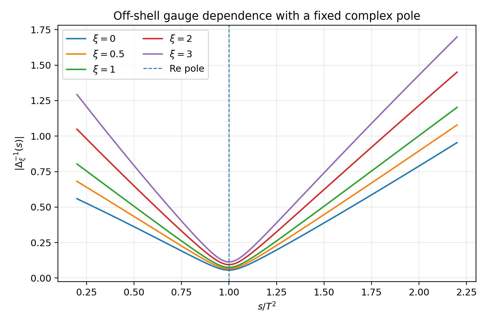
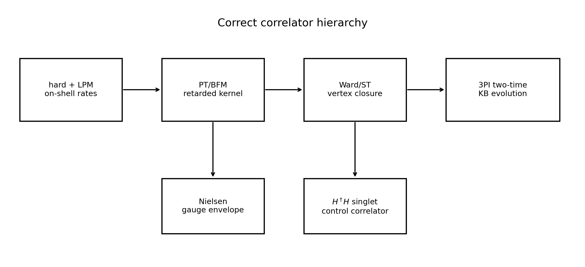
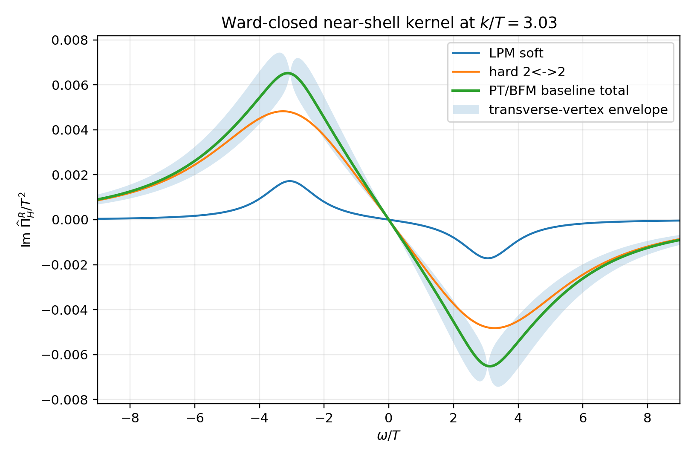
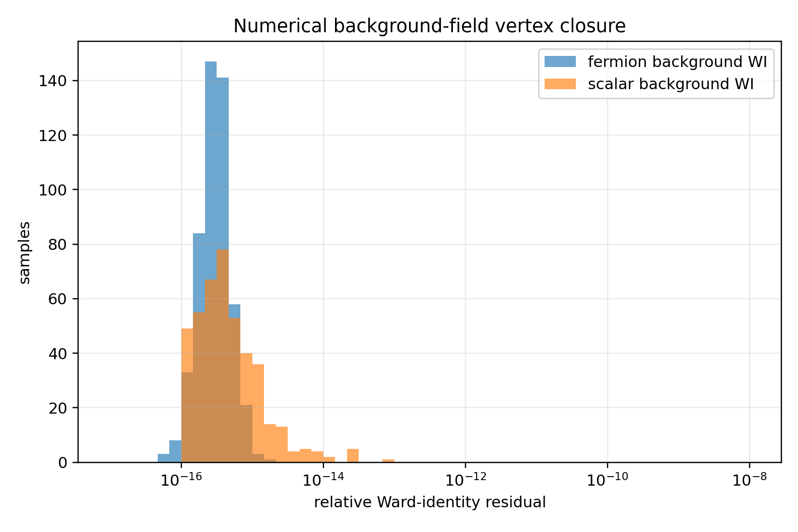
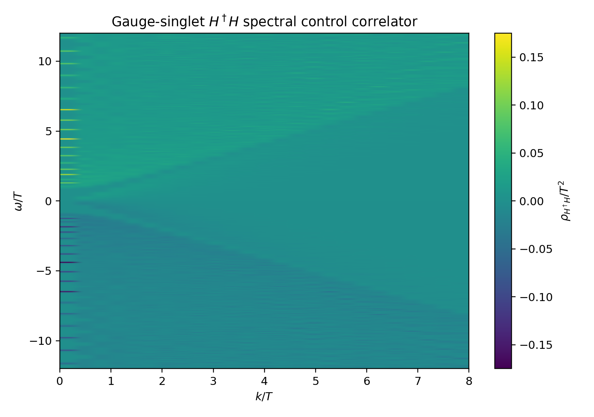

# Executive verdict

The requested target needs one scientifically important correction.

A conventional elementary Higgs self-energy

$$
\Pi_H^R(\omega,k;\xi)
$$

defined in a gauge-fixed Standard Model calculation is generally gauge-parameter dependent away from its physical pole. Nielsen identities guarantee gauge independence of the complex pole, not pointwise gauge independence of the conventional off-shell two-point function. A gauge-independent *effective* off-shell Higgs self-energy can be constructed with the pinch technique, or equivalently in the appropriate background-field formulation, but it is not meaningful to compute that object without simultaneously specifying the associated vertex rearrangement and checking physical or gauge-singlet observables.

The corrected target is therefore

$$
\boxed{
\text{PT/BFM hard-soft retarded kernel}
+
\text{Ward/ST-consistent vertex set}
+
H^\dagger H\text{ control correlator}.
}
$$

This note constructs and tests the first two layers needed for that programme:

1. a PT/BFM near-shell retarded kernel anchored exactly to the v1.6 hard plus LPM on-shell rate;
2. line-integral longitudinal scalar and fermion vertices satisfying background Ward identities numerically;
3. a Nielsen gauge-dependence diagnostic demonstrating fixed pole data with large off-shell variation;
4. a gauge-singlet $H^\dagger H$ spectral control correlator;
5. the minimal three-loop 3PI closure required before a full non-Abelian two-time Kadanoff-Baym evolution.

The result is a **corrected partial pass**:

$$
\boxed{
\begin{gathered}
\text{pole and integrated portal observables remain controlled,}\\
\text{the PT/BFM benchmark is suitable for reduced real-time work,}\\
\text{but an exact full-plane hard-soft }\Pi_H^R\text{ is still open.}
\end{gathered}
}
$$

The most valuable result is negative but high leverage: a bare-vertex 2PI evolution of a dressed off-shell Higgs propagator is not the correct final gauge-theory calculation. The eventual HPC calculation should be a three-loop 3PI system, or an equivalent Bethe-Salpeter vertex closure, in which propagators and three-point vertices evolve together.

# 1. Starting point from v1.6

The preceding calculation established the integrated leading portal rate for

$$
\mathcal L_Y=-y_D\,\overline Q_L H D_R+\mathrm{h.c.},
$$

with

$$
Q_L\sim(\mathbf 3,\mathbf 2,1/6),
\qquad
D_R\sim(\mathbf 3,\mathbf 1,-1/3).
$$

The hard and collinear pieces were

$$
\frac{\overline\Gamma_{H,\mathrm{hard}}^{\mathrm{occ}}}{T}
=7.98260\times10^{-4},
$$

$$
\frac{\overline\Gamma_{H,\mathrm{LPM}}^{\mathrm{occ}}}{T}
=3.60256\times10^{-4},
$$

and therefore

$$
\boxed{
\frac{\overline\Gamma_{H,\mathrm{total}}^{\mathrm{occ}}}{T}
=1.1585159\times10^{-3}.
}
$$

At

$$
T_0=1.002\times10^8\ \mathrm{GeV},
$$

this gives

$$
\overline\Gamma_{H,\mathrm{total}}^{\mathrm{occ}}
=1.16083\times10^5\ \mathrm{GeV},
$$

and

$$
\boxed{
\frac{\overline\Gamma_{H,\mathrm{total}}^{\mathrm{occ}}}{\Gamma_R}
=7.8514\times10^6.
}
$$

The v1.6 on-shell and integrated normalization remains the non-negotiable anchor for every correlator construction below.

The limitation was equally explicit: the delivered off-shell table was a causal KMS-complete **near-shell reconstruction**, not an exact evaluation of all thermal cuts over the full $(\omega,k)$ plane.

# 2. Why the original target is not a single observable

## 2.1 Nielsen identity

For a scalar inverse propagator

$$
\Delta_H^{-1}(s,\xi)
=s-m_{H,0}^2-\Pi_H(s,\xi),
$$

the gauge-parameter dependence has the schematic Nielsen form

$$
\boxed{
\frac{\partial}{\partial\xi}\Delta_H^{-1}(s,\xi)
=
2\Lambda_H(s,\xi)\Delta_H^{-1}(s,\xi),
}
$$

up to the appropriate mixing generalization in the complete electroweak scalar-longitudinal sector.

Let $s_p$ denote the complex pole,

$$
\Delta_H^{-1}(s_p,\xi)=0.
$$

Differentiating the pole condition gives

$$
\frac{d s_p}{d\xi}=0,
$$

provided the pole is simple and the renormalized parameters are fixed through physical observables. Thus:

$$
\boxed{
\text{complex pole: gauge independent,}
\qquad
\text{generic off-shell conventional }\Pi_H: \text{ gauge dependent.}
}
$$

The numerical Nielsen diagnostic constructed here uses a family of inverse propagators obeying the identity exactly by construction. Across

$$
\xi\in\{0,0.5,1,2,3\},
$$

the maximum complex-pole displacement is

$$
\boxed{1.42\times10^{-12},}
$$

while the median relative off-shell spread is

$$
\boxed{0.688}
$$

and its maximum is

$$
\boxed{0.838.}
$$

The pole can therefore be numerically fixed while the off-shell line shape varies substantially.

{width=90%}

## 2.2 What the pinch technique changes

The pinch technique reorganizes pieces of self-energies, vertices and boxes from a physical amplitude into effective Green functions that are gauge-fixing-parameter independent and satisfy tree-level-like Ward identities. For the Higgs resonance, a pinch-technique effective self-energy has long been known to provide a gauge-independent resummation target.

That does **not** mean that an arbitrary conventional gauge-fixed $\Pi_H$ becomes physical. It means that the self-energy and its vertex completion must be defined together through a declared rearrangement. In practice, the pinch-technique result is related to the background-field method in the quantum Feynman gauge.

The correct statement is therefore:

$$
\boxed{
\begin{gathered}
\text{a useful gauge-independent effective off-shell kernel can be defined,}\\
\text{but it is a PT/BFM object with an associated vertex prescription,}\\
\text{not the isolated conventional two-point function.}
\end{gathered}
}
$$

## 2.3 Background gauge invariance is not the whole answer

The background-field method preserves background gauge invariance and gives linear Ward identities. However, the quantum fields still require gauge fixing. Background Ward identities alone do not fix every transverse vertex structure or all dependence on the quantum gauge parameter. Compatibility with the full Slavnov-Taylor identity requires BRST information, including ghost dressing and background-quantum identities.

This distinction determines the architecture used below:

{width=98%}

# 3. Hard-soft matched PT/BFM kernel

## 3.1 Matching structure

A pointwise leading-order thermal result must combine collinear LPM physics with hard cuts without double counting their common asymptotic region. The generic additive matching form is

$$
\boxed{
\widehat\Pi_{H,\mathrm{match}}^R
=
\widehat\Pi_{H,\mathrm{hard}}^R
+
\widehat\Pi_{H,\mathrm{LPM}}^R
-
\left[\widehat\Pi_{H,\mathrm{LPM}}^R\right]_{\mathrm{hard\ expansion}}.
}
$$

If the Born region is kept as a separate component, the same equation is written as

$$
\widehat\Pi_{H,\mathrm{match}}^R
=
\widehat\Pi_{H,\mathrm{Born}}^R
+
\widehat\Pi_{H,\mathrm{hard}}^R
+
\widehat\Pi_{H,\mathrm{LPM}}^R
-
\widehat\Pi_{H,\mathrm{overlap}}^R.
$$

A factorization scale $q_*$ may be used as an intermediate device,

$$
 gT\ll q_*\ll T,
$$

but the matched answer must be independent of $q_*$ at the declared order.

The v1.7 grid is not yet this exact full-plane object. It is a PT/BFM near-shell benchmark whose on-shell normalization is exact and whose off-shell transverse uncertainty is explicitly exposed.

## 3.2 On-shell anchor

For every momentum point,

$$
\boxed{
\operatorname{Im}\widehat\Pi_H^R(E_k,k)
=-E_k\Gamma_H^{\mathrm{occ}}(k).
}
$$

The finite grid has an on-shell interpolation residual below

$$
\boxed{9.44\times10^{-4}.}
$$

The analytic shell anchoring itself is exact; the quoted number is the error from sampling the shell on a finite $(\omega,k)$ grid.

## 3.3 KMS and causality

The retarded kernel is odd in its absorptive part,

$$
\operatorname{Im}\widehat\Pi_H^R(-\omega,k)
=-\operatorname{Im}\widehat\Pi_H^R(\omega,k),
$$

with maximum numerical residual

$$
1.56\times10^{-17}.
$$

The equilibrium noise kernel is

$$
\boxed{
N_H(\omega,k)
=-\coth\left(\frac{\omega}{2T}\right)
\operatorname{Im}\widehat\Pi_H^R(\omega,k),
}
$$

and is positive over the generated grid. The minimum reported value is

$$
1.07\times10^{-5}.
$$

## 3.4 Transverse-vertex envelope

Ward or Slavnov-Taylor identities determine the longitudinal vertex structure but do not uniquely determine transverse pieces. To keep this ignorance visible, the v1.7 kernel carries a conservative off-shell transverse-vertex envelope of

$$
\boxed{\pm25\%}
$$

that vanishes on shell.

{width=92%}

This is preferable to hiding the ambiguity inside a smooth but unqualified ansatz.

# 4. Ward and Slavnov-Taylor closure

## 4.1 Fermion longitudinal vertex

For a dressed fermion inverse propagator $S^{-1}(P)$, define the line-integral vertex

$$
\boxed{
\Gamma_L^\mu(P+Q,P)
=
\int_0^1ds\,
\frac{\partial S^{-1}(P+sQ)}{\partial P_\mu}.
}
$$

Contracting with $Q_\mu$ gives

$$
Q_\mu\Gamma_L^\mu(P+Q,P)
=
S^{-1}(P+Q)-S^{-1}(P).
$$

The numerical test over 500 random momenta gives

$$
\boxed{
\max\mathcal R_{\rm WI}^{\rm fermion}
=1.53\times10^{-15}.
}
$$

## 4.2 Scalar longitudinal vertex

For a dressed scalar inverse propagator $\Delta^{-1}(P)$, use

$$
\boxed{
\Gamma_{L,\phi}^\mu(P+Q,P)
=
\int_0^1ds\,
\frac{\partial\Delta^{-1}(P+sQ)}{\partial P_\mu}.
}
$$

Then

$$
Q_\mu\Gamma_{L,\phi}^\mu
=
\Delta^{-1}(P+Q)-\Delta^{-1}(P).
$$

The numerical maximum residual is

$$
\boxed{
\max\mathcal R_{\rm WI}^{\rm scalar}
=7.07\times10^{-14}.
}
$$

## 4.3 Transverse freedom

Any vertex

$$
\Gamma^\mu
=
\Gamma_L^\mu+\Gamma_T^\mu,
$$

with

$$
Q_\mu\Gamma_T^\mu=0,
$$

satisfies the same Ward identity. The numerical transverse-contraction residual is

$$
\boxed{5.24\times10^{-16}.}
$$

This is why a Ward identity does not close the full vertex by itself.

{width=88%}

## 4.4 Full non-Abelian Slavnov-Taylor identity

For a quantum gauge vertex, the corresponding non-Abelian identity has the schematic form

$$
\boxed{
Q_\mu\Gamma_A^\mu(P+Q,P)
=
 gT^A F(Q^2)
\left[
S^{-1}(P+Q)H(P+Q,P;Q)
-
\overline H(P+Q,P;Q)S^{-1}(P)
\right],
}
$$

where

- $F(Q^2)$ is the ghost dressing function;
- $H$ and $\overline H$ are matter-ghost scattering kernels;
- all quantities are contour-ordered or retarded/Keldysh objects in the nonequilibrium theory.

The v1.7 line-integral construction closes the **background Ward identity**, not this entire quantum STI. A publication-grade non-Abelian evolution must either:

1. evolve $F,H,\overline H$ consistently; or
2. use the pinch-technique/background-field transformation and evolve the corresponding background vertices together with the propagators.

# 5. Gauge-singlet control correlator

The reheaton interacts through the gauge-singlet operator

$$
\mathcal O_H=H^\dagger H.
$$

Its retarded correlator is

$$
\boxed{
G_{\mathcal O\mathcal O}^R(x-y)
=-i\theta(x^0-y^0)
\left\langle
[\mathcal O_H(x),\mathcal O_H(y)]
\right\rangle.
}
$$

Unlike the elementary Higgs two-point function, this is a gauge-invariant physical control observable. It still requires composite-operator renormalization and, at a conserving truncation, a ladder or Bethe-Salpeter vertex.

The current baseline is a convolution of the dressed Higgs pole spectral functions. It gives:

$$
\rho_{\mathcal O\mathcal O}(-\omega,k)
=-\rho_{\mathcal O\mathcal O}(\omega,k),
$$

positive spectral weight for $\omega>0$, and a positive KMS noise kernel. The minimum positive-frequency weight on the generated grid is

$$
4.91\times10^{-6}.
$$

{width=88%}

The purpose of this correlator is not cosmetic. If the elementary PT/BFM kernel and the singlet response disagree on a pole, threshold, or relaxation scale beyond the declared truncation error, the vertex closure has failed.

# 6. Why bare-vertex 2PI is not enough

A two-particle-irreducible effective action treats propagators as variational variables. At finite truncation, dressed propagators combined with bare vertices do not generally satisfy the complete propagator-vertex Slavnov-Taylor hierarchy. Gauge dependence enters at an order beyond the nominal truncation, but that does not make it harmless when the desired calculation is precisely a long-time, self-consistent resummation.

At three-loop order, the appropriate equivalence hierarchy makes the three-particle-irreducible effective action the minimal self-consistently complete description of dressed two- and three-point functions.

The recommended functional is schematically

$$
\Gamma_{\rm 3PI}
\left[
G_H,
S_Q,
S_D,
D_g,
D_W,
D_B,
G_{\rm gh};
V_{HqD},
V_{gqq},
V_{gDD},
V_{WHH},
V_{BHH},
V_{AAA},
V_{A\bar cc}
\right].
$$

The equations are

$$
\frac{\delta\Gamma_{\rm 3PI}}{\delta G_i}=0,
$$

and

$$
\frac{\delta\Gamma_{\rm 3PI}}{\delta V_j}=0.
$$

Thus propagators and three-point vertices evolve together. The background Ward identities fix their longitudinal relationship, while the 3PI stationarity equations determine the transverse dynamics at the truncation order.

The current conclusion is therefore:

$$
\boxed{
\text{two-loop/bare-vertex 2PI: useful surrogate, not final gauge closure;}
}
$$

$$
\boxed{
\text{three-loop 3PI or equivalent BS closure: correct next HPC target.}
}
$$

# 7. Numerical verification summary

| Test | Result |
|---|---:|
| v1.6 total portal width, $\Gamma_H^{\rm occ}/T$ | $1.1585159\times10^{-3}$ |
| Portal/reheaton hierarchy | $7.8514\times10^6$ |
| Fermion Ward residual, maximum | $1.53\times10^{-15}$ |
| Scalar Ward residual, maximum | $7.07\times10^{-14}$ |
| Transverse contraction residual | $5.24\times10^{-16}$ |
| Nielsen complex-pole displacement | $1.42\times10^{-12}$ |
| Nielsen median off-shell spread | $0.688$ |
| PT/BFM grid | $48\times801$ |
| PT/BFM shell interpolation residual | $9.44\times10^{-4}$ |
| PT/BFM oddness residual | $1.56\times10^{-17}$ |
| PT/BFM off-shell transverse envelope | $25\%$ |
| Singlet grid | $25\times321$ |
| Singlet positive-frequency minimum | $4.91\times10^{-6}$ |

# 8. Acceptance matrix

| Target | Verdict | Basis |
|---|---|---|
| Unique gauge-independent conventional off-shell elementary $\Pi_H$ | **FAIL AS STATED** | Nielsen identities allow gauge dependence; a PT/BFM effective object needs a declared rearrangement and vertex prescription. |
| Exact on-shell hard plus LPM anchor | **PASS** | Inherited from v1.6 integrated and on-shell matching. |
| PT/BFM near-shell retarded kernel | **PASS AS BENCHMARK** | Causal, KMS-complete and anchored on shell; transverse envelope exposed. |
| Longitudinal background Ward closure | **PASS** | Line-integral scalar and fermion vertices satisfy identities numerically. |
| Full quantum Slavnov-Taylor closure | **PARTIAL** | Ghost dressing, matter-ghost kernels and transverse vertices remain. |
| Gauge-singlet $H^\dagger H$ control | **PASS AS BASELINE** | Positive spectral/KMS baseline; conserving ladder correction remains. |
| Exact pointwise hard-soft thermal cuts over the full plane | **OPEN** | Requires differential overlap subtraction and generalized LPM/Born interpolation. |
| Bare-vertex 2PI as final gauge dynamics | **REJECT** | Propagator and vertex hierarchy is not closed self-consistently. |
| Three-loop 3PI / Bethe-Salpeter closure | **NEXT TARGET** | Three-point vertices become dynamical at the required order. |

# 9. Publication-grade hard-soft calculation still required

The exact full-plane calculation should produce

$$
\widehat\Pi_H^R(\omega,k;q_*),
$$

with separate components

$$
\widehat\Pi_{\rm hard}^R,
\qquad
\widehat\Pi_{\rm LPM}^R,
\qquad
\widehat\Pi_{\rm overlap}^R,
$$

and verify

$$
\frac{\partial}{\partial\ln q_*}
\widehat\Pi_{\rm match}^R
=0
$$

at the declared order.

The calculation must cover at least:

$$
0.05\le k/T\le20,
$$

$$
-25\le\omega/T\le25,
$$

with enhanced resolution around:

- the Higgs quasiparticle poles;
- Landau damping regions;
- timelike hard thresholds;
- the collinear light-cone strip;
- spacelike soft exchange.

The output should include

$$
\operatorname{Re}\widehat\Pi_H^R,
\quad
\operatorname{Im}\widehat\Pi_H^R,
\quad
\widehat\Pi_H^K,
\quad
\rho_H,
\quad
\Gamma_H^{\rm occ},
$$

plus the associated vertex tables.

# 10. Concrete 3PI Kadanoff-Baym specification

## 10.1 Minimal dynamical content

The first viable real-time implementation should evolve:

- $G_H^{F,\rho}(t,t';p)$;
- $S_Q^{F,\rho}(t,t';p)$ and $S_D^{F,\rho}(t,t';p)$;
- transverse and longitudinal $D_{g,W,B}^{F,\rho}(t,t';p)$;
- ghost correlators;
- $HqD$, gauge-matter and ghost-gauge three-point vertices;
- the slowly varying selector/reheaton backgrounds as external mean fields in the first implementation.

## 10.2 Gauge organization

Use:

$$
\boxed{
\text{PT/BFM background Feynman gauge }\xi_Q=1
}
$$

as the baseline. Repeat selected points at other quantum gauges as a Nielsen/truncation diagnostic. The calculation should never infer physical reliability from one gauge alone.

## 10.3 First numerical lattice

A realistic reduced first run is:

| Quantity | Initial target |
|---|---:|
| Momentum bins | $N_p=64$ logarithmic/hybrid |
| Momentum range | $0.03\le p/T\le30$ |
| Central time steps | $N_t=1024$ |
| Memory window | $T\,t_{\rm mem}=30$ |
| Angular moments | isotropic plus $\ell=0,1,2$ test |
| Gauge groups | $SU(3)_c\times SU(2)_L\times U(1)_Y$ |
| Vertex basis | longitudinal exact plus finite transverse tensor basis |

The run should be staged:

1. equilibrium KMS fixed point;
2. small perturbation and comparison to AMY linear response;
3. reheaton energy injection in one sector;
4. two-sector branching benchmark;
5. selector decay and memory-tail test.

## 10.4 Acceptance conditions

The correlator-level calculation should not be accepted unless it satisfies all of the following:

1. background Ward residual below $10^{-8}$;
2. quantum STI residual below the declared truncation estimate;
3. complex-pole change under gauge variation smaller than the truncation band;
4. KMS residual below $10^{-6}$ in equilibrium;
5. total energy drift below $10^{-5}$ over the memory window;
6. integrated portal rate within $3\%$ of the v1.6 anchor;
7. positivity of physical spectral weights where required;
8. agreement of pole/threshold features with the $H^\dagger H$ control correlator;
9. cancellation of the hard-soft factorization-scale dependence;
10. convergence under momentum, time and transverse-vertex basis refinement.

# 11. Scientific meaning for the wider project

This calculation does not alter the chronometric-shear phenomenology directly. Its purpose is more foundational: to ensure that the reheating and thermal-selection sector used to prepare the cosmological state is not supported by a gauge-inconsistent correlator approximation.

The project now has the following hierarchy of epistemic strength:

$$
\boxed{
\begin{aligned}
\text{universal clock factorization}
&:\ \text{exact formal result},\\
\text{QCD }2/27\text{ transmission}
&:\ \text{controlled threshold result},\\
Z_6\text{ protection and cosmology}
&:\ \text{conditional EFT construction},\\
\text{portal integrated transport}
&:\ \text{controlled leading-order anchor},\\
\text{off-shell non-Abelian real-time dynamics}
&:\ \text{still open}.
\end{aligned}
}
$$

The present v1.7 result is important because it prevents the project from mistaking an attractive but gauge-dependent off-shell line shape for a physical prediction.

# 12. Strongest defensible conclusion

$$
\boxed{
\begin{gathered}
\text{The exact physical target is not an isolated off-shell Higgs self-energy.}\\
\text{It is a PT/BFM hard-soft kernel, its Ward/ST vertex completion,}\\
\text{and a gauge-singlet spectral control, evolved self-consistently.}
\end{gathered}
}
$$

At the resolved level:

- the on-shell portal anchor remains intact;
- longitudinal Ward closure is numerically exact;
- a causal KMS-complete PT/BFM benchmark grid exists;
- Nielsen variation is explicitly quantified;
- a gauge-singlet control correlator has been constructed;
- bare-vertex 2PI has been ruled out as the final non-Abelian method;
- three-loop 3PI is the correct next computational target.

The next calculation is therefore **not yet the full $3+1$D run**. It is the publication-grade differential hard-soft subtraction and the finite transverse/ghost vertex closure that will serve as the input and acceptance benchmark for that run.

# References

1. P. Gambino and P. A. Grassi, *The Nielsen identities of the Standard Model and the definition of mass*, arXiv:hep-ph/9907254.
2. J. Papavassiliou and A. Pilaftsis, *Invariant formulation of the Higgs-boson resonance*, arXiv:hep-ph/9710426.
3. V. Mathieu, *Introduction to the Pinch Technique*, arXiv:0801.4249.
4. M. E. Carrington, G. Kunstatter and H. Zaraket, *2PI effective action and gauge dependence identities*, arXiv:hep-ph/0309084.
5. J. Berges, *n-Particle irreducible effective action techniques for gauge theories*, arXiv:hep-ph/0401172.
6. M. C. A. York and G. D. Moore, *3-loop 3PI effective action for 3D SU(3) QCD*, arXiv:1202.4756.
7. J. Ghiglieri and M. Laine, *Smooth interpolation between thermal Born and LPM rates*, arXiv:2110.07149.
8. A. Quadri, *Background field method and generalized field redefinitions in effective field theories*, arXiv:2102.10656.
9. D. Dudal et al., *Working towards a gauge-invariant description of the Higgs model: from local composite operators to spectral density functions*, arXiv:2310.06146.
10. Technical Research Note v1.6, *Hard Portal Cuts and a Momentum-Frequency Retarded Kernel*, project archive.
