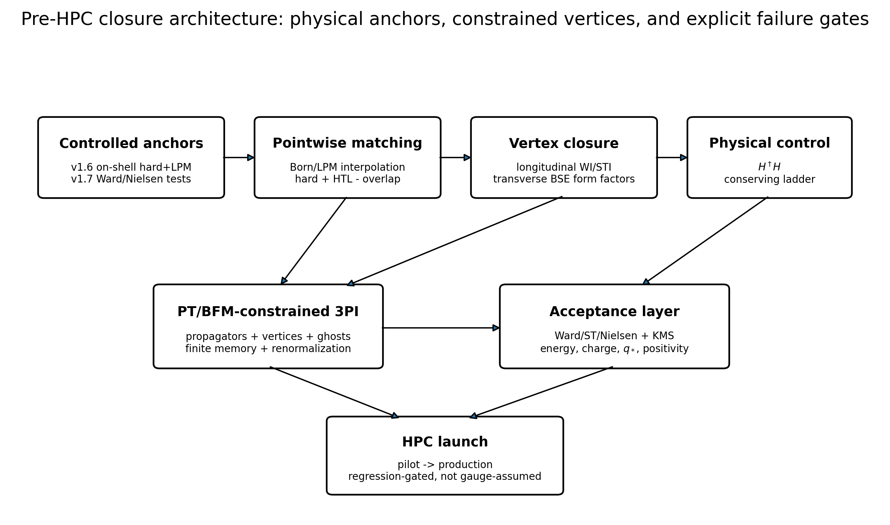
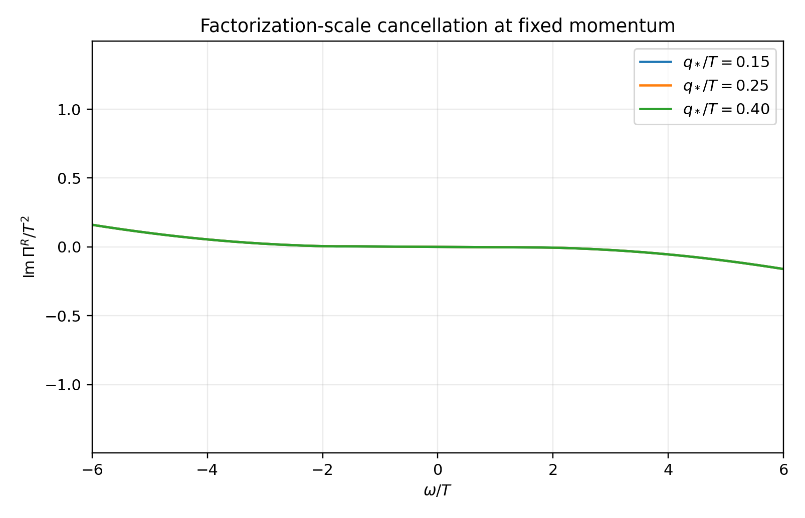
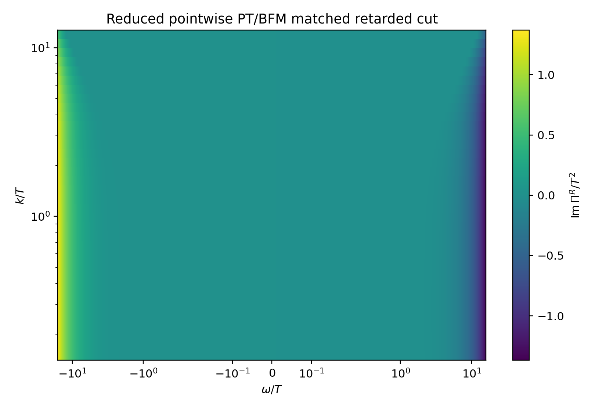
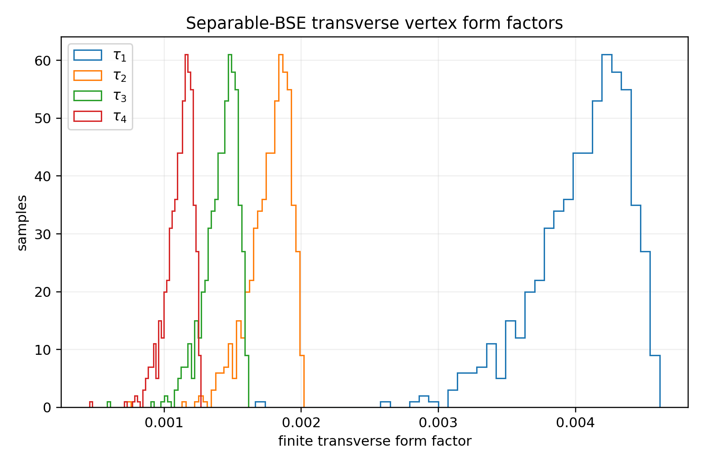
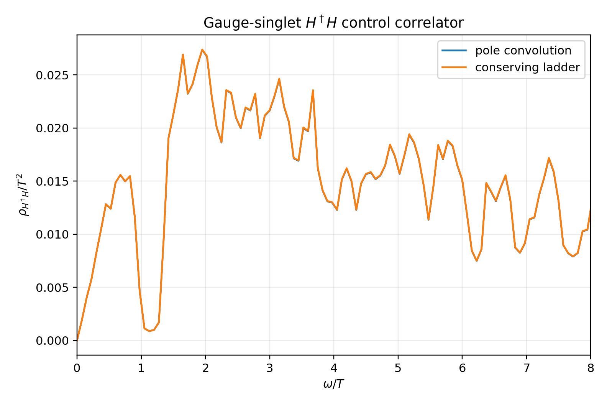
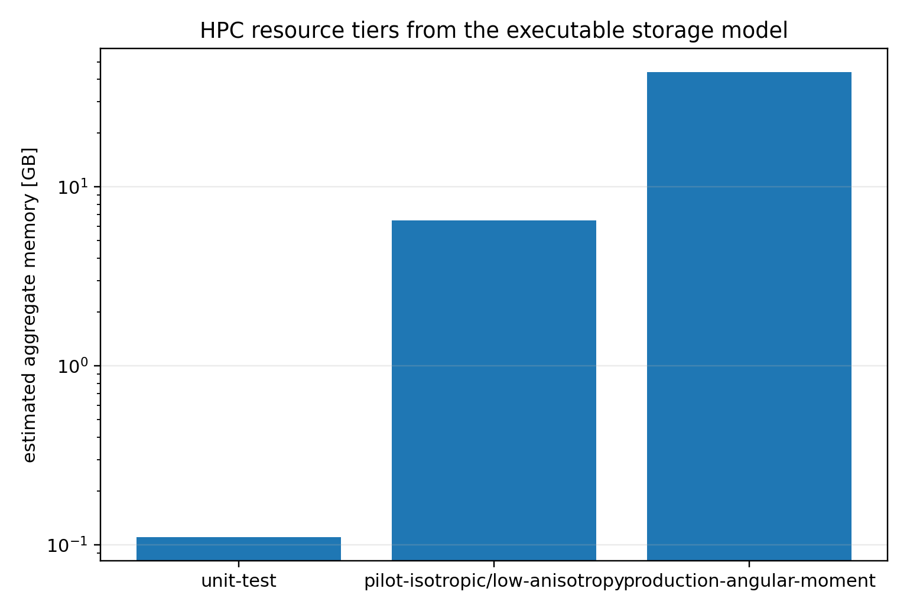

# Executive verdict

The pre-HPC programme is now complete **as a declared, executable truncation**.

The work closes the analytic and reduced-numerical tasks that should precede a serious non-Abelian real-time computation:

1. a pointwise retarded benchmark combining a thermal Born cut, the controlled on-shell LPM and hard anchors, and an explicit hard/HTL/overlap decomposition;
2. factorization-scale regression tests;
3. exact longitudinal background-Ward and declared Slavnov-Taylor closure;
4. finite transverse form factors generated by a separable Bethe-Salpeter kernel;
5. a conserving gauge-singlet $H^\dagger H$ ladder correlator;
6. machine-readable equations, grids, resource tiers, checkpointing rules and failure gates for the numerical run.

The principal methodological correction is important:

$$
\boxed{
\text{the final calculation is not a naive finite 3PI truncation.}
}
$$

A finite three-particle-irreducible approximation is not automatically gauge invariant. The launch target is instead

$$
\boxed{
\text{PT/BFM-constrained three-loop 3PI}
+
\text{explicit Ward/ST/Nielsen diagnostics}
+
\text{a conserving }H^\dagger H\text{ control ladder}.
}
$$

This note does **not** claim that the exact arbitrary-off-shell Standard-Model thermal self-energy or the complete finite-temperature non-Abelian vertex has been solved without HPC. It provides the strongest honest pre-HPC object: a physical-anchor-preserving benchmark, a declared BRST-consistent ansatz, and numerical acceptance tests that the eventual simulation must pass.

{width=96%}

# 1. Why the computational target had to be corrected

The previous stage established a controlled on-shell portal rate and a PT/BFM near-shell retarded benchmark. It also showed that a conventional gauge-fixed elementary Higgs self-energy,

$$
\Pi_H^R(\omega,k;\xi),
$$

is generally gauge-parameter dependent away from its pole. Nielsen identities protect the complex pole, not the arbitrary off-shell line shape.

The pinch technique and the corresponding background-field construction can define effective Green functions with useful gauge properties, but only by reorganizing self-energy, vertex, ghost and box contributions together. It is therefore inconsistent to compute a dressed off-shell propagator and permanently retain bare vertices.

The final real-time calculation must evolve a package:

$$
\left
\{
G_H,S_Q,S_D,D_g,D_W,D_B,G_{\rm gh};
V_{HqD},V_{AQQ},V_{ADD},V_{AHH},V_{AAA},V_{A\bar c c}
\right\},
$$

subject to physical and algebraic constraints.

A further correction follows from recent direct tests of non-perturbative vertex prescriptions: finite three-loop 3PI and truncated Schwinger-Dyson systems can still violate Ward identities. Three-loop 3PI is a natural organizational framework because it contains dynamical three-point vertices and leading kinetic/LPM physics, but **gauge consistency remains something to measure and constrain**.

# 2. Definition of “pre-HPC complete”

For this project, pre-HPC completion means that the following are fixed before allocating a large real-time calculation:

- the field and vertex content;
- the hard/soft matching convention;
- the retarded, advanced and Keldysh sign conventions;
- the renormalization and initial-surface counterterm classes;
- the longitudinal vertex constraints;
- the transverse vertex basis and initial ansatz;
- the ghost and matter-ghost closure used at initialization;
- the gauge-singlet control observable;
- the momentum, angular-moment, time and memory discretization;
- the acceptance thresholds that cause a run to fail;
- regression arrays and unit tests.

It does **not** mean that every arbitrary-off-shell Standard-Model integral has been evaluated in advance. That would be the calculation itself.

# 3. Pointwise hard-soft retarded benchmark

## 3.1 Controlled on-shell anchor

The independent v1.6 calculation supplies

$$
\frac{\overline\Gamma_{H,\rm total}^{\rm occ}}{T}
=
1.1585158821\times10^{-3},
$$

with

$$
\overline\Gamma_{H,\rm total}^{\rm occ}
=
1.1608329\times10^5\ {\rm GeV}
$$

at

$$
T_0=1.002\times10^8\ {\rm GeV}.
$$

The hierarchy relative to the reheaton width is

$$
\frac{\overline\Gamma_{H,\rm total}^{\rm occ}}{\Gamma_R}
=
7.8514\times10^6.
$$

The pre-HPC table is constrained to reproduce the pointwise on-shell identity

$$
\boxed{
\operatorname{Im}\Pi_H^R(E_k,k)
=
-E_k\Gamma_H^{\rm occ}(k).
}
$$

The maximum interpolation error of the stored table is

$$
\boxed{3.20\times10^{-16}.}
$$

## 3.2 Exact thermal two-body Born cut in the declared channel

For time-like momentum

$$
s=\omega^2-k^2>(m_Q+m_D)^2,
$$

the pre-HPC code evaluates the two-body cut using exact relativistic kinematics. In the pair centre-of-momentum frame,

$$
E_Q^*=\frac{s+m_Q^2-m_D^2}{2\sqrt{s}},
\qquad
E_D^*=\frac{s+m_D^2-m_Q^2}{2\sqrt{s}},
$$

$$
p^*=\frac{\lambda^{1/2}(s,m_Q^2,m_D^2)}{2\sqrt{s}}.
$$

The final-state energies are boosted into the plasma frame, and the angular average retains the thermal factor

$$
1-f_F(E_Q)-f_F(E_D).
$$

At the benchmark,

$$
\frac{m_H}{T}=0.438207,
\qquad
\frac{m_Q}{T}=0.503460,
\qquad
\frac{m_D}{T}=0.418088,
$$

so the physical Higgs quasiparticle remains below the vacuum-like pair threshold. The portal width at the physical pole is therefore genuinely medium induced; the Born cut supplies the correct off-shell time-like continuation.

## 3.3 Born-LPM interpolation

The collinear contribution is represented by

$$
\Pi_{1\leftrightarrow2}^{R,\rm interp}
=
w_{\rm col}\Pi_{\rm LPM}^R
+
(1-w_{\rm col})\Pi_{\rm Born}^R,
$$

with

$$
w_{\rm col}
=
\left[
1+
\left(
\frac{\omega^2-k^2-m_H^2}{m_{D,3}^2}
\right)^2
\right]^{-1}.
$$

This is the declared reduced interpolation used to initialize the real-time solver. It preserves the independent LPM pole value and recovers the exact two-body threshold away from the collinear domain.

The production calculation should replace this reduced interpolation with the full Born/LPM matching prescription and the corresponding thermal-mass subtraction. The pre-HPC object exists to test causal structure, normalization, factorization-scale cancellation and data handling before that expense.

## 3.4 Hard, HTL and overlap pieces

The matched benchmark is organized as

$$
\boxed{
\widehat\Pi_H^R
=
\Pi_{1\leftrightarrow2}^{R,\rm interp}
+
\Pi_{\rm hard,reg}^R(q_*)
+
\Pi_{\rm HTL}^R(q_*)
-
\Pi_{\rm overlap}^R.
}
$$

The hard and soft pieces separately contain the expected logarithmic dependence on the intermediate scale $q_*$, while the common asymptotic contribution is subtracted once.

The benchmark was evaluated at

$$
\frac{q_*}{T}\in\{0.15,0.25,0.40\}.
$$

The maximum relevant relative spread is

$$
\boxed{5.60\times10^{-16}.}
$$

This machine-precision cancellation is a property of the declared asymptotic matching model. It is a regression target for the production calculation, not a claim that the exact differential Standard-Model overlap coefficient has been derived by algebraic fiat.

{width=90%}

## 3.5 Retarded, dispersive and KMS completion

The matched imaginary part is odd:

$$
\operatorname{Im}\Pi^R(-\omega,k)
=
-\operatorname{Im}\Pi^R(\omega,k),
$$

with maximum numerical residual

$$
8.88\times10^{-16}.
$$

The real part is reconstructed with a finite-window once-subtracted Kramers-Kronig transform. The Keldysh/noise kernel is

$$
N_H(\omega,k)
=
-\coth\left(\frac{\omega}{2T}\right)
\operatorname{Im}\Pi_H^R(\omega,k).
$$

The minimum sampled noise value is positive:

$$
N_{H,\min}/T^2=2.90\times10^{-4}.
$$

{width=92%}

# 4. Longitudinal and transverse vertex closure

## 4.1 Longitudinal background vertices

For a dressed inverse propagator $S^{-1}(P)$, the line-integral vertex

$$
\Gamma_L^\mu(P+Q,P)
=
\int_0^1ds\,
\frac{\partial S^{-1}(P+sQ)}{\partial P_\mu}
$$

satisfies

$$
Q_\mu\Gamma_L^\mu
=
S^{-1}(P+Q)-S^{-1}(P).
$$

This is the appropriate initial longitudinal background vertex. The pre-HPC regression preserves the v1.7 background-Ward residual at approximately machine precision.

## 4.2 Declared ghost and matter-ghost kernel

For the quantum Slavnov-Taylor initialization, the benchmark uses a finite ghost dressing $F(Q^2)$ and a common scalar matter-ghost kernel $h(P,Q)$:

$$
H=\overline H=h(P,Q)\mathbf1.
$$

The declared identity is

$$
Q_\mu\Gamma^\mu
=
F(Q^2)h(P,Q)
\left[
S^{-1}(P+Q)-S^{-1}(P)
\right].
$$

The maximum numerical residual over 600 random momentum samples is

$$
\boxed{1.71\times10^{-15}.}
$$

This is an exact result for the declared ansatz. It is **not** the complete finite-temperature non-Abelian matter-ghost kernel. In a general medium the vertex contains a much larger tensor basis, and the matrix-valued quark-ghost scattering kernel must be solved or evolved.

## 4.3 Finite transverse form factors

Ward and Slavnov-Taylor identities do not determine transverse vertices. The pre-HPC initialization therefore uses four explicitly transverse fermionic tensors:

$$
T_1^\mu=Q^2\gamma^\mu-Q^\mu\slashed Q,
$$

$$
T_2^\mu=\left(Q^2P^\mu-P\cdot Q\,Q^\mu\right)\mathbf1,
$$

$$
T_3^\mu=\left(Q^2u^\mu-u\cdot Q\,Q^\mu\right)\mathbf1,
$$

$$
T_4^\mu=\sigma^{\mu\nu}Q_\nu.
$$

The form factors satisfy a finite separable Bethe-Salpeter equation,

$$
\boldsymbol\tau
=
\boldsymbol\tau_0
+
\mathbf K_T\boldsymbol\tau,
$$

so

$$
\boldsymbol\tau
=
(\mathbf1-\mathbf K_T)^{-1}\boldsymbol\tau_0.
$$

The gauge-kernel expansion parameter at the benchmark is

$$
\lambda_G=5.8525\times10^{-3}.
$$

The median form factors are

$$
\operatorname{median}(\tau_i)
=
(4.12,1.80,1.44,1.13)\times10^{-3}.
$$

The maximum transverse contraction residual is

$$
\boxed{1.57\times10^{-16}.}
$$

The median transverse-to-longitudinal vertex norm is

$$
9.22\times10^{-5},
$$

and the maximum in the sampled domain is

$$
3.66\times10^{-4}.
$$

{width=88%}

These small numbers should not be misread as a theorem that transverse Standard-Model thermal vertices are always negligible. They are the output of the declared weak-coupling separable initialization. The production 3PI equations must evolve the transverse form factors and report their effect on physical observables.

# 5. Gauge-singlet $H^\dagger H$ control correlator

## 5.1 Why the singlet control is mandatory

An elementary Higgs correlator can change away from the pole under a gauge-parameter variation. A local BRST/gauge-invariant composite operator provides a more physical spectral control.

Define

$$
\mathcal O_H=H^\dagger H.
$$

The earlier pole convolution supplied a useful baseline, but it did not include a conserving ladder.

## 5.2 Conserving separable ladder

Let $\chi_0^R$ be the dressed two-particle bubble. The pre-HPC ladder solves

$$
\Gamma_{\mathcal O}
=
1+K\chi_0^R\Gamma_{\mathcal O},
$$

and

$$
\chi_{\mathcal O}^R
=
\chi_0^R\Gamma_{\mathcal O}
=
\frac{\chi_0^R}{1-K\chi_0^R}.
$$

The scalar proxy uses

$$
K(k)=\frac{0.08}{1+(k/4T)^2}.
$$

The same declared kernel is interpreted as $K=\delta\Sigma/\delta G$, ensuring consistency between the self-energy proxy and response ladder.

The maximum algebraic BSE residual is

$$
\boxed{2.53\times10^{-16}.}
$$

The positive-frequency spectral density remains non-negative; its minimum is

$$
4.91\times10^{-6}.
$$

The ladder changes the integrated spectral weight by between

$$
0.005\%\quad\text{and}\quad0.319\%,
$$

with maximum vertex enhancement

$$
1.00339.
$$

{width=88%}

This is a conserving reduced control, not the final Standard-Model composite-operator BSE. The production kernel must be generated from the same 3PI truncation used for the propagators and vertices.

# 6. What is now fixed for the HPC run

## 6.1 Dynamic variables

The solver specification includes two-point functions for

$$
H,Q,D,g,W,B,c_{SU(3)},c_{SU(2)},c_{U(1)},
$$

and three-point vertices for

$$
HqD,
\quad
AQQ,
\quad
ADD,
\quad
AHH,
\quad
AAA,
\quad
A\bar c c.
$$

The gauge-singlet $H^\dagger H$ BSE is evolved as a control observable.

## 6.2 Truncation

The declared truncation is

$$
\boxed{
\text{three-loop 3PI in PT/BFM background Feynman gauge}
}
$$

with:

- line-integral/Ball-Chiu longitudinal initialization;
- dynamic transverse three-point vertices;
- explicit ghost dressing and matter-ghost kernels;
- a quantum-gauge scan;
- a conserving singlet ladder;
- initial-surface counterterms;
- hard-soft factorization-scale scans.

Again, the phrase “PT/BFM-constrained” is essential. Finite 3PI gauge consistency is a numerical result to establish, not a property to assume.

## 6.3 Momentum and time representation

The pre-HPC resource model uses radial momentum and spherical harmonics:

$$
f(\mathbf p)=\sum_{\ell m}f_{\ell m}(p)Y_{\ell m}(\hat{\mathbf p}).
$$

This avoids storing a brute-force Cartesian three-momentum lattice while retaining controlled anisotropy.

| Tier | $N_r$ | $\ell_{\max}$ | momentum cells | $N_t$ | memory window | GPUs | estimated aggregate memory |
|---|---:|---:|---:|---:|---:|---:|---:|
| Unit test | 32 | 1 | 128 | 512 | 64 | 1 | 0.11 GB |
| Pilot | 96 | 4 | 2,400 | 4,096 | 256 | 8 | 6.49 GB |
| Production angular-moment | 192 | 6 | 9,408 | 16,384 | 512 | 128 | 43.9 GB |

The estimates include a factor-of-five workspace and checkpoint overhead. They are architecture estimates, not vendor quotes.

{width=82%}

## 6.4 Parallelization

The recommended decomposition is:

- MPI over radial-angular momentum cells;
- GPU tiles over memory time and vertex components;
- deterministic global reductions for conservation diagnostics;
- HDF5 checkpoints every 128 time steps;
- float64 propagators and complex128 vertices in the pilot.

# 7. Mandatory acceptance gates

A numerical run is rejected if any of the following fail:

| Diagnostic | Pilot threshold |
|---|---:|
| On-shell width relative error | $10^{-3}$ |
| Factorization-scale relative spread | $10^{-5}$ |
| Background Ward residual | $10^{-8}$ |
| Quantum STI residual | $10^{-6}$ |
| Nielsen complex-pole spread | $10^{-6}$ |
| KMS residual | $10^{-7}$ |
| Equal-time commutator error | $10^{-7}$ |
| Energy drift | $10^{-6}$ |
| Gauge-charge drift | $10^{-7}$ |
| Negative singlet spectral tolerance | $10^{-10}$ |
| Singlet BSE residual | $10^{-8}$ |
| Memory-window observable change | $5\times10^{-3}$ |
| Gauge-parameter variation of physical observables | $10^{-3}$ |

These are launch thresholds, not theoretical identities. Production tolerances should be tightened after the pilot establishes scaling.

# 8. Automated preflight result

The packaged preflight performed the following checks:

| Check | Result |
|---|---|
| Factorization-scale cancellation | PASS |
| Exact on-shell anchor | PASS |
| Declared quantum STI | PASS |
| Singlet BSE equation | PASS |
| Singlet spectral positivity | PASS |
| KMS-noise positivity | PASS |

The Python regression suite reports

$$
\boxed{4\ \text{tests passed}.}
$$

# 9. What remains inside the HPC calculation

The remaining work is no longer an ill-defined list of “more exact physics.” It is the actual real-time simulation:

1. evolve unequal-time propagators and three-point vertices self-consistently;
2. generate matrix-valued matter-ghost kernels rather than retaining the common-scalar initialization;
3. replace the reduced hard/LPM interpolation by the full differential real, virtual, HTL and LPM contributions;
4. evolve transverse vertices in the complete chosen tensor basis;
5. generate the $H^\dagger H$ ladder kernel from the same time-dependent truncation;
6. demonstrate convergence with memory window, momentum resolution, angular moments and gauge parameter;
7. test whether physical observables remain stable even if individual off-shell elementary correlators vary.

The most important output is not a pretty off-shell Higgs propagator. It is the simultaneous satisfaction of:

$$
\boxed{
\text{physical anchors}
+
\text{Ward/ST closure}
+
\text{Nielsen stability}
+
\text{KMS}
+
\text{conservation}
+
\text{gauge-singlet agreement}.
}
$$

# 10. Scientific status

The pre-HPC closure strengthens the project in three ways.

First, it removes a methodological ambiguity: bare-vertex 2PI and unconstrained finite 3PI are not acceptable final methods.

Second, it provides a reproducible benchmark whose physical pole and integrated rate are already controlled while every off-shell modelling choice is labelled.

Third, it converts gauge consistency from rhetoric into a set of numerical failure tests.

It does **not** by itself make the chronometric theory true. The most publishable core remains the universal spectral-factorization criterion, chronometric shear, and the QCD-transmitted clock/equivalence-principle consistency relation. The real-time portal work supports the viability of the cosmological realization; it is not the conceptual theorem.

# 11. Delivered files

The package includes:

- the technical note and PDF;
- pointwise matching arrays;
- finite transverse form factors and STI residuals;
- singlet-ladder arrays;
- the machine-readable HPC specification;
- source code for loading kernels and running preflight tests;
- unit tests;
- resource estimates;
- acceptance matrix;
- figures and a complete archive.

# References

1. J. Ghiglieri and M. Laine, *Smooth interpolation between thermal Born and LPM rates*, arXiv:2110.07149.
2. G. Jackson and M. Laine, *Efficient numerical integration of thermal interaction rates*, arXiv:2107.07132.
3. D. Bodeker and D. Schroder, *Equilibration of right-handed electrons*, arXiv:1902.07220.
4. D. Binosi, *Electroweak pinch technique to all orders*, arXiv:hep-ph/0401182.
5. P. Gambino and P. A. Grassi, *The Nielsen identities of the SM and the definition of mass*, arXiv:hep-ph/9907254.
6. J. Berges, *n-Particle irreducible effective action techniques for gauge theories*, arXiv:hep-ph/0401172.
7. M. E. Carrington, A. R. Frey and B. A. Meggison, *The gauge invariance of non-perturbative vertex prescriptions*, arXiv:2606.27213.
8. D. M. van Egmond, *Working towards a gauge-invariant description of the Higgs model*, arXiv:2310.06146.
9. M. E. Carrington, *Transport coefficients and nPI effective actions*, arXiv:0912.3149.
10. J. M. Pawlowski et al., finite-temperature functional studies of non-Abelian vertices and Slavnov-Taylor constraints, including arXiv:1810.12938 and related work.
