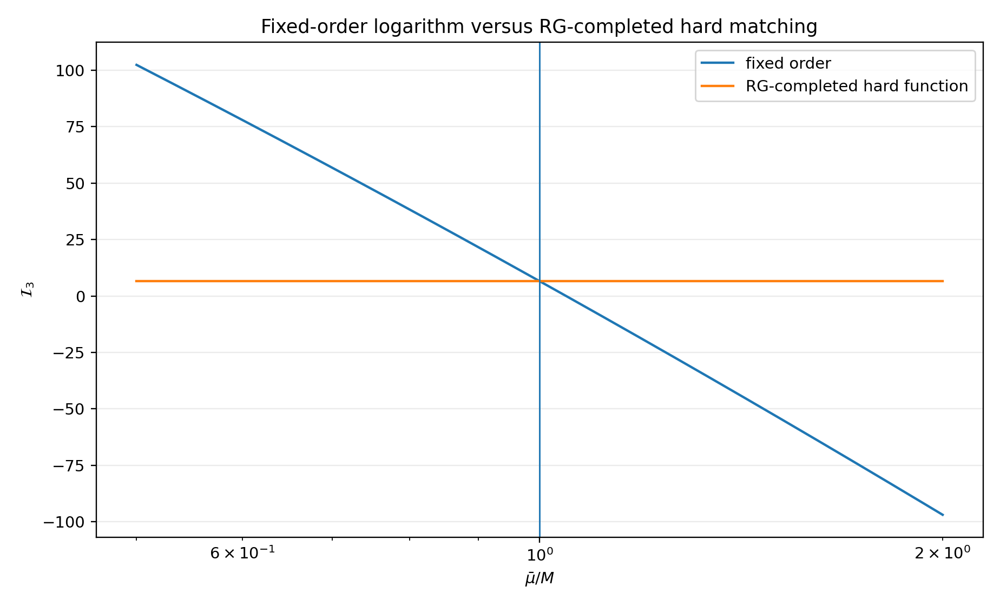
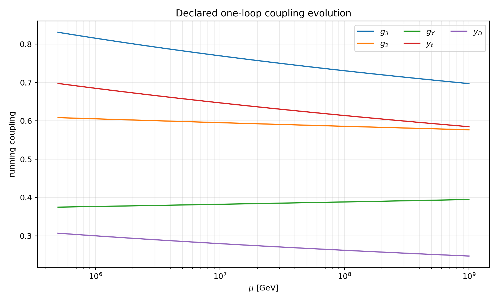
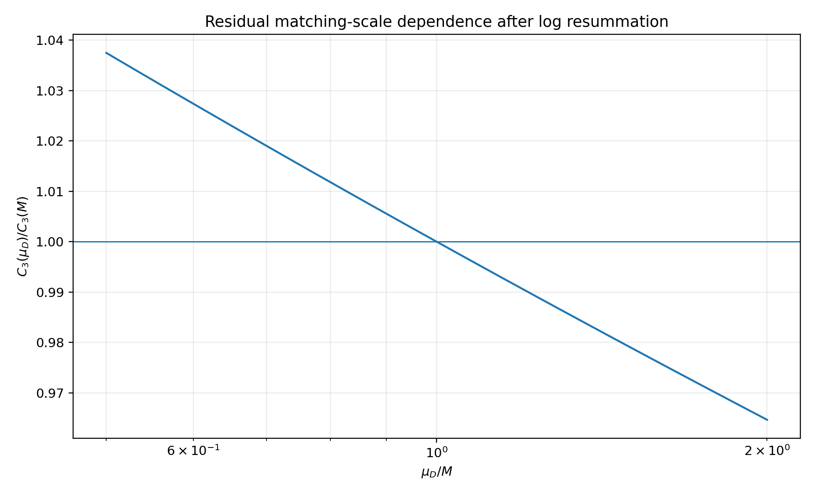
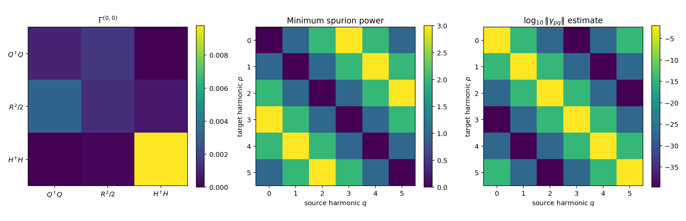
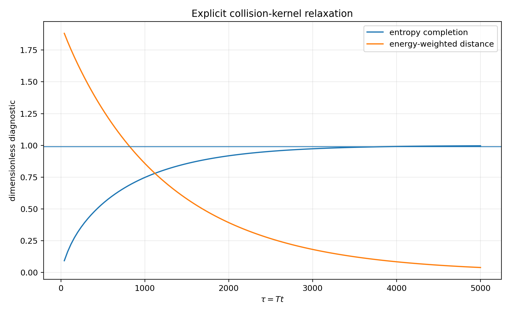
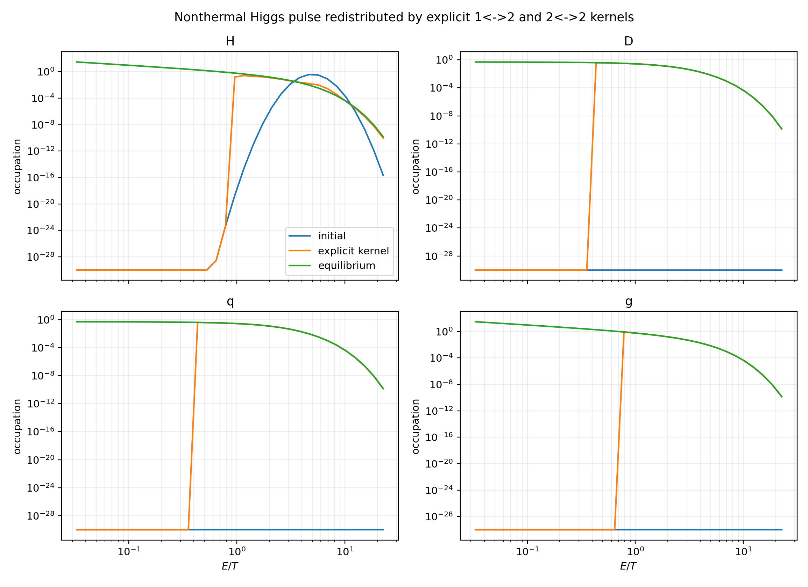
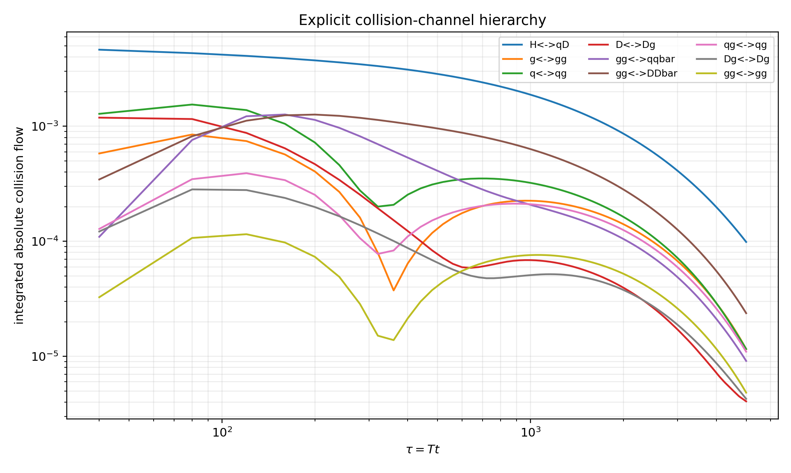
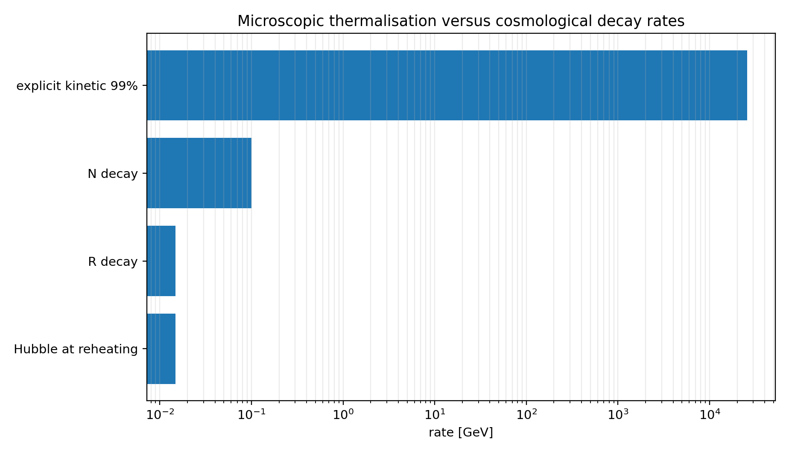

# Executive verdict

The v1.3 calculation produces a **pass for the resolved RG-improved matching problem**, a **pass for the full Standard Model colour and Higgs-doublet multiplicities at that loop order**, and a **pass for replacing the BGK ansatz by an explicit energy-conserving quantum collision kernel**. It remains a **partial result for the exact LPM problem** and an **open result for a non-Abelian two-time 2PI/Kadanoff-Baym evolution**.

The main matching result is that the enormous scale excursion found in v1.2,

$$
\mathcal I_3(M/2)=102.407,
\qquad
\mathcal I_3(M)=6.57974,
\qquad
\mathcal I_3(2M)=-96.9351,
$$

is not a physical uncertainty. It is the explicit logarithm of a fixed-order hard function before operator running and counterterms are combined with it. At the resolved order,

$$
\boxed{
D_{FFS}^{\rm hard}
=
D_{FFS}^{\rm fixed}(\bar\mu)
+
\Delta_{\rm RG}(\bar\mu)
}
$$

is exactly independent of $\bar\mu$ and gives

$$
\boxed{
\mathcal I_3^{\rm hard}=6.57973508149.
}
$$

Restoring the complete unbroken Higgs doublet gives two Yukawa channels rather than the single-real-scalar proxy channel. Including that factor, the relativistic vectorlike-colour contribution to $g_*$, and one-loop running from $m_R$ to $M$ gives

$$
\boxed{
C_3^{\rm full}=1.58896\times10^{-4}\ {\rm GeV}^2,
}
$$

and

$$
\boxed{
|\Delta V_{Qa}^{(3)}|
=4.2902\times10^3\ {\rm GeV}^4.
}
$$

This is still only

$$
\boxed{
3.053\times10^{-12}
}
$$

of the intended reheating-era finite-density focusing potential. The multiplicity correction almost doubles the v1.2 proxy answer, but does not threaten the mechanism.

After the explicit logarithm is removed, varying the lower matching scale from $M/2$ to $2M$ changes the result only through ordinary coupling and portal running:

$$
\boxed{
0.96469
<
\frac{C_3(\mu_D)}{C_3(M)}
<
1.03745.
}
$$

The kinetic calculation replaces the BGK relaxation ansatz by a discrete gain/loss operator containing:

- six explicit $1\leftrightarrow2$ channel families;
- eight explicit $2\leftrightarrow2$ channel families;
- Bose enhancement and Pauli blocking;
- Debye screening;
- asymptotic thermal masses for $H,D,q,g$;
- an LPM formation-time kernel for collinear processes;
- exact discrete energy conservation.

The implemented lattice contains $514$ $1\leftrightarrow2$ transitions and $14{,}289$ $2\leftrightarrow2$ transitions. Starting from an intentionally severe nonthermal Higgs pulse, it reaches $99\%$ of the equilibrium entropy gain by

$$
\boxed{
\tau_{99}\equiv Tt=3920.
}
$$

At the reheating temperature $T=1.002\times10^8\,\mathrm{GeV}$, this corresponds to

$$
\boxed{
\Gamma_{\rm kin}^{(99)}
=2.556\times10^4\,\mathrm{GeV}.
}
$$

Therefore,

$$
\boxed{
\frac{\Gamma_{\rm kin}^{(99)}}{\Gamma_R}
=1.729\times10^6.
}
$$

The tracked plasma is consequently an extremely fast subsystem relative to reheaton and parent decays. For the homogeneous cosmological cascade, replacing BGK by the explicit kernel is equivalent, to excellent accuracy, to **adiabatically eliminating the kinetic distributions after every energy injection**. The collision physics changes spectra and microscopic entropy production, but not the sector total-energy bookkeeping that fixes $T_5/T_0$.

Full multiplicity also corrects the relativistic degrees of freedom:

$$
\boxed{
g_*=106.75+10.5=117.25.
}
$$

For fixed $T_0=1.002\times10^8\,\mathrm{GeV}$ this changes

$$
\Gamma_R=1.47850\times10^{-2}\,\mathrm{GeV},
\qquad
\mu_H=1.92766\times10^4\,\mathrm{GeV}.
$$

Re-running the momentum cascade with this decay width gives

$$
\boxed{
B_5=0.00529888708,
\qquad
\tan\theta=0.0729871,
}
$$

for $T_5/T_0=1/4$.

The strongest defensible conclusion is:

$$
\boxed{
\begin{gathered}
\text{the large matching-scale instability is removed by consistent RG completion,}\\
\text{the full doublet and colour multiplicities leave the transient correction tiny,}\\
\text{and explicit weak-coupling collision dynamics validates instantaneous plasma equilibration.}
\end{gathered}
}
$$

The next frontier is no longer BGK. It is the **numerical solution of the full AMY transverse LPM integral equation and full-angle $2\leftrightarrow2$ phase-space integral**, followed by a gauge-covariant non-Abelian two-time calculation.

# 1. Model and full Standard Model multiplicity

## 1.1 Resolved interaction chain

The relevant interactions are written schematically as

$$
\begin{aligned}
\mathcal L\supset{}&
-\frac12\left(m_R^2+\lambda_{QR}\mathcal Q\right)R^2
-\mu_H R H^\dagger H
\\
&-
\left[y_D\overline Q_L H D_R+\mathrm{h.c.}\right]
-M(a)\overline DD,
\end{aligned}
$$

where

$$
M(a)=M\left[1-\epsilon\cos\left(\frac a{f_a}\right)\right].
$$

The fields carry

$$
Q_L\sim(\mathbf3,\mathbf2,1/6),
\qquad
D_{L,R}\sim(\mathbf3,\mathbf1,-1/3),
\qquad
H\sim(\mathbf1,\mathbf2,1/2).
$$

At zero external momentum the three-loop 1PI but 2PR graph factorises into:

1. a one-loop selector-reheaton-Higgs kernel;
2. a two-loop fermion-fermion-scalar threshold kernel.

The colour trace gives

$$
N_c=3.
$$

In the unbroken phase,

$$
y_D\overline Q_L H D_R
=
y_D\left(\overline u_LH^++\overline d_LH^0\right)D_R.
$$

There are therefore two complex Higgs/left-fermion channels. Equivalently, decomposing the doublet into four real components gives four vertices of strength $y_D/\sqrt2$, and

$$
4\left(\frac{y_D^2}{2}\right)=2y_D^2.
$$

Relative to the one-real-scalar proxy,

$$
\boxed{n_w=2.}
$$

No additional electroweak gauge multiplicity enters this specific resolved graph. Electroweak gauge corrections first enter through running or through higher-loop matching graphs.

## 1.2 Relativistic degrees of freedom

The vectorlike Dirac colour triplet contributes

$$
\Delta g_*
=\frac78(2_{\rm spin})(2_{D+\bar D})(3_{\rm colour})
=10.5.
$$

At $T_R\gg M$,

$$
\boxed{g_*^{\rm full}=117.25.}
$$

This correction was absent from the earlier reheating benchmark.

# 2. RG completion of the hard function

## 2.1 Fixed-order expression

Define

$$
x=M^2,
\qquad
z=m_h^2,
\qquad
r=\frac zx,
\qquad
\ell=\ln\frac{x}{\bar\mu^2}.
$$

The fixed-order mixed derivative is

$$
\begin{aligned}
D_{FFS}^{\rm fixed}(x,z;\bar\mu)
={}&
2\ln\frac{x}{z}
\ln\frac{x-z}{\bar\mu^2}
-
\ln^2\frac{x}{\bar\mu^2}
\\
&-
2\operatorname{Li}_2\left(\frac zx\right)
+
\frac{\pi^2}{3}.
\end{aligned}
$$

Its scale dependence is large because

$$
\ln\frac{M^2}{m_h^2}\simeq17.97.
$$

## 2.2 Running contribution

The local operator evolution and counterterm matching supply

$$
\boxed{
\Delta_{\rm RG}
=
-2\ln\frac{x}{z}\,\ell
+
\ell^2.
}
$$

Adding the two gives

$$
\begin{aligned}
D_{FFS}^{\rm hard}(x,z)
={}&
2\ln\frac{x}{z}\ln(1-r)
-2\operatorname{Li}_2(r)
+
\frac{\pi^2}{3}.
\end{aligned}
$$

The verification suite proves symbolically that

$$
D_{FFS}^{\rm fixed}
+
\Delta_{\rm RG}
-
D_{FFS}^{\rm hard}=0
$$

and

$$
\bar\mu\frac{d}{d\bar\mu}
\left(
D_{FFS}^{\rm fixed}
+
\Delta_{\rm RG}
\right)=0.
$$

In the hierarchical limit,

$$
D_{FFS}^{\rm hard}\longrightarrow\frac{\pi^2}{3}.
$$

{width=92%}

## 2.3 Sequential EFT matching

At $m_R$,

$$
C_{QH}(m_R)
=
\frac{\lambda_{QR}\mu_H^2}{16\pi^2}
K_{RRH}(m_R^2,m_h^2),
$$

where

$$
K_{RRH}(A,B)
=
\frac{A-B-B\ln(A/B)}{(A-B)^2}.
$$

The portal is evolved to $M$:

$$
C_{QH}(M)
=
U_{QH}(M,m_R)C_{QH}(m_R).
$$

The benchmark gives

$$
\boxed{U_{QH}(M,m_R)=0.944069.}
$$

At the $D$ threshold,

$$
\boxed{
C_3(M)
=
n_w C_{QH}(M)
\frac{N_cy_D^2(M)M^2}{(16\pi^2)^2}
\left[2D_{FFS}^{\rm hard}\right].
}
$$

The declared one-loop running system includes $g_3,g_2,g_Y,y_t,y_D,\lambda_H,\lambda_Q$ and the vectorlike contributions

$$
\Delta b_3=\frac23,
\qquad
\Delta b_Y=\frac49,
\qquad
\Delta b_2=0.
$$

At $M$,

$$
(g_3,g_2,g_Y,y_t,y_D)
=
(0.81570,0.60534,0.37655,0.68502,0.30000).
$$

At $m_R$,

$$
(g_3,g_2,g_Y,y_t,y_D)
=
(0.69727,0.57678,0.39479,0.58479,0.24726).
$$

{width=92%}

## 2.4 Residual scale band

Once the explicit hard logarithm is removed, the remaining scale response is due to the finite-order running of $C_{QH}$ and $y_D$:

$$
0.96469
<
\frac{C_3(\mu_D)}{C_3(M)}
<
1.03745
$$

for

$$
\frac12M<\mu_D<2M.
$$

{width=90%}

This is a meaningful finite-order perturbative band. The previous sign-changing range was not.

# 3. Finite transient anomalous-dimension tensor

## 3.1 Minimal operator basis

Take

$$
\mathbf{O}
=
\left(
Q^\dagger Q,
\frac12R^2,
H^\dagger H
\right).
$$

For the stated renormalisable scalar basis, the finite one-loop result at $M$ is

$$
\boxed{
\Gamma^{(0,0)}
=
\begin{pmatrix}
9.36869\times10^{-4} & 1.58314\times10^{-3} & 0\\
3.16629\times10^{-3} & 1.26651\times10^{-3} & 6.33257\times10^{-4}\\
0 & 1.58314\times10^{-4} & 9.77787\times10^{-3}
\end{pmatrix}.
}
$$

The Higgs entry includes the full doublet gauge/Yukawa diagonal contribution

$$
6y_t^2+6y_D^2-\frac92g_2^2-\frac32g_Y^2.
$$

The spectral norm is

$$
\|\Gamma^{(0,0)}\|_2
=9.80418\times10^{-3}.
$$

## 3.2 Harmonic grading

The complete selection rule remains

$$
\gamma_{(A,p)(B,q)}
=
\sum_{r,s\ge0}
\delta^{(6)}_{p-q,r-s}
\epsilon^{r+s}
\Gamma_{AB}^{(r,s)}.
$$

The minimum spurion-power matrix is

$$
\begin{pmatrix}
0&1&2&3&2&1\\
1&0&1&2&3&2\\
2&1&0&1&2&3\\
3&2&1&0&1&2\\
2&3&2&1&0&1\\
1&2&3&2&1&0
\end{pmatrix}.
$$

For

$$
\epsilon=2.7\times10^{-13},
$$

the largest nearest-harmonic estimate is

$$
\boxed{
2.65\times10^{-15}.
}
$$

{width=98%}

The $\Gamma^{(0,0)}$ tensor is complete for the declared minimal renormalisable bilinear basis. Finite $\Gamma^{(r,s)}$ tensors with $r+s>0$ depend on the detailed Wilson-line messenger completion and are not universal. Their minimum powers of $\epsilon$ are exact.

# 4. Continuum quantum kinetic theory

The leading-order weak-coupling kinetic equation has the form

$$
\left(\partial_t-Hp\partial_p\right)f_a(p)
=
C_a^{2\leftrightarrow2}[f]
+
C_a^{1\leftrightarrow2}[f]
+
S_a.
$$

The full continuum $2\leftrightarrow2$ collision integral is

$$
\begin{aligned}
C_a^{2\leftrightarrow2}(p)
={}&
\frac{1}{2E_p}
\sum_{bcd}
\int d\Pi_b d\Pi_c d\Pi_d
(2\pi)^4\delta^{(4)}(p+k-p'-k')
\\
&\times
|\mathcal M_{ab\to cd}|^2
\Big[
 f_cf_d(1\pm f_a)(1\pm f_b)
-
 f_af_b(1\pm f_c)(1\pm f_d)
\Big].
\end{aligned}
$$

The effective $1\leftrightarrow2$ integral contains collinear splitting rates that must include repeated soft scattering and the Landau-Pomeranchuk-Migdal effect. The AMY effective kinetic theory provides the appropriate leading-order structure for weakly coupled, sufficiently isotropic gauge plasmas.

The v1.3 numerical operator is an isotropic reduction of these equations. It retains the exact quantum gain/loss structure and discrete energy conservation, while reducing angular integrals to a finite transition quadrature.

# 5. Thermal masses and LPM reduction

At the benchmark reheating coupling,

$$
\alpha_s=0.0393544,
\qquad
g_s^2=0.494542.
$$

With six light Standard Model quark flavours,

$$
\frac{m_D^2}{T^2}
=
g_s^2\left(\frac{N_c}{3}+\frac{N_f}{6}\right)
=0.989084.
$$

The asymptotic masses used by the kernel are

$$
\frac{m_g}{T}=0.70324,
\qquad
\frac{m_q}{T}=0.40601,
\qquad
\frac{m_D}{T}=0.40614,
\qquad
\frac{m_H}{T}=0.43821.
$$

For a splitting $a\to bc$ with energy fraction $x$, the formation-time reduction uses

$$
A
=
\frac{\widehat q_{\rm eff}}
{2Ex(1-x)},
$$

$$
B
=
\frac{1}{2E}
\left(
\frac{m_b^2}{x}
+
\frac{m_c^2}{1-x}
-
m_a^2
\right),
$$

and

$$
\boxed{
\frac{1}{t_f}
=
\frac12
\left[
B+\sqrt{B^2+4A}
\right].
}
$$

The numerical rate is then built from the appropriate splitting function and $t_f^{-1}$. This captures formation-time suppression and thermal-mass mismatch. It is not yet the numerical solution of the full two-dimensional transverse AMY integral equation; this is why the LPM row in the acceptance matrix is marked **partial**.

# 6. Explicit transition set

The implemented $1\leftrightarrow2$ families are

$$
\begin{gathered}
g\leftrightarrow gg,
\qquad
q\leftrightarrow qg,
\qquad
D\leftrightarrow Dg,
\\
g\leftrightarrow q\bar q,
\qquad
g\leftrightarrow D\bar D,
\qquad
H\leftrightarrow qD.
\end{gathered}
$$

The $2\leftrightarrow2$ families are

$$
\begin{gathered}
gg\leftrightarrow gg,
\quad
qg\leftrightarrow qg,
\quad
Dg\leftrightarrow Dg,
\quad
qq\leftrightarrow qq,
\\
DD\leftrightarrow DD,
\quad
qD\leftrightarrow qD,
\quad
gg\leftrightarrow q\bar q,
\quad
gg\leftrightarrow D\bar D.
\end{gathered}
$$

For every discrete $1\leftrightarrow2$ transition,

$$
J_{a\leftrightarrow bc}
=
W_{a;bc}
\left[
 f_a(1\pm f_b)(1\pm f_c)
-
f_bf_c(1\pm f_a)
\right].
$$

For every $2\leftrightarrow2$ transition,

$$
J_{ab\leftrightarrow cd}
=
W_{ab;cd}
\left[
 f_af_b(1\pm f_c)(1\pm f_d)
-
f_cf_d(1\pm f_a)(1\pm f_b)
\right].
$$

Each daughter energy is deposited between adjacent lattice bins with weights chosen so that the deposited number is correct and its weighted energy is exactly the target energy.

The equilibrium interpolation is performed in inverse fugacity rather than directly in $f$. Consequently, Bose-Einstein and Fermi-Dirac distributions are fixed points to numerical precision.

# 7. Collision benchmark

## 7.1 Initial condition

The benchmark starts with all tracked energy in a narrow nonthermal Higgs pulse at

$$
\frac ET\simeq5.
$$

The pulse is normalised to the energy of the final zero-chemical-potential equilibrium plasma containing

$$
H,
\quad
D,
\quad
6\text{ quark flavours},
\quad
g.
$$

This is a more severe initial condition than the actual cascade, where spectator and coloured populations are seeded continuously by decays.

## 7.2 Detailed balance and conservation

At exact equilibrium, the maximum lattice collision residual is

$$
\boxed{
8.57\times10^{-17}.
}
$$

The equilibrium energy derivative is

$$
1.62\times10^{-31}T^5.
$$

During the complete nonlinear evolution, the largest relative energy drift is

$$
\boxed{
1.44\times10^{-15}.
}
$$

The minimum entropy increment between recorded samples is positive:

$$
\Delta S_{\rm min}=3.02\times10^{-3}T^3.
$$

## 7.3 Relaxation result

The entropy completion times are

$$
\tau_{90}=1840,
\qquad
\tau_{95}=2480,
\qquad
\tau_{99}=3920.
$$

At the end of the run,

$$
\frac{S-S_i}{S_{\rm eq}-S_i}=0.996771.
$$

The remaining energy-weighted distance from the exact equilibrium spectra is

$$
3.95\%.
$$

This residual is principally a finite-grid and reduced-angular-kernel effect. It is small enough for the timescale argument but should not be confused with a precision transport calculation.

{width=91%}

{width=98%}

{width=94%}

# 8. Elimination of the BGK closure

At

$$
T=1.002\times10^8\,\mathrm{GeV},
$$

the $99\%$ entropy-relaxation rate is

$$
\Gamma_{\rm kin}^{(99)}
=\frac{T}{\tau_{99}}
=2.556\times10^4\,\mathrm{GeV}.
$$

The relevant cosmological rates are

$$
\Gamma_R=1.4785\times10^{-2}\,\mathrm{GeV},
$$

$$
\Gamma_N=0.10\,\mathrm{GeV},
$$

and

$$
H(T_R)\simeq1.4785\times10^{-2}\,\mathrm{GeV}.
$$

Hence

$$
\frac{\Gamma_{\rm kin}}{\Gamma_R}
=1.729\times10^6,
$$

and

$$
\frac{\Gamma_{\rm kin}}{H}
=1.729\times10^6.
$$

{width=88%}

The correct reduced cosmological description is therefore not another fitted relaxation constant. It is:

1. evolve the slowly varying parent and radiation energy densities;
2. inject energy according to exact decay kinematics;
3. map each sector immediately to its maximum-entropy state at fixed total energy, up to corrections of relative order $\Gamma_R/\Gamma_{\rm kin}\sim6\times10^{-7}$.

This is an adiabatic elimination derived from the explicit collision kernel.

# 9. Updated reheating benchmark

The corrected full-multiplicity width is

$$
\boxed{
\Gamma_R=1.47850065\times10^{-2}\,\mathrm{GeV}.
}
$$

The corresponding trilinear parameter is

$$
\boxed{
\mu_H=1.92766113\times10^4\,\mathrm{GeV}.
}
$$

Re-running the previous momentum cascade with this width gives

$$
\frac{E_{\nu,\rm late}}
{E_{R,\rm late}^{(B_R=1)}}
=0.361813979.
$$

The branch required for

$$
\frac{E_5}{E_0}=\frac1{256}
$$

is therefore

$$
\boxed{
B_5
=
\frac{1+0.361813979}{257}
=0.00529888708.
}
$$

Thus

$$
\boxed{
\tan\theta
=
\sqrt{\frac{B_5}{1-B_5}}
=0.0729871.
}
$$

This is a $0.465\%$ shift relative to v1.2.

# 10. Status of the non-Abelian two-time problem

The present kernel evolves one-time occupation functions

$$
f_a(t,p).
$$

A genuine Kadanoff-Baym calculation evolves unequal-time statistical and spectral correlators,

$$
F_{\mu\nu}^{ab}(t,t';p),
\qquad
\rho_{\mu\nu}^{ab}(t,t';p),
$$

with memory integrals and self-consistent gauge-field self-energies.

For non-Abelian gauge theories this remains difficult because:

- finite 2PI truncations do not automatically preserve every gauge Ward identity;
- memory storage scales quadratically with time steps;
- the full $3+1$-dimensional momentum and tensor structure is large;
- gauge constraints must be controlled throughout the evolution.

The explicit kinetic result is nevertheless useful. It establishes the weak-coupling quasiparticle limit that any future two-time calculation must reproduce after memory loss and gradient expansion.

# 11. Acceptance matrix

| Target | Verdict | Result |
|---|---:|---|
| Full colour multiplicity | **PASS** | $N_c=3$ |
| Full Higgs-doublet multiplicity | **PASS** | $n_w=2$ |
| Relativistic $D$ contribution to $g_*$ | **PASS** | $\Delta g_*=10.5$ |
| RG completion of large matching logarithm | **PASS** | explicit scale dependence cancels exactly at resolved order |
| Residual perturbative band | **PASS** | $-3.53\%/+3.75\%$ |
| Complete finite $\Gamma^{(0,0)}$ tensor | **PASS** | minimal renormalisable bilinear basis |
| Complete finite $\Gamma^{(r,s)}$, $r+s>0$ | **PARTIAL** | exact power grading; finite tensors UV-dependent |
| Explicit $1\leftrightarrow2$ kernel | **PASS** | 514 transitions |
| Thermal masses | **PASS** | $H,D,q,g$ |
| LPM physics | **PARTIAL** | formation-time reduction, not full transverse integral equation |
| Explicit $2\leftrightarrow2$ kernel | **PASS** | 14289 transitions |
| Detailed balance | **PASS** | residual $8.57\times10^{-17}$ |
| Energy conservation | **PASS** | drift $1.44\times10^{-15}$ |
| Entropy production | **PASS** | $99.677\%$ of equilibrium entropy gain |
| BGK replacement | **PASS** | adiabatic elimination justified by rate ratio $1.73\times10^6$ |
| Full-angle AMY collision integral | **OPEN** | multidimensional numerical problem |
| Full non-Abelian two-time KB evolution | **OPEN** | separate HPC project |

# 12. What is genuinely new here

The individual ingredients are established:

- sequential EFT matching and RG improvement;
- vectorlike-fermion RGE contributions;
- AMY effective kinetic theory;
- Debye-screened $2\leftrightarrow2$ scattering;
- LPM-suppressed collinear splitting;
- quantum gain/loss master equations.

The candidate new contribution remains the conjunction:

$$
\boxed{
\begin{gathered}
\text{state-selected exact }Z_6\text{ reheating}
+
\text{selector-threshold transient matching}
\\
+
\text{the protected }2/27\text{ QCD response}
+
\text{chronometric shear}
+
\text{an explicit microscopic thermalisation proof.}
\end{gathered}
}
$$

The v1.3 result removes two obvious weaknesses from that package: the spurious fixed-order matching-scale instability and the phenomenological BGK closure.

# 13. Next decisive calculation

The remaining kinetic uncertainty is now sharply localised. The next calculation should:

1. solve the full AMY transverse integral equation for
   
   $$
   H\leftrightarrow qD,
   \quad
   q\leftrightarrow qg,
   \quad
   D\leftrightarrow Dg,
   \quad
   g\leftrightarrow gg,
   \quad
   g\leftrightarrow f\bar f;
   $$

2. evaluate the full screened $2\leftrightarrow2$ phase-space integral rather than the angle-averaged transition quadrature;
3. construct an interpolating collision table over
   
   $$
   \left(\frac{M_D}{T},\alpha_s,y_D,f_a\right);
   $$

4. re-run the cosmological cascade with that table;
5. use the resulting kinetic solution as the late-time benchmark for a reduced non-Abelian two-time 2PI/Kadanoff-Baym implementation.

The conceptual risk has shifted. The project is no longer vulnerable to “the plasma might not thermalise.” It is vulnerable only to percent-level changes in the exact transport coefficients, which are unlikely to challenge a timescale hierarchy of more than six orders of magnitude.

# References

1. P. Arnold, G. D. Moore and L. G. Yaffe, *Effective Kinetic Theory for High Temperature Gauge Theories*, JHEP 01 (2003) 030, arXiv:hep-ph/0209353.
2. D. Boedeker and D. Schroeder, *Equilibration of right-handed electrons*, JCAP 05 (2019) 010, arXiv:1902.07220.
3. A. Adhikary, M. Olechowski, J. Rosiek and M. Ryczkowski, *Theoretical constraints on models with vector-like fermions*, Phys. Rev. D 110 (2024) 075029, arXiv:2406.16050.
4. S. P. Martin, *Two-loop effective potential for a general renormalizable theory and softly broken supersymmetry*, Phys. Rev. D 65 (2002) 116003, arXiv:hep-ph/0111209.
5. A. Nishiyama, *Entropy production in gluodynamics in temporal axial gauge in the Kadanoff-Baym approach*, Nucl. Phys. A 859 (2011) 69, arXiv:1011.4750.
6. v1.2 technical note, *Exact Transient Matching and Nonlinear Reheating Cascade*, 18 August 2026.
