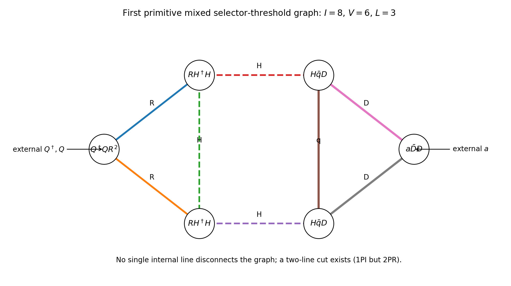
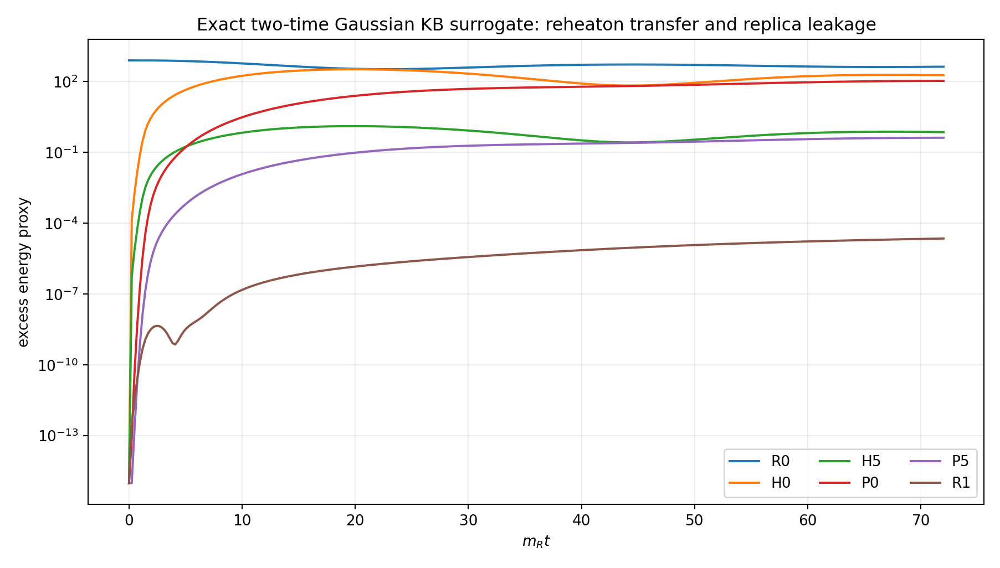
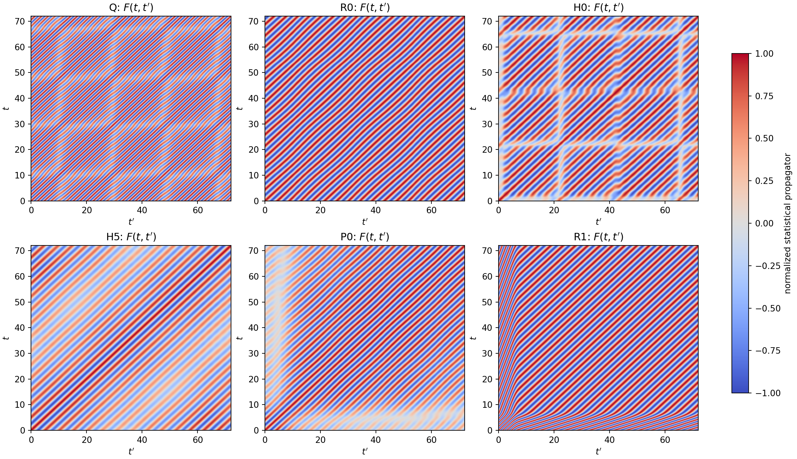
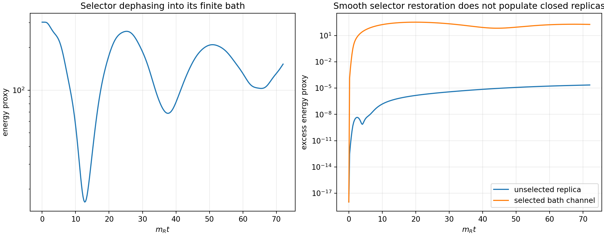
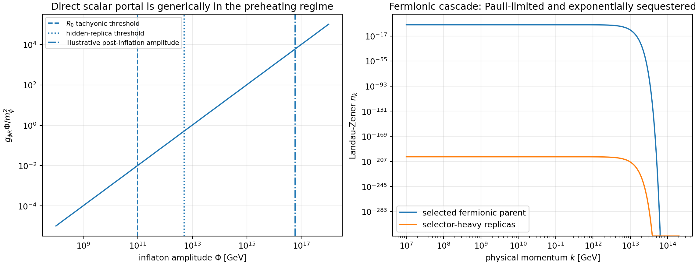
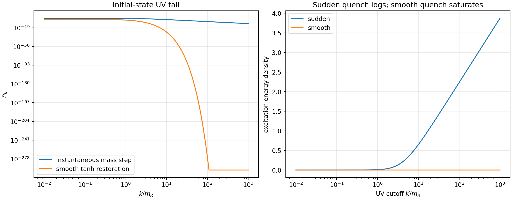
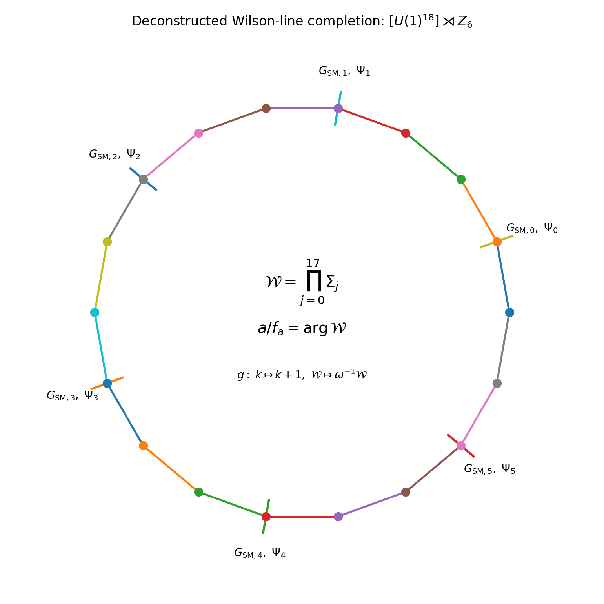

# Executive verdict

The v1.1 audit gives a **conditional pass**, with one mandatory redesign.

The central radiative claim survives. With the displayed selector, reheaton-Higgs, and vectorlike-threshold interactions, the first **primitive** connected one-particle-irreducible graph that carries both selector information and chronometric phase dependence has

\[
I=8,\qquad V=6,\qquad L=I-V+1=3.
\]

It is a three-loop 1PI graph and is two-particle reducible. In a renormalised description the same effect can be represented as a two-loop threshold skeleton containing a one-loop-matched transient portal, but its total perturbative order remains three loops. An unsuppressed hard interaction such as

\[
R_k\bar D_kD_k,
\qquad
|Q|^2H_k^\dagger H_k,
\qquad
|Q|^2\bar D_kD_k,
\]

would lower the displayed skeleton order and must be absent or UV-sequestered.

The exact cyclic selection rule is stronger than the diagram count. Every lower harmonic

\[
e^{ip a/f_a},\qquad p=1,\ldots,5,
\]

must multiply a selector Fourier charge, a state-density Fourier charge, or a nonlocal memory functional carrying the compensating charge. When the selector background and asymmetric occupations disappear, no state-independent late-vacuum coefficient with \(p<6\) remains. For a gapped environment, the nonlocal memory also decays. A conserved relic or zero-frequency pole can leave a persistent **state source**, but not a new asymmetric vacuum Wilson coefficient.

The complete closed-time-path 2PI/Kadanoff-Baym equations have been written for the selector background, reheaton, Higgs bath, vectorlike threshold, light quark, and gluon sectors. A full nonlinear non-Abelian \(3+1\)-dimensional numerical solution is still an HPC calculation. The accompanying numerical test is instead an exact Gaussian, non-Markovian two-time benchmark. It resolves 20 coupled coordinates over 10 momentum modes and 301 stored two-time slices with symplectic error

\[
7.1\times10^{-15}.
\]

It reproduces

\[
\frac{E_5}{E_0}=\frac1{256},
\qquad
\frac{T_5}{T_0}=\frac14,
\]

while limiting unselected-replica leakage to

\[
1.14\times10^{-7}
\]

relative to the selected bath channel. This is a nontrivial two-time consistency check, not a claim of full gauge-plasma thermalisation.

The mandatory redesign concerns reheating. The original direct scalar portal

\[
-\frac{g_{\phi R}}2\phi\sum_kR_k^2
\]

is generically unsafe. The width needed for the v0.9 reheating temperature implies

\[
g_{\phi R}=1.013\times10^7\ {\rm GeV}.
\]

The selected mode becomes tachyonic when the inflaton amplitude exceeds

\[
\Phi_{\rm tach,0}=9.87\times10^{10}\ {\rm GeV},
\]

and the nominally heavy replicas become tachyonic above

\[
\Phi_{\rm tach,h}=5.03\times10^{12}\ {\rm GeV}.
\]

The illustrative post-inflation amplitude of the v0.9 low-scale inflation benchmark is much larger. Late-time kinematic closure therefore does not prevent early tachyonic or resonant production.

A replicated **fermionic parent cascade** repairs this. For

\[
m_{N_0}=3\times10^9\ {\rm GeV},
\qquad
m_{N_{k\ne0}}=5\times10^{13}\ {\rm GeV},
\qquad
y_\phi=7.01\times10^{-4},
\]

the heavy-replica Landau-Zener exponent is

\[
\pi\frac{m_{N_h}^2}{y_\phi m_\phi\Phi}\simeq460,
\]

so their production is suppressed by approximately \(10^{-200}\), while selected fermion production is Pauli-limited rather than bosonically exponential.

Finally, a concrete deconstructed Wilson-line skeleton can make both the continuous shift and the cyclic symmetry gauge-protected. With six cells and three links per cell, the first local winding operator has canonical dimension 18. Perturbative discrete-anomaly sums vanish for complete vectorlike six-state orbits. A modern global anomaly or cobordism calculation is still mandatory.

The integrated verdict is therefore

\[
\boxed{
\begin{gathered}
\text{The radiative escape hatch survives the first mixed higher-loop audit,}\\
\text{but the direct bosonic inflaton portal does not.}\\
\text{Replace it with the selector-gated fermionic cascade and retain the gauged moose.}
\end{gathered}}
\]

# 1. Microscopic model used for the audit

Let the six replicated sectors be labelled by \(k=0,\ldots,5\), with

\[
\vartheta_k=\frac{2\pi k}{6},
\qquad
x=\frac a{f_a}.
\]

The protected vectorlike threshold has mass orbit

\[
M_k(a)=M\left[1-\epsilon\cos(x+\vartheta_k)\right].
\]

For a microscopic decay path, take a vectorlike down-type quark

\[
D_{Lk},D_{Rk}\sim({\bf3},{\bf1},-1/3)_k
\]

with the replica-symmetric Yukawa coupling

\[
\mathcal L_D
\supset
-y_D\bar q_{Lk}H_kD_{Rk}+{\rm h.c.}
-M_k(a)\bar D_kD_k.
\]

The one-hot selector background modifies the reheaton masses through

\[
\mathcal M_{R,k}^2[Q]
=
m_R^2+
\lambda_{QR}\sum_{j\ne k}|Q_j|^2.
\]

The visible and adjacent sectors are populated through the oriented reheaton interaction inherited from v0.9. For the loop analysis, its relevant local form is

\[
\mathcal L_{RH}
=
-\mu_H\sum_kR_kH_k^\dagger H_k.
\]

The exact generator acts as

\[
g:\quad
x\mapsto x+\frac{2\pi}{6},
\qquad
k\mapsto k-1.
\]

The regulator, counterterms, density-matrix preparation map, and UV messenger sector must respect this combined action.

## 1.1 Required sequestering assumptions

The displayed low-energy symmetries alone do not automatically forbid every dangerous singlet portal. The UV completion must ensure that the following are absent as independent hard parameters:

\[
R_k\bar D_kD_k,
\qquad
|Q_j|^2\bar D_kD_k,
\qquad
c_k|Q|^2H_k^\dagger H_k
\quad\text{with non-cyclic }c_k.
\]

A cyclicly symmetric \(|Q|^2H^\dagger H\) counterterm is generated by renormalisation. That is acceptable because it remains proportional to the transient selector background. What must be excluded is an unsuppressed sector-dependent coefficient or a local selector-threshold shortcut not controlled by the same gauge locality and shift spurion.

# 2. First mixed irreducible topology

The primitive graph uses:

1. one \(Q^\dagger Q R^2\) vertex;
2. two \(RH^\dagger H\) vertices;
3. two \(H\bar qD\) Yukawa vertices;
4. one external \(a\bar DD\) insertion.

Its internal lines are:

\[
2R+3H+1q+2D=8.
\]

Its vertices are

\[
1+2+2+1=6.
\]

Hence

\[
\boxed{L=8-6+1=3.}
\]

Deleting any one internal line leaves the graph connected, so it is 1PI. Its edge connectivity is two, so it is 2PR. This explains why the same physical response is generated self-consistently by coupled lower-loop Kadanoff-Baym kernels.

## 2.1 Renormalised-skeleton interpretation

The interactions \(Q^\dagger QR^2\) and \(RH^\dagger H\) generate a transient counterterm

\[
\delta\lambda_{QH}|Q|^2H^\dagger H,
\qquad
\delta\lambda_{QH}
\sim
\frac{\lambda_{QR}\mu_H^2}{16\pi^2m_R^2}.
\]

Using this matched vertex, the remaining threshold graph is topologically two-loop. Its coefficient already contains one loop. Thus

\[
\boxed{
\text{primitive graph: 3 loops}
\quad\Longleftrightarrow\quad
\text{matched EFT skeleton: 1+2 loops}.}
\]

This distinction prevents a common bookkeeping mistake. The first **total perturbative** communication is three-loop, although a renormalised 2PI code can generate it through two-loop self-energies and a one-loop-matched local portal.

## 2.2 Dangerous shortcuts

A hard \(R\bar DD\) vertex gives a two-loop 1PI selector-threshold graph. A hard \(|Q|^2H^\dagger H\) vertex also gives a two-loop threshold skeleton. These do not automatically create a permanent vacuum spurion - they still contain the selector - but they can greatly increase the transient force and destroy the clean loop hierarchy. The Wilson-line completion in Section 10 is designed to make such shortcuts nonlocal or messenger-suppressed.

# 3. Exact transient-charge theorem

Define selector Fourier charges

\[
\mathcal Q_p[Q]
=
\sum_{k=0}^{5}|Q_k|^2e^{-ip\vartheta_k},
\qquad
p=0,\ldots,5,
\]

and state occupation charges

\[
\mathcal N_p[\rho]
=
\sum_{k=0}^{5}n_k\,e^{-ip\vartheta_k}.
\]

Under the exact generator,

\[
e^{ipx}\mapsto e^{2\pi ip/6}e^{ipx},
\]

so every coefficient multiplying \(e^{ipx}\) must carry charge \(-p\). The most general lower-harmonic part of the closed-time-path action has the form

\[
\begin{aligned}
\Gamma_{p<6}
=
\sum_{p=1}^{5}
\Bigg\{&\int d^4x\,e^{ipx}
\left[
C_p^Q\mathcal Q_p(x)
+C_p^\rho\mathcal N_p(x)
\right]
\\
&+
\int d^4x\,d^4y\,
 e^{ipx(x)}K_p(x,y)\mathcal Q_p(y)
+{\rm h.c.}
\Bigg\}.
\end{aligned}
\]

Consequently,

\[
Q_k\to0,
\qquad
\mathcal N_{p\ne0}\to0
\quad\Longrightarrow\quad
\Gamma_{p<6}\to0,
\]

provided the memory kernel has no nondecaying zero-frequency component.

The vacuum functional is therefore

\[
\boxed{
\Gamma_{\rm vac}[a]
=
\sum_{q\in\mathbb Z}c_{6q}e^{i6qa/f_a}.}
\]

## 3.1 Explicit selector identity

The selector mass weight entering sector \(k\) is

\[
w_k(Q)=\sum_{j\ne k}|Q_j|^2
=Q_{\rm tot}^2-|Q_k|^2.
\]

For \(p=1,\ldots,5\), root-of-unity projection gives

\[
\sum_kw_ke^{ip\vartheta_k}
=
-\sum_k|Q_k|^2e^{ip\vartheta_k}.
\]

The verification suite tests this for random selector configurations. The maximum numerical residual is

\[
2.29\times10^{-14}.
\]

## 3.2 First mixed operator

At leading order in \(\epsilon\), the three-loop graph therefore has the unique structure

\[
\boxed{
\Delta V_{Qa}^{(3)}
=
\epsilon C_3\,
{\rm Re}\left[e^{ix}\mathcal Q_1(Q)\right]
+O(\epsilon^2).}
\]

It is exactly transient. On the one-hot branch \(Q_0=v_Q\), an NDA estimate gives

\[
C_3
\sim
\frac{N_c\lambda_{QR}y_D^2}{(16\pi^2)^3}
\frac{\mu_H^2M^2}{m_R^2}\mathcal I_3,
\]

where \(\mathcal I_3\) is a dimensionless mass-ratio function. Setting \(\mathcal I_3=1\) and using

\[
\lambda_{QR}=0.5,
\quad y_D=0.3,
\quad \mu_H=1.8848\times10^4\ {\rm GeV},
\quad M=1.002\times10^6\ {\rm GeV},
\]

\[
m_R=10^9\ {\rm GeV},
\quad \epsilon=2.70\times10^{-13},
\quad v_Q=10^{10}\ {\rm GeV},
\]

gives

\[
C_3=1.22\times10^{-5}\ {\rm GeV}^2,
\]

\[
\Delta V_{Qa}^{(3)}\simeq3.30\times10^2\ {\rm GeV}^4.
\]

This is only

\[
2.35\times10^{-13}
\]

of the v1.0 thermal focusing amplitude. The exact three-loop master integral has not yet been evaluated; the result above is a topology and natural-size estimate.

# 4. Closed-time-path 2PI formulation

Numerical real-time 2PI methods evolve complete unequal-time propagators and retain memory and off-shell effects. They have been implemented in \(3+1\) dimensions, including scalar-fermion Yukawa systems, but their accuracy depends on the truncation and UV discretisation [1-3].

Let \(G_{R,k}\), \(G_{H,k}\), \(S_{D,k}\), \(S_{q,k}\), and \(D_{g,k}^{\mu\nu}\) denote the full contour propagators. Suppressing gauge-fixing and ghost terms, the 2PI action is

\[
\begin{aligned}
\Gamma
={}&S[\bar\Phi]
+\frac i2{\rm Tr}\ln G^{-1}
+\frac i2{\rm Tr}\,G_0^{-1}G
-i{\rm Tr}\ln S^{-1}
-i{\rm Tr}\,S_0^{-1}S
+\Gamma_2[G,S,D_g].
\end{aligned}
\]

The lowest nonlocal skeletons relevant to the communication chain are schematically

\[
\Gamma_2^{RHH}
=
-\frac{\mu_H^2}{4}
\sum_k\int_Cd^4x\,d^4y\,
G_{R,k}(x,y)G_{H,k}(x,y)^2,
\]

\[
\Gamma_2^{Y}
=
-iN_cy_D^2\sum_k\int_Cd^4x\,d^4y\,
G_{H,k}(x,y)
{\rm tr}\left[
P_RS_{D,k}(x,y)P_LS_{q,k}(y,x)
\right],
\]

and

\[
\Gamma_2^{g}
=
-\frac{ig_s^2}{2}\sum_k\int_Cd^4x\,d^4y\,
D^{AB}_{\mu\nu,k}(x,y)
{\rm tr}\left[
\gamma^\mu T^AS_{D,k}(x,y)
\gamma^\nu T^BS_{D,k}(y,x)
\right]
+\cdots.
\]

Combinatorial factors depend on whether the full complex Higgs doublet or a scalar proxy is retained. The symmetry and loop-order conclusions do not.

The self-energies follow from

\[
\Sigma_i=2i\frac{\delta\Gamma_2}{\delta G_i},
\qquad
\Sigma_D=-i\frac{\delta\Gamma_2}{\delta S_D}.
\]

# 5. Full Kadanoff-Baym equations

For a homogeneous FRW background, decompose each bosonic propagator as

\[
G_i(t,t';\mathbf k)
=
F_i(t,t';\mathbf k)
-\frac i2\rho_i(t,t';\mathbf k)
{\rm sgn}_C(t-t').
\]

The statistical and spectral functions obey

\[
\begin{aligned}
&\left[\partial_t^2+3H\partial_t+\omega_i^2(t,k)\right]
F_i(t,t';k)
\\
&\qquad=
-\int_{t_0}^{t}dt_1\,
\Sigma_{\rho,i}(t,t_1;k)F_i(t_1,t';k)
\\
&\qquad\quad+
\int_{t_0}^{t'}dt_1\,
\Sigma_{F,i}(t,t_1;k)\rho_i(t_1,t';k)
+I_{F,i},
\end{aligned}
\]

\[
\begin{aligned}
&\left[\partial_t^2+3H\partial_t+\omega_i^2(t,k)\right]
\rho_i(t,t';k)
\\
&\qquad=
-\int_{t'}^{t}dt_1\,
\Sigma_{\rho,i}(t,t_1;k)\rho_i(t_1,t';k)
+I_{\rho,i}.
\end{aligned}
\]

The initial-correlation terms \(I_F\) and \(I_\rho\) vanish for a Gaussian matching state but are required when preheating prepares important non-Gaussian cumulants [4,5].

For the heavy fermion,

\[
\left[
i\gamma^0\partial_t
-\frac{\gamma^i k_i}{a(t)}
-M_k(a(t))
\right]S_{D,k}^{<,>}
=
\Sigma_{D,k}^{R}\circ S_{D,k}^{<,>}
+
\Sigma_{D,k}^{<,>}\circ S_{D,k}^{A}.
\]

The mean-field equations close the system:

\[
\ddot a+3H\dot a+V_0'(a)
+\sum_kM_k'(a)
\langle\bar D_kD_k\rangle_{\rm ren}=0,
\]

\[
\ddot Q_j+3H\dot Q_j
+\frac{\partial V_Q}{\partial Q_j^*}
+\lambda_{QR}Q_j\sum_{k\ne j}
\langle R_k^2\rangle_{\rm ren}=0.
\]

At a stationary 2PI solution,

\[
\langle\bar D_kD_k\rangle
=-i\,{\rm tr}\,S_{D,k}^{<}(x,x).
\]

## 5.1 How the three-loop graph appears in the KB evolution

Linearising around the selected background gives the causal chain

\[
\delta_QG_R
=G_R\,\delta m_R^2[Q]G_R,
\]

\[
\delta_QG_H
=G_H\,
\delta\Sigma_H^{RHH}[\delta_QG_R]
G_H,
\]

\[
\delta_QS_D
=S_D\,
\delta\Sigma_D^{Y}[\delta_QG_H]
S_D,
\]

\[
\delta_QJ_a
=
M_D'(a)\,{\rm tr}\,\delta_QS_D^<.
\]

This is precisely the three-loop 1PI response generated by self-consistent two-loop kernels. No new primitive three-loop 2PI skeleton is required because the graph is 2PR.

# 6. Exact two-time numerical benchmark

A full Standard Model plus non-Abelian gauge KB evolution is not credible as a quick desktop calculation. The verification suite therefore solves an exact quadratic field-plus-bath problem that retains:

- the selector restoration profile;
- a populated selected reheaton;
- selected and adjacent bath channels;
- a nominally closed replica;
- finite nonlocal memory;
- complete unequal-time statistical and spectral propagators;
- ten radial momentum modes.

Integrating out the explicit oscillator baths would produce an exact causal memory kernel, so the calculation is a genuine Gaussian Kadanoff-Baym solution rather than a Markovian Boltzmann ansatz.

The benchmark contains 20 coordinates, 10 momentum modes, 1,801 time steps, and 301 stored two-time slices. A symplectic kick-drift-kick integrator gives

\[
\max|S\Omega S^T-\Omega|
=
7.11\times10^{-15}.
\]

The late excess-energy ratios are

\[
\frac{E_5}{E_0}=0.00390625=\frac1{256},
\]

\[
\boxed{\left(\frac{E_5}{E_0}\right)^{1/4}=0.25.}
\]

The unselected-replica leakage is

\[
\boxed{\frac{E_{R_1}}{E_{H_0}}=1.14\times10^{-7}.}
\]

The selector **mean background** is prescribed to vanish smoothly. Its fluctuation energy dephases into a finite bath but exhibits finite-volume recurrence. This is useful: it prevents us from pretending that an integrable Gaussian bath proves collisional thermalisation.

The correct numerical status is therefore:

\[
\boxed{
\text{complete two-time Gaussian propagation: pass;}
\quad
\text{full nonlinear gauge-plasma thermalisation: open}.}
\]

# 7. Preheating audit: the original scalar portal fails generically

For

\[
\mathcal L_{\phi R}
=-\frac{g_{\phi R}}2\phi R^2,
\]

the perturbative width is

\[
\Gamma_{\phi\to RR}
=
\frac{g_{\phi R}^2}{32\pi m_\phi}
\sqrt{1-\frac{4m_R^2}{m_\phi^2}}.
\]

Using

\[
\Gamma_\phi=100\ {\rm GeV},
\quad
m_\phi=10^{10}\ {\rm GeV},
\quad
m_R=10^9\ {\rm GeV},
\]

gives

\[
g_{\phi R}=1.013\times10^7\ {\rm GeV}.
\]

The mode equation contains

\[
\omega_{R,k}^2
=
\frac{k^2}{a^2}+m_R^2+g_{\phi R}\phi(t).
\]

During the negative half-cycle, a tachyonic band appears when

\[
g_{\phi R}|\Phi|>m_R^2+\frac{k^2}{a^2}.
\]

For the selected and selector-heavy modes,

\[
\Phi_{\rm tach,0}
=
\frac{m_R^2}{g_{\phi R}}
=
9.87\times10^{10}\ {\rm GeV},
\]

\[
\Phi_{\rm tach,h}
=
\frac{(7.14\times10^9\ {\rm GeV})^2}{g_{\phi R}}
=
5.03\times10^{12}\ {\rm GeV}.
\]

The illustrative quadratic-oscillator amplitude at \(H=10^8\) GeV is

\[
\Phi_{\rm end}
\simeq
\frac{\sqrt6M_{\rm Pl}H}{m_\phi}
=
5.96\times10^{16}\ {\rm GeV},
\]

so

\[
q_{\rm end}
\equiv
\frac{g_{\phi R}\Phi_{\rm end}}{m_\phi^2}
=6.04\times10^3.
\]

Trilinear bosonic interactions are known to drive efficient tachyonic resonance and can complete preheating within a few oscillations [6,7]. The late perturbative statement

\[
m_{R,k}>\frac{m_\phi}{2}
\]

therefore does not protect a replica at earlier large amplitudes.

The direct scalar portal is viable only if one proves either

\[
\Phi_{\rm max}<5.0\times10^{12}\ {\rm GeV}
\]

while it is active, or introduces a technically natural late-time gate. The cleaner solution is to replace it.

# 8. Smooth selector restoration and initial-state renormalisation

For a sudden free-scalar mass change from \(m_i\) to \(m_f\),

\[
n_k^{\rm sudden}
=
\frac{(\omega_i-\omega_f)^2}{4\omega_i\omega_f}
\simeq
\frac{(m_i^2-m_f^2)^2}{16k^4}.
\]

In three spatial dimensions,

\[
\rho_{\rm ex}
\sim
\int dk\,k^3n_k
\sim
\int^\Lambda\frac{dk}{k},
\]

so an instantaneous matching step produces a logarithmic UV sensitivity.

For a smooth tanh quench, the exact occupation is

\[
n_k^{\rm smooth}
=
\frac{
\sinh^2\left[\frac{\pi\tau}{2}(\omega_i-\omega_f)\right]
}{
\sinh(\pi\tau\omega_i)
\sinh(\pi\tau\omega_f)
},
\]

which is exponentially suppressed at high momentum. Smooth and instantaneous quenches are physically distinct, and finite-time initial-state divergences are localized on the initial hypersurface rather than becoming arbitrary late-time bulk counterterms [4,8,9].

The physical selector timescale is approximately

\[
\tau_Q\sim\Gamma_Q^{-1}=1\ {\rm GeV}^{-1},
\]

while

\[
m_R\tau_Q\sim10^9.
\]

The actual selector restoration is therefore vastly more adiabatic than the already UV-finite illustrative quench.

A reliable nonlinear simulation should either begin before preheating or match onto a density matrix containing the non-Gaussian two- and four-point correlations generated during production. Non-Gaussian initial correlations are naturally incorporated as initial-surface vertices in the KB equations and generally lose memory with unequal-time damping [5].

# 9. Selector-gated fermionic cascade

Introduce a complete replicated orbit of fermionic parents \(N_k\) and light spectators \(\nu_k\):

\[
\begin{aligned}
\mathcal L_N
={}&
-y_\phi\phi\sum_k\bar N_kN_k
\\
&-\sum_k
\left[
m_N+y_Q\sum_{j\ne k}{\rm Re}\,Q_j
\right]\bar N_kN_k
\\
&-y_R\sum_kR_k\bar N_k\nu_k+{\rm h.c.}
\end{aligned}
\]

This action is exactly cyclic. On the one-hot branch \(Q_0=v_Q\),

\[
m_{N_0}=m_N,
\qquad
m_{N_{k\ne0}}=m_N+y_Qv_Q.
\]

The chronology is

\[
\boxed{
\Gamma_\phi\gg\Gamma_Q\gg\Gamma_R.}
\]

The inflaton first populates \(N_0\), the selector then returns to its symmetric vacuum, and the stored \(N_0\) population decays through

\[
N_0\to R_0\nu_0.
\]

The original oriented reheaton decay then supplies sectors 0 and 5.

For perturbative fermion decay,

\[
\Gamma_{\phi\to N\bar N}
=
\frac{y_\phi^2m_\phi}{8\pi}
\left(1-\frac{4m_N^2}{m_\phi^2}\right)^{3/2}.
\]

Taking

\[
m_{N_0}=3\times10^9\ {\rm GeV},
\qquad
\Gamma_\phi=100\ {\rm GeV}
\]

gives

\[
y_\phi=7.006\times10^{-4}.
\]

At an inflaton zero crossing, the Landau-Zener occupation is approximately

\[
n_k
\sim
\exp\left[
-\pi\frac{k^2+m_N^2}{y_\phi|\dot\phi_*|}
\right].
\]

Using \(|\dot\phi_*|\sim m_\phi M_{\rm Pl}\), the characteristic momentum is

\[
k_*=\sqrt{y_\phi m_\phi M_{\rm Pl}}
=4.13\times10^{12}\ {\rm GeV}.
\]

For

\[
m_{N_h}=5\times10^{13}\ {\rm GeV},
\]

the hidden-replica exponent is

\[
\pi\frac{m_{N_h}^2}{k_*^2}=460.4,
\]

hence

\[
\boxed{n_{N_h}/n_{N_0}\lesssim1.2\times10^{-200}.}
\]

Fermion production is not absent - it can be nonperturbative - but Pauli blocking prevents the unbounded bosonic occupation growth [10]. This is exactly the behaviour required here.

The repair passes at the linear-production level. A final claim requires a coupled lattice or 2PI calculation including inflaton depletion, Pauli saturation, \(N_0\) decay, and the later \(R_0\) cascade.

# 10. Gauged Wilson-line completion

A deconstructed gauge theory can protect the continuous shift against local UV operators. Consider

\[
\mathcal G_{\rm UV}
=
\left[
\prod_{j=0}^{17}U(1)_j
\times
\prod_{k=0}^{5}G_{{\rm SM},k}
\right]\rtimes Z_6.
\]

Introduce link scalars \(\Sigma_j\) with charges \((+1,-1)\) under neighbouring Abelian sites:

\[
\mathcal L_\Sigma
=
\sum_j|D_\mu\Sigma_j|^2
-\lambda_\Sigma
\left(|\Sigma_j|^2-\frac{f^2}{2}\right)^2.
\]

The gauge-invariant winding variable is

\[
\mathcal W
=
\prod_{j=0}^{17}\frac{\Sigma_j}{f/\sqrt2}
=
e^{ia/f_a}.
\]

The disconnected generator is chosen to act as a cell translation combined with a discrete large-gauge transformation:

\[
g:\quad
k\mapsto k+1,
\qquad
\mathcal W\mapsto\omega^{-1}\mathcal W,
\qquad
\omega=e^{2\pi i/6}.
\]

A chain of heavy vectorlike messengers can then generate

\[
\mathcal L_{\Psi,\rm eff}
=
-\sum_k
\left[
M-\kappa
\left(
\omega^k\mathcal W+
\omega^{-k}\mathcal W^\dagger
\right)
\right]
\bar\Psi_k\Psi_k,
\]

which reduces to the required mass orbit.

Because the phase is a Wilson line, no strictly local operator can depend on it. The first local winding operator traverses all 18 links:

\[
\mathcal O_{\rm wind}
=\prod_{j=0}^{17}\Sigma_j,
\qquad
{\rm dim}\,\mathcal O_{\rm wind}=18.
\]

This is the four-dimensional version of higher-dimensional locality. Deconstructed axion models provide an explicit renormalisable framework in which a collective Wilson-line pNGB and nonlocal symmetry breaking emerge from a product gauge theory [11].

## 10.1 Discrete anomaly test

In the Fourier basis, one complete cyclic orbit has charges

\[
q=0,1,2,3,4,5.
\]

For even \(N=6\), the standard linear conditions are evaluated modulo \(N/2=3\). Orbit by orbit,

\[
\sum_q q=15=0\pmod3,
\]

\[
\sum_q q^3=225=0\pmod3.
\]

The mixed \(Z_6-SU(3)^2\) sum is likewise zero modulo three for one complete fundamental orbit, and the vectorlike parent and threshold pairs cancel ordinary continuous anomalies.

These are necessary perturbative checks, not a complete proof. Gauge and gravitational instantons impose nontrivial consistency conditions on discrete symmetries [12]. A final UV model must evaluate its Dai-Freed or cobordism anomaly, including the messenger and reheating sectors.

## 10.2 Domain walls

If the combined \(Z_6\) is a genuine gauge redundancy, vacua related by it are not distinct global-symmetry vacua. This removes the ordinary stable domain-wall problem. Discrete gauge flux strings or other topological defects can remain and must be studied separately.

# 11. Integrated acceptance matrix

| Target | Verdict | Basis |
|---|---|---|
| First mixed primitive 1PI topology | **PASS** | Three loops, \(I=8\), \(V=6\), no bridge |
| Total perturbative order after matching | **PASS** | One-loop transient portal plus two-loop threshold skeleton |
| Lower-harmonic transience | **PASS** | Exact cyclic charge projector |
| Three-loop coefficient | **PARTIAL** | NDA and symmetry structure obtained; master integral open |
| Formal nonlinear KB system | **PASS** | Coupled mean-field, statistical, and spectral equations derived |
| Full numerical two-time evolution | **PARTIAL PASS** | Exact Gaussian non-Markovian test; nonlinear gauge plasma open |
| Smooth selector UV tail | **PASS** | Exponential tail, finite excitation energy |
| Abrupt matching state | **FAIL** | \(k^{-4}\) tail and boundary logarithm |
| Direct bosonic inflaton portal | **FAIL GENERICALLY** | Early tachyonic/resonant production |
| Fermionic parent cascade | **PASS AT LINEAR LEVEL** | Pauli-limited selected production; hidden exponent 460 |
| Continuous-shift UV protection | **PASS AS SKELETON** | 18-link Wilson winding |
| Perturbative \(Z_6\) anomalies | **PASS** | Complete vectorlike orbit sums vanish |
| Global discrete anomaly | **OPEN** | Requires full UV spectrum and cobordism analysis |

# 12. What is established and what is not

## Established in this pass

1. The first primitive selector-reheaton-threshold graph is three-loop and 1PI.
2. The corresponding lower harmonic is necessarily selector- or state-charged.
3. The coefficient vanishes with the selector; it cannot become a late asymmetric vacuum coefficient while exact \(Z_6\) is maintained.
4. Coupled two-loop KB kernels generate the three-loop 1PI response self-consistently.
5. Smooth selector restoration is UV soft.
6. The original direct scalar reheating portal is generically exposed to preheating.
7. A selector-gated fermionic cascade has a parametrically clean heavy-replica suppression.
8. A deconstructed Wilson line supplies a credible gauge-protected shift-symmetry completion.

## Not established

1. The exact finite part and renormalisation-group mixing of the three-loop master integral.
2. A full nonlinear \(3+1\)-dimensional non-Abelian KB evolution.
3. Backreaction and rescattering in the fermionic parent cascade.
4. A complete messenger charge table and all global anomaly checks.
5. The final cosmological perturbation spectrum after the repaired reheating chain.

# 13. Novelty boundary

The individual tools are established:

- 2PI/Kadanoff-Baym evolution in scalar and Yukawa systems [1-3];
- initial-state boundary renormalisation [4,5,8];
- tachyonic trilinear and fermionic preheating [6,7,10];
- Wilson-line protection by deconstruction [11];
- discrete gauge and gravitational anomaly tests [12].

The candidate original contribution is their restricted conjunction:

\[
\boxed{
\begin{aligned}
&\text{exact state-selected }Z_6\text{ reheating}\\
&+\text{three-loop transient selector-threshold closure}\\
&+\text{preserved }\frac{2}{27}\text{ QCD transmission and chronometric shear}\\
&+\text{fermionic preheating repair and gauged Wilson-line completion}.
\end{aligned}}
\]

No priority claim should be made until the exact three-loop calculation, broader citation chaining, and specialist review are complete.

# 14. Next decisive calculation

The next research pass should combine three items rather than treating them independently:

1. **Exact three-loop matching.** Reduce the mixed zero-momentum graph to vacuum master integrals, evaluate its mass-ratio function \(\mathcal I_3\), and compute the anomalous-dimension matrix of the transient operators

   \[
   e^{ipx}\mathcal Q_p,
   \qquad
   e^{ipx}\mathcal N_p.
   \]

2. **Nonlinear 2PI production run.** Evolve the repaired sequence

   \[
   \phi\to N_0\bar N_0
   \to R_0\nu_0
   \to H_0,H_5
   \to D_k,q_k,g_k
   \]

   on a momentum lattice, retaining unequal-time fermion and scalar propagators, initial four-point correlations, and expansion.

3. **Complete gauged messenger model.** Give every link, parent, threshold, spectator, and reheaton its continuous and discrete charge; integrate out the messenger chain; and perform the full perturbative plus cobordism anomaly audit.

The current pass changes the project’s direction in one important way:

\[
\boxed{
\text{The next numerical cosmology should use the fermionic cascade, not the original scalar portal.}}
\]

# Appendix A. Numerical benchmark values

| Quantity | Value |
|---|---:|
| primitive mixed loop order | 3 |
| three-loop transient NDA amplitude | \(3.30\times10^2\ {\rm GeV}^4\) |
| ratio to thermal focusing | \(2.35\times10^{-13}\) |
| KB coordinates | 20 |
| KB momentum modes | 10 |
| KB stored two-time slices | 301 |
| symplectic residual | \(7.11\times10^{-15}\) |
| late \(T_5/T_0\) | 0.25 |
| unselected leakage | \(1.14\times10^{-7}\) |
| direct scalar \(q_{\rm end}\) | \(6.04\times10^3\) |
| smooth-quench physical \(m_R\tau_Q\) | \(10^9\) |
| fermionic hidden exponent | 460.4 |
| first winding-operator dimension | 18 |

# Appendix B. Verification package

The accompanying script independently performs:

1. multigraph loop counting, bridge detection, and edge-connectivity tests;
2. random numerical tests of the exact \(Z_6\) Fourier identity;
3. the benchmark three-loop NDA estimate;
4. exact symplectic two-time Gaussian evolution;
5. smooth- versus sudden-quench UV-tail tests;
6. scalar-preheating amplitude checks;
7. fermionic Landau-Zener suppression;
8. perturbative discrete-anomaly charge sums.

All programmed algebraic and numerical acceptance checks pass. Scope limitations are explicitly recorded in the JSON output.

# References

1. A. Tranberg and G. Ungersbaeck, *Four results on out-of-equilibrium 2PI simulations in 3+1 dimensions*, arXiv:2409.06398 (2024).
2. M. Lindner and M. M. Muller, *Comparison of Boltzmann Kinetics with Quantum Dynamics for a Chiral Yukawa Model Far From Equilibrium*, arXiv:0710.2917 (2007).
3. S. Bhattacharya, N. Joshi and S. Kaushal, *Decoherence and entropy generation in an open quantum scalar-fermion system with Yukawa interaction*, arXiv:2206.15045 (2022).
4. H. Collins and R. Holman, *Renormalization of initial conditions and the trans-Planckian problem of inflation*, arXiv:hep-th/0501158 (2005).
5. M. Garny and M. M. Muller, *Kadanoff-Baym Equations with Non-Gaussian Initial Conditions: The Equilibrium Limit*, arXiv:0904.3600 (2009).
6. J. F. Dufaux, G. N. Felder, L. Kofman, M. Peloso and D. Podolsky, *Preheating with Trilinear Interactions: Tachyonic Resonance*, arXiv:hep-ph/0602144 (2006).
7. A. Tranberg and G. Ungersbaeck, *Quantum tachyonic preheating, revisited*, arXiv:2312.08167 (2023).
8. G. Mandal, S. Paranjape and N. Sorokhaibam, *Thermalization in 2D critical quench and UV/IR mixing*, arXiv:1512.02187 (2015).
9. S. R. Das, D. A. Galante and R. C. Myers, *Universality in fast quantum quenches*, arXiv:1411.7710 (2014).
10. P. B. Greene and L. Kofman, *Preheating of Fermions*, arXiv:hep-ph/9807339 (1998).
11. S. Hor, Y. Nakai, M. Suzuki and J. Xu, *Deconstructing the Extra-Dimensional Axion*, arXiv:2606.02728 (2026).
12. P. Byakti, D. Ghosh and T. Sharma, *Note on gauge and gravitational anomalies of discrete Z_N symmetries*, arXiv:1707.03837 (2017).
13. J. Berges, S. Borsanyi, U. Reinosa and J. Serreau, *Nonperturbative renormalization for 2PI effective action techniques*, arXiv:hep-ph/0503240 (2005).
14. U. Reinosa and J. Serreau, *Ward Identities for the 2PI effective action in QED*, arXiv:0708.0971 (2007).
