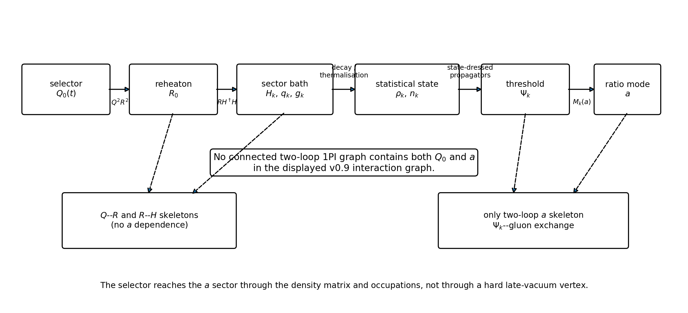
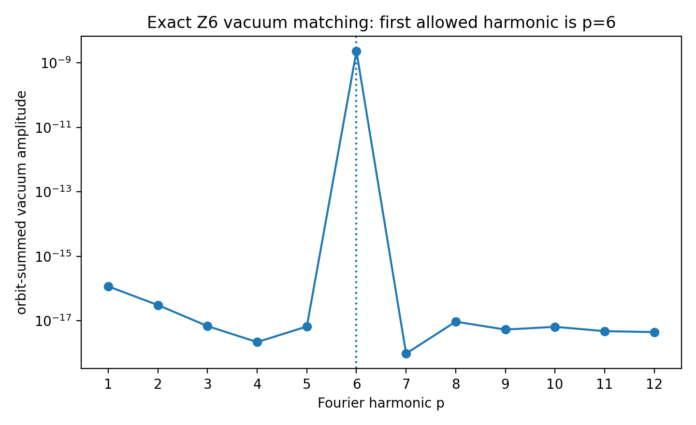
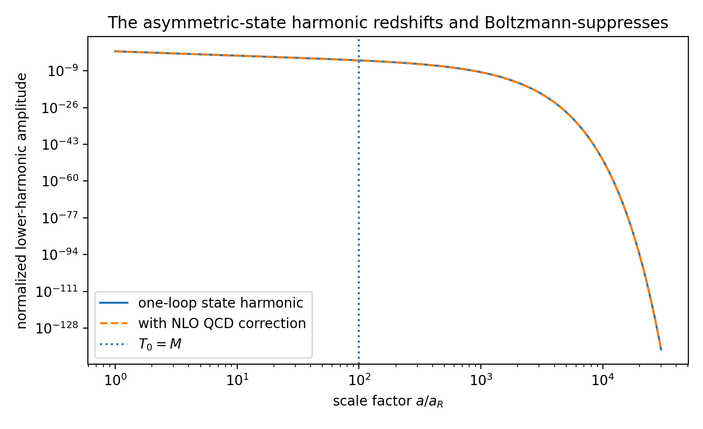
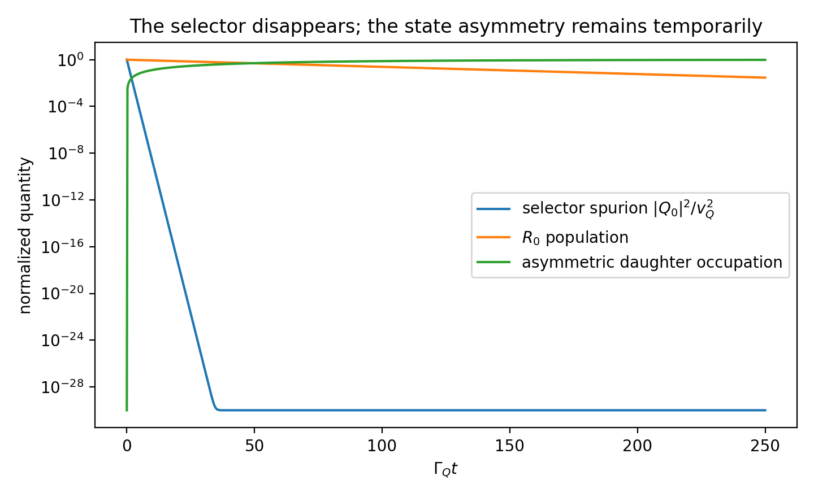
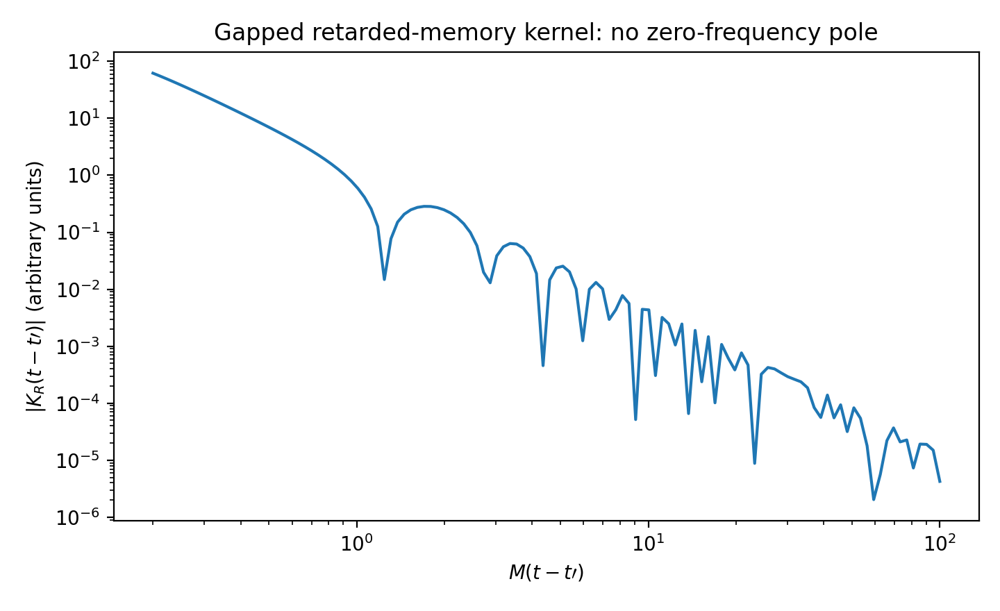

# Executive verdict

The calculation gives a **conditional pass through two loops**.

The v0.9 reheating construction genuinely separates three different objects:

1. the **state-independent vacuum effective action**, which remains exactly cyclic;
2. the **transient selector-background functional**, which can contain lower harmonics only while the selector is nonzero;
3. the **state-dependent closed-time-path influence functional**, which can contain lower harmonics because the density matrix is asymmetric, but whose coefficients track physical occupations, conserved densities, or nonlocal memory rather than late-vacuum Wilson coefficients.

For the displayed interaction graph, no connected two-loop 1PI diagram contains both the selector background `Q_0` and the chronometric ratio mode `a`. The only two-loop skeleton with explicit `a` dependence is the ordinary heavy-fermion--gluon exchange diagram in each replicated colour sector. Selector/reheaton diagrams are `a` independent at this order. The selector influences the `a` equation through the density matrix that it prepares, not through a hard late-vacuum vertex.

The static, locally thermal limit of that two-loop in-in functional can be evaluated using the NLO massive-quark pressure. For the v0.9 benchmark, the QCD correction:

- increases the first-harmonic thermal focusing amplitude by `6.19%` at `mu = 2 pi T`;
- shifts its selected phase by only `-1.72e-4 rad`, or `-0.00984 degrees`;
- leaves the intended sector-0/sector-5 focusing mechanism intact.

The lower harmonic associated with the heavy threshold redshifts and becomes Boltzmann suppressed. A representative gapped memory kernel loses six orders of magnitude between its early- and late-time RMS amplitudes. Initial-state ultraviolet divergences, where present, are localized on the matching surface and require boundary counterterms; they do not become sector-asymmetric bulk vacuum counterterms.

The result is therefore:

\[
\boxed{
\text{asymmetry in the state, symmetry in the action is a real two-loop escape hatch}
}
\]

subject to five non-negotiable conditions:

1. the action, measure, regulator, and counterterms preserve the exact cyclic symmetry;
2. `epsilon` is the only local spurion that breaks the continuous shift symmetry of `a`;
3. the initial or matched state is ultraviolet-soft, or its boundary divergences are explicitly renormalized;
4. no sector-charged condensate or zero-frequency pole survives as a permanent order parameter;
5. the first mixed selector--threshold matching order above two loops is shown to obey the same spurion accounting.

The most important negative result is equally sharp:

\[
\boxed{
Z_6\text{ alone is not sufficient.}
}
\]

The cyclic symmetry permits transient operators of the form

\[
\epsilon^p e^{ip a/f_a}\,\mathcal Q_{-p}[Q]+\text{h.c.},
\]

where `mathcal Q_{-p}` is a selector composite carrying the opposite replica charge. Such terms are harmless if they vanish when `Q -> 0`, but their coefficient must still be forced to carry the appropriate shift-breaking power of `epsilon`. This requires **phase sequestering**: a continuous shift symmetry restored at `epsilon -> 0`, preferably realized by a Wilson-line or collective-pNGB completion.

# 1. Question being tested

The v0.9 cosmology uses an exact cyclic microscopic action but a temporarily asymmetric history:

\[
Q_0\ne0
\quad\longrightarrow\quad
\phi\to R_0R_0
\quad\longrightarrow\quad
Q_k\to0
\quad\longrightarrow\quad
R_0\text{ decays into sectors }0\text{ and }5.
\]

The intended late temperature hierarchy is

\[
(\xi_0,\xi_1,\xi_2,\xi_3,\xi_4,\xi_5)
\simeq
(1,0,0,0,0,1/4).
\]

The conceptual claim is that a cosmological state may break the replica symmetry without inserting a symmetry-breaking coefficient into the vacuum Lagrangian. The radiative objection is obvious: a transient preferred sector might be communicated through loops to the protected heavy-fermion mass orbit,

\[
M_k(a)=M\left[1-\epsilon\cos\left(x+\theta_k\right)\right],
\qquad
x\equiv\frac{a}{f_a},
\qquad
\theta_k=\frac{2\pi k}{6},
\]

and thereby regenerate an unsuppressed first through fifth vacuum harmonic.

The decisive question is therefore not merely whether the classical Lagrangian is cyclic. It is whether the **renormalized real-time effective action**, after the selector has vanished, contains a persistent local term

\[
\Delta V_{\rm hard}(a)
=
\sum_{p=1}^{5}
\Lambda_p^4\cos(px+\delta_p)
\]

whose coefficient remains nonzero in the vacuum and is not proportional to a surviving state variable.

# 2. Exact microscopic sectors and time windows

## 2.1 Protected threshold orbit

The protected sector contains six replicated colour groups and six vectorlike fermions,

\[
\mathcal G_{\rm colour}
=
\left[\prod_{k=0}^{5}SU(3)_k\right]\rtimes Z_6,
\]

with the mass orbit shown above. Under the exact generator `z`, the sectors are cyclically permuted and the compact phase is shifted by one sixth of a period. In the symmetric vacuum, the complete sector sum is invariant under

\[
x\mapsto x+\frac{2\pi}{6}.
\]

Consequently, a state-independent local potential may contain only harmonics `p = 6q`. If `epsilon -> 0` restores a continuous shift symmetry and the effective action is analytic in the spurion, the `q`th allowed harmonic begins no earlier than `epsilon^(6q)`.

## 2.2 Reheaton and selector orbit

The v0.9 reheating sector contains complete cyclic orbits `X_k`, `Y_k`, and `Q_k`. The relevant interactions are

\[
\begin{aligned}
\mathcal L_R={}&
\frac12\sum_k(\partial X_k)^2
+\frac12\sum_k(\partial Y_k)^2
-\frac12m_X^2\sum_kX_k^2
-\frac12m_Y^2\sum_kY_k^2
\\
&+\mu_{XY}^2\sum_kX_kY_{k-1}
-\mu_H\sum_k\left(
X_kH_k^\dagger H_k+Y_kH_k^\dagger H_k
\right),
\end{aligned}
\]

and

\[
V_{QR}
=
\frac{\lambda_{QR}}2
\sum_k
\left(X_k^2+Y_{k-1}^2\right)
\sum_{j\ne k}|Q_j|^2.
\]

No coefficient privileges `k=0`. Inflation chooses one of six symmetry-related one-hot selector branches. On the branch labelled `Q_0 = v_Q`, only the light reheaton `R_0` lies below the inflaton production threshold. The selector subsequently returns to the unique symmetric vacuum `Q_k=0`.

## 2.3 Chronology

The benchmark decay hierarchy is

\[
\Gamma_\phi=100\ {\rm GeV}
\gg
\Gamma_Q=1\ {\rm GeV}
\gg
\Gamma_R=1.4135\times10^{-2}\ {\rm GeV}.
\]

Within one selector lifetime, the fraction of `R_0` that has decayed is

\[
1-e^{-\Gamma_R/\Gamma_Q}
=0.0140356.
\]

After five selector lifetimes,

\[
\frac{|Q_0|^2}{v_Q^2}=e^{-10}=4.54\times10^{-5},
\]

whereas only `6.82%` of the reheaton population has decayed. Thus most daughter radiation is produced after the selector background is already negligible. The replica label survives in the occupation of `R_0`; it does not require a persistent selector expectation value.

# 3. Closed-time-path formulation

## 3.1 Generating functional

Let `Phi` denote all dynamical fields, including the replicated sectors, the reheaton orbit, the selector, and the ratio mode. For a density operator `rho_i` specified at the initial matching time `t_i`, the Schwinger--Keldysh generating functional is

\[
Z_{\rho_i}[J_+,J_-;Q_+,Q_-]
=
{\rm Tr}\left[
U_{J_+,Q_+}(t_f,t_i)\,
ho_i\,
U_{J_-,Q_-}^{\dagger}(t_f,t_i)
\right].
\]

Equivalently,

\[
Z_{\rho_i}
=
\int_{\rm CTP}\mathcal D\Phi_+\mathcal D\Phi_-
\;\rho_i[\Phi_+(t_i),\Phi_-(t_i)]
\exp\left
\{iS[\Phi_+,Q_+]-iS[\Phi_-,Q_-]
+iJ_+\Phi_+-iJ_-\Phi_-
\right\}.
\]

The plus and minus fields live on the forward and backward branches of the closed time contour and are identified at the final turning point.

## 3.2 Replica-covariance theorem

Let `Zhat` be the unitary operator that implements the exact cyclic symmetry. If the action, measure, regulator, and counterterms are invariant, then

\[
U_{zJ,zQ}=\widehat Z\,U_{J,Q}\,\widehat Z^{-1}.
\]

Cyclicity of the trace gives

\[
Z_{\rho_i}[zJ_+,zJ_-;zQ_+,zQ_-]
=
Z_{\widehat Z^{-1}\rho_i\widehat Z}[J_+,J_-;Q_+,Q_-].
\]

After the Legendre transform, the corresponding effective action obeys

\[
\boxed{
\Gamma_{\widehat Z\rho_i\widehat Z^{-1}}
[z\varphi_+,z\varphi_-;zQ_+,zQ_-]
=
\Gamma_{\rho_i}[\varphi_+,\varphi_-;Q_+,Q_-].
}
\]

This is covariance, not invariance under a field transformation at fixed asymmetric state.

### Corollary: harmonic coefficients carry state charge

Write a local contribution schematically as

\[
\Gamma_{\rho,Q}^{\rm loc}
\supset
\int d^4x
\sum_{p\in\mathbb Z}
C_p[\rho,Q](x)e^{ipx(x)}.
\]

Replica covariance requires

\[
C_p[z\rho z^{-1},zQ]
=
e^{-2\pi i p/6}C_p[\rho,Q]
\]

up to the sign convention chosen for the cyclic phase shift. Therefore:

- if both `rho` and `Q` are cyclic, `C_p=0` unless `p` is a multiple of six;
- if the state or background has a nonzero replica Fourier moment, lower harmonics are allowed;
- a lower-harmonic coefficient cannot become state independent without a persistent symmetry-breaking spurion.

Useful state and selector multipoles are

\[
\mathcal N_p(t,\mathbf q)
=
\sum_{k=0}^{5}e^{ip\theta_k}n_k(t,\mathbf q),
\]

and

\[
\mathcal Q_p(t)
=
\sum_{k=0}^{5}e^{ip\theta_k}|Q_k(t)|^2.
\]

The precise sign attached to `p` depends on the active-transformation convention. The invariant content is that the coefficient of `e^{ipx}` must carry the opposite replica charge.

This theorem is exact and all orders. It does not by itself say that a state moment decays; it says exactly where any lower harmonic must live.

# 4. Two-loop topology audit

## 4.1 One-loop structures

At one loop, the `a` dependence comes from the determinant of the six heavy fermions,

\[
-i\sum_k{\rm Tr}_{\rm C}\ln
\left(i\gamma^\mu D_{k,\mu}-M_k[a]\right).
\]

In the symmetric vacuum, summing the complete orbit projects this determinant onto harmonics `p=6q`.

The selector, reheaton, and Higgs/bath determinants can depend on `Q_0(t)` and on the state, but in the displayed model they have no direct `a` dependence.

## 4.2 Two-loop skeletons

The two-loop 1PI or 2PI skeletons fall into four classes:

| Skeleton class | Contains `Q`? | Contains `a`? | Effect |
|---|---:|---:|---|
| selector--reheaton double bubble or sunset | yes | no | transient selector/reheaton masses and damping |
| reheaton--Higgs/bath skeleton | indirectly | no | prepares sector-dependent occupations |
| pure gluon/ghost skeleton | no | no | contributes to pressure but not directly to `delta Gamma/delta a` |
| heavy-fermion--gluon exchange | through state only | yes | NLO QCD correction to the `a` force |

A connected two-loop graph containing `Q_0` and `a` would need a renormalizable vertex shared by the selector/reheaton graph and the heavy threshold. The displayed v0.9 action has no such vertex. Connecting the two sides through the sector bath requires additional interaction vertices and at least one higher loop.

Therefore:

\[
\boxed{
\Gamma_{Q-a}^{\rm 1PI,(2\ loop)}=0
\quad\text{for the displayed interaction graph.}
}
\]

This is a topology statement, not a claim that all higher-loop portal graphs vanish. The first nonzero mixed order depends on the decay operators assigned to `Psi_k` and on the UV completion of the Higgs thermalizer.

# 5. Two-loop 2PI/CTP effective action

## 5.1 QCD sector

Let `S_k^{ab}` and `D_{k,mu nu}^{ab}` denote the contour-ordered heavy-fermion and gluon propagators, where the contour indices take values `+` and `-`. The two-loop fermion--gluon contribution can be written compactly as

\[
\boxed{
\Gamma_{2,{\rm QCD}}^{(2)}
=
-\frac{i g_s^2}{2}
\sum_{k=0}^{5}
\int_{\rm C}d^4x\,d^4y\;
{\rm tr}\left[
\gamma^\mu T^A S_k(x,y)
\gamma^\nu T^B S_k(y,x)
\right]
D^{AB}_{k,\mu\nu}(x,y).
}
\]

Gauge-fixing, ghost, and pure-glue skeletons complete the two-loop QCD functional but carry no explicit `a` dependence. At the stationary propagators,

\[
\frac{\delta\Gamma}{\delta S_k}=0,
\qquad
\frac{\delta\Gamma}{\delta D_k}=0.
\]

The implicit `a` derivatives of the dressed propagators therefore drop out of the field equation. Taking the physical limit `a_+=a_-=a` yields

\[
\boxed{
\Box a+V_0'(a)
+
\sum_{k=0}^{5}
M_k'(a)
\langle\bar\Psi_k\Psi_k\rangle_{\rho,{\rm ren}}
=0,
}
\]

where the condensate includes the one-loop statistical contribution and its two-loop QCD correction.

This equation is the real-time generalization of differentiating the equilibrium free energy with respect to the mass.

## 5.2 Influence-functional expansion

Define the mass source

\[
j_k[a](x)
\equiv
M_k[a(x)]-M,
\]

and the composite operator

\[
O_k(x)=\bar\Psi_k\Psi_k.
\]

In the Keldysh average/difference basis,

\[
j_{k,r}=\frac12(j_{k,+}+j_{k,-}),
\qquad
j_{k,a}=j_{k,+}-j_{k,-},
\]

the influence action through quadratic order in the source is

\[
\begin{aligned}
\Gamma_{\rm IF}={}&
-\sum_k\int d^4x\;
 j_{k,a}(x)\langle O_k(x)\rangle_\rho
\\
&-\sum_k\int d^4x\,d^4y\;
 j_{k,a}(x)G^R_{OO,k}(x,y)j_{k,r}(y)
\\
&+\frac{i}{2}\sum_k\int d^4x\,d^4y\;
 j_{k,a}(x)G^H_{OO,k}(x,y)j_{k,a}(y)
+O(j^3).
\end{aligned}
\]

The three terms have distinct meanings:

- `⟨O_k⟩` gives the local state-dependent drift or potential;
- `G^R` gives nonlocal response, dissipation, and memory;
- `G^H` gives noise and decoherence.

A vacuum Wilson coefficient, a finite-density potential, and a memory kernel are therefore not interchangeable descriptions of the same object.

# 6. Vacuum/state decomposition

Write each full propagator as

\[
S_k=S_{k,{\rm vac}}+\delta S_{k,\rho},
\qquad
D_k=D_{k,{\rm vac}}+\delta D_{k,\rho}.
\]

The two-loop exchange functional then separates into:

1. an all-vacuum term `S_vac S_vac D_vac`;
2. terms with one statistical insertion;
3. terms with two or three statistical insertions.

## 6.1 Vacuum term

The all-vacuum term is the same functional of `M_k(a)` in every replicated sector:

\[
\Gamma_{\rm vac}^{(2)}[a]
=
\sum_{k=0}^{5}
\mathcal F_{\rm vac}^{(2)}(M_k(a),g_s,\mu).
\]

Under `x -> x+2 pi/6`, the set of masses is permuted. Hence

\[
\Gamma_{\rm vac}^{(2)}
\left(x+\frac{2\pi}{6}\right)
=
\Gamma_{\rm vac}^{(2)}(x).
\]

Its Fourier series contains only

\[
p=0,\pm6,\pm12,\ldots.
\]

Because every insertion of `e^{+ix}` or `e^{-ix}` comes with one factor of `epsilon`, the first nonconstant term remains `O(epsilon^6)`.

A symbolic root-of-unity expansion through `epsilon^10` and a numerical Fourier transform of a representative one-plus-two-loop analytic sector functional both confirm this selection rule. The largest numerical amplitude among `p=1,...,5` is `5.09e-8` of the `p=6` amplitude, consistent with floating-point cancellation of an exactly vanishing result.

## 6.2 State terms

A statistical insertion contains an occupation function or a non-equilibrium correlator specific to sector `k`. The sector sum is then weighted:

\[
\Gamma_{\rm state}
\sim
\sum_k
\mathcal W_k[\rho]
\mathcal F(M_k(a)).
\]

If the weights are unequal, the root-of-unity projector no longer annihilates the lower harmonics. This is not a radiative failure; it is the intended finite-density effect.

At first order in `epsilon`,

\[
\Gamma_{\rm state}^{(p=1)}
\propto
{\rm Re}\left[
e^{ix}
\sum_k\mathcal W_k e^{i\theta_k}
\right].
\]

The coefficient is exactly the first replica Fourier moment of the state. It vanishes when the state becomes cyclic, and it redshifts or Boltzmann suppresses when the corresponding particles disappear.

## 6.3 Ultraviolet structure

For a UV-soft or Hadamard state, the statistical additions `delta S_rho` and `delta D_rho` vanish sufficiently rapidly at large momentum. Diagrams containing at least one such insertion are then UV finite after the usual vacuum subdivergences are removed. The divergent bulk part is the vacuum part and therefore preserves the exact cyclic symmetry.

If one imposes a general effective state at a finite matching surface, additional divergences may occur. They are localized on that initial surface and are removed by boundary counterterms. They renormalize the state specification, not a late-time sector-asymmetric bulk coupling.

# 7. Explicit NLO thermal harmonic

## 7.1 High-temperature pressure

In a locally thermal and slowly varying regime, the static limit of the CTP effective action is the thermal free energy. For one massive Dirac colour triplet at zero chemical potential, the mass-dependent high-temperature pressure through NLO can be written

\[
P_k(T_k,M_k)
=
P_{k,0}
-
N_cM_k^2T_k^2
\left[
\frac1{12}
+
(4\pi\alpha_{s,k})C_F C_T(\bar\mu/T_k)
\right]
+
O(M_k^4),
\]

where

\[
C_T(r)
=
J_3(0)
+
\frac{1}{48\pi^2}
\left[
\frac12+3\ln\left(
\frac{r e^{\gamma_E}}{\pi}
\right)
\right],
\]

and

\[
J_3(0)=-0.00129532.
\]

Defining

\[
r_k
=
12(4\pi\alpha_{s,k})C_F C_T(\bar\mu/T_k),
\]

the first harmonic of the effective potential `V=-P` is

\[
\boxed{
V_{\rm state}^{(1+2)}(x)
=
-\frac{N_cM^2\epsilon}{6}
{\rm Re}\left[
e^{ix}
\sum_{k=0}^{5}T_k^2(1+r_k)e^{i\theta_k}
\right]
+O(\epsilon^2).
}
\]

This is the two-loop correction to the same state phasor used in v0.8 and v0.9.

## 7.2 Benchmark

Use

\[
M=1.002\times10^6\ {\rm GeV},
\qquad
T_0=1.002\times10^8\ {\rm GeV},
\qquad
T_5=T_0/4,
\]

with the remaining sectors empty and `epsilon = 2.70e-13`. At `bar mu = 2 pi T`, one-loop running gives

\[
\alpha_{s,0}=0.0393544,
\qquad
\alpha_{s,5}=0.0416445,
\]

and hence

\[
r_0=0.0617566,
\qquad
r_5=0.0653504.
\]

The leading phasor is

\[
\frac{W_{\rm LO}}{T_0^2}
=
1+\frac1{16}e^{i5\pi/3},
\]

with

\[
|W_{\rm LO}|=1.03266948,
\qquad
\arg W_{\rm LO}=-0.05243827.
\]

At NLO,

\[
|W_{\rm NLO}|=1.09656599,
\qquad
\arg W_{\rm NLO}=-0.05261005.
\]

Therefore,

\[
\boxed{
\frac{|W_{\rm NLO}|}{|W_{\rm LO}|}=1.061875,
}
\]

and

\[
\boxed{
\Delta\arg W=-1.7178\times10^{-4}\ {\rm rad}
=-0.009842^\circ.
}
\]

The NLO correction strengthens the focusing amplitude by approximately `6.19%` and barely rotates the selected phase.

The corresponding first-harmonic free-energy amplitudes are

\[
|V_{p=1}^{\rm LO}|=1.4053\times10^{15}\ {\rm GeV}^4,
\]

and

\[
|V_{p=1}^{\rm NLO}|=1.4922\times10^{15}\ {\rm GeV}^4.
\]

For comparison, the protected zero-temperature `p=6` coefficient at the same benchmark is

\[
|V_{p=6}^{\rm vac}|=9.27\times10^{-56}\ {\rm GeV}^4.
\]

The enormous ratio is expected: the early thermal state is intentionally allowed to choose a branch, while the vacuum potential is protected to sixth spurion order.

## 7.3 Renormalization-scale band

| Scale | Amplitude ratio `NLO/LO` | Selected phasor phase |
|---|---:|---:|
| `bar mu = pi T` | 1.02784 | -0.0525205 rad |
| `bar mu = 2 pi T` | 1.06188 | -0.0526100 rad |
| `bar mu = 4 pi T` | 1.09408 | -0.0526846 rad |

The phase is more stable than the amplitude. A complete HTL-resummed and time-dependent calculation would reduce the residual scale ambiguity, but nothing in this band suggests a qualitative loss of focusing.

# 8. Decay of the state harmonic

The exact one-loop scalar-density integral was used to follow the heavy-threshold force as the populated-sector temperatures redshift. At early times the force scales approximately as `M^2 T^2 epsilon`. When `T_0` reaches `M`, at scale factor

\[
\frac{a}{a_R}=\frac{T_0}{M}=100,
\]

Boltzmann suppression begins to dominate. By `a/a_R = 3e4`, the normalized first-harmonic amplitude is

\[
1.44\times10^{-138}
\]

at one loop and

\[
1.36\times10^{-138}
\]

with the NLO correction used in its domain of validity.

This conclusion is specific to the heavy-threshold contribution. Later QCD trace-anomaly and baryonic finite-density terms can persist much longer and are part of the cosmological vacuum-selection mechanism. They remain state-dependent source terms proportional to physical densities; they are not vacuum matching coefficients.

# 9. Selector disappearance and state persistence

The selector and the state occupy different temporal roles. With the benchmark widths, the selector order parameter falls rapidly, while the selected reheaton population remains. The daughter-state asymmetry is therefore produced primarily after the hard background has disappeared.

The figure uses a simple exponential timing model. It establishes the hierarchy but does not replace a non-equilibrium solution for the rolling selector and reheaton occupation numbers.

# 10. Nonlocal memory, dissipation, and noise

## 10.1 Spectral representation

For a stationary or slowly varying bath, the retarded kernel admits a spectral representation of the form

\[
K_R(t-t')
=
\theta(t-t')
\int_0^\infty\frac{d\omega}{\pi}
\rho_K(\omega)
\sin\left[\omega(t-t')\right].
\]

If the spectral density has no zero-frequency delta function or nonintegrable singularity, phase mixing implies that the kernel decays at late separation. A numerical representative with a two-particle threshold gives

\[
\frac{{\rm RMS}_{\rm late}}{{\rm RMS}_{\rm early}}
=1.76\times10^{-6}.
\]

The calculation is intentionally diagnostic, not a claim that the hot QCD kernel is literally gapped. In a thermal plasma, scattering cuts and hydrodynamic poles can produce power-law or long-lived tails. Such contributions are tied to conserved densities and occupations. They may preserve a finite-density force, but they still do not become a state-independent vacuum coefficient.

## 10.2 What can survive

A late effect can survive if one of the following remains:

- a conserved sector number carried by a stable relic;
- a stable asymmetric condensate;
- a topological or hydrodynamic zero mode;
- a permanent selector expectation value;
- a hard symmetry-breaking coupling;
- an anomaly that violates the cyclic symmetry.

The first three are state variables or order parameters. The last three would be genuine failures of the proposed escape hatch.

A transient force may also displace `a` and leave coherent oscillations after the force turns off. That is a changed initial condition for the symmetric late-time theory, not a new lower-harmonic vacuum operator.

# 11. Initial-state and matching-surface renormalization

A practical calculation often integrates out the selector/reheaton era and starts the lower-energy evolution at a finite time `t_star` with a reduced density matrix. The short-distance structure of that matrix matters.

For a physical UV-soft state, the high-momentum correlators approach the interacting vacuum correlators, so the ordinary bulk counterterms suffice. For a more general effective state, loop diagrams can produce divergences localized at `t_star`. They are removed by local boundary operators in the density-matrix action, for example Gaussian terms schematically of the form

\[
S_{\rm bdry}
=
\frac12\int_{t=t_\star}d^3x\,d^3y
\left[
\Phi_+ A\Phi_+
-\Phi_- A^*\Phi_-
+2i\Phi_+B\Phi_-
\right].
\]

Replica covariance requires these boundary kernels to transform with the state. A one-hot or sector-asymmetric boundary counterterm is therefore allowed if it renormalizes the asymmetric state. Its support remains on the matching surface.

The key distinction is:

\[
\boxed{
\text{boundary renormalization of }\rho
\ne
\text{bulk renormalization of the late vacuum Hamiltonian}.
}
\]

# 12. Operator audit and the phase-sequestering condition

## 12.1 Exact cyclic symmetry is necessary but insufficient

Construct selector Fourier composites

\[
\mathcal Q_p
=
\sum_{k=0}^{5}e^{ip\theta_k}|Q_k|^2.
\]

Because `mathcal Q_p` carries replica charge, the local operator

\[
\boxed{
\Delta\mathcal L_{p,Q}
=
c_{p,Q}\epsilon^p
 e^{ipx}\mathcal Q_{-p}
+\text{h.c.}
}
\]

is cyclically invariant for `p=1,...,5`. On the one-hot branch it generates a transient lower harmonic. When every `Q_k` returns to zero, it vanishes.

The problem would be more serious if the same operator could be generated without the factor `epsilon^p`, or if integrating out the selector left behind a `Q`-independent coefficient. To prevent that, the theory must satisfy:

\[
\boxed{
\epsilon\to0
\quad\Longrightarrow\quad
U(1)_a\text{ shift symmetry is restored.}
}
\]

Every local nonderivative dependence on `a` must then contain the appropriate number of explicit shift-breaking spurions. This is the **phase-sequestering condition**.

## 12.2 Recommended UV implementation

The strongest implementation is to make `a` a Wilson-line or collective pNGB for which:

- local selector/reheaton operators cannot depend directly on the complete phase;
- the mass orbit is generated only by a complete messenger chain;
- breaking the phase symmetry requires the same replicated spurions that produce `M_k(a)`;
- the residual `Z_6` is an anomaly-free discrete gauge symmetry rather than a merely global one.

This converts the empirical absence of a portal into a structural selection rule.

## 12.3 Dangerous operator classes

| Operator or effect | Allowed by exact `Z6`? | Persists at `Q=0`? | Verdict |
|---|---:|---:|---|
| `epsilon^p e^{ipx} mathcal Q_{-p}` | yes | no | acceptable transient focusing |
| `epsilon^p e^{ipx} mathcal N_{-p}` | yes | while state persists | acceptable finite-density force |
| `epsilon^p e^{ipx}` for `p=1,...,5` | no | yes | forbidden if symmetry exact |
| sector-dependent mass/coupling left after `Q->0` | no | yes | hard failure |
| stable charged condensate | state-dependent | yes | model-dependent persistent source |
| initial-surface counterterm | yes for asymmetric state | boundary only | acceptable if renormalized |
| anomaly-induced cyclic breaking | possible in bad UV completion | yes | hard failure |

# 13. What the two-loop calculation has and has not proved

## 13.1 Proved or explicitly checked

1. **CTP covariance:** the exact effective action transforms covariantly with the density matrix; a fixed asymmetric state may possess lower harmonics without violating the microscopic symmetry.
2. **Topology:** no connected two-loop 1PI graph contains both `Q_0` and `a` in the displayed v0.9 interaction graph.
3. **Vacuum protection:** the one- and two-loop vacuum sector sum contains no `p=1,...,5` harmonic.
4. **State localization:** every lower harmonic at two loops contains a state or transient-background insertion.
5. **Thermal NLO stability:** QCD increases the focusing amplitude by about `6%` and shifts the phase by only `0.01 degrees` at the central scale.
6. **Late matching:** the heavy-threshold state harmonic is removed by redshift and Boltzmann suppression.
7. **Memory condition:** without a zero-frequency pole, a transient retarded memory kernel dephases.
8. **Renormalization structure:** UV divergences from a general initial state are boundary localized; bulk vacuum counterterms retain the cyclic symmetry.

## 13.2 Not yet proved

1. An all-orders theorem excluding every mixed selector--threshold bulk operator in a specified UV completion.
2. The exact first nonzero loop order of direct `Q`--`a` communication once all vectorlike-fermion decay operators are supplied.
3. A full two-loop Kadanoff--Baym solution for the nonthermal selector, reheaton, Higgs, quark, gluon, and threshold distributions.
4. Nonperturbative preheating and resonance production of nominally inaccessible replica sectors.
5. Absence of anomalies in the proposed discrete-gauge embedding.
6. The fate of long-time hydrodynamic tails in the actual expanding plasma.

# 14. Acceptance matrix

| Requirement | Verdict | Reason |
|---|---:|---|
| exact cyclic bulk counterterms | **PASS** | vacuum divergences are sector-orbit sums |
| forbidden vacuum harmonics through two loops | **PASS** | root-of-unity selection and numerical Fourier check |
| no direct two-loop selector--ratio skeleton | **PASS** | absent from displayed interaction graph |
| intended finite-density first harmonic | **PASS** | generated by replica Fourier moment of the state |
| NLO QCD control at benchmark | **PASS** | `6.19%` correction at central scale |
| phase stability | **PASS** | `0.00984 degrees` shift |
| selector removed before most reheaton decay | **PASS** | only `1.40%` decays in one selector lifetime |
| heavy-threshold state term disappears | **PASS** | redshift plus Boltzmann suppression |
| gapped memory disappears | **PASS conditional** | no zero-frequency pole |
| initial-state renormalization | **PASS conditional** | requires UV-soft state or boundary counterterms |
| exact `Z6` alone protects every transient operator | **FAIL** | charged selector composites permit transient low harmonics |
| phase sequestering | **REQUIRED** | must be enforced by UV symmetry/geometry |
| all-orders radiative escape | **OPEN** | requires higher-loop portal theorem |
| nonperturbative reheating | **OPEN** | requires lattice or Kadanoff--Baym simulation |

# 15. Novelty boundary

The ingredients are individually established:

- the Schwinger--Keldysh treatment of mixed and nonequilibrium states;
- boundary renormalization of effective initial states;
- symmetry-preserving 2PI truncations for linearly realized global symmetries;
- cyclic suppression of vacuum harmonics with an unsuppressed finite-density force;
- the NLO massive-quark pressure;
- state-induced symmetry breaking with a symmetric Hamiltonian.

The candidate contribution is the combined result:

\[
\boxed{
\begin{gathered}
\text{exact cyclic threshold protection}
+
\text{transient state-selected reheating}
\\
+
\text{CTP replica-covariance theorem}
+
\text{two-loop topology separation}
\\
+
\text{NLO QCD phasor stability}
+
\text{chronometric-shear interpretation}.
\end{gathered}
}
\]

The targeted literature search found direct precedent for state-generated finite-density potentials and direct warnings that a hard asymmetric reheating spurion radiatively produces lower vacuum harmonics. It did not reveal the exact selector/reheaton/visible-QCD/chronometric package above. That is a candidate priority claim, not yet a definitive one.

# 16. Next decisive calculation

The positive two-loop result moves the bottleneck upward rather than eliminating it. The next calculation should have two linked parts.

## 16.1 First mixed selector--threshold matching order

Specify the complete vectorlike-fermion decay operators and the UV thermalizer. Enumerate all connected 1PI graphs containing:

- at least one selector insertion;
- at least one shift-breaking heavy-threshold insertion;
- enough sector-bath connectors to join them.

Then calculate the first nonzero coefficient of

\[
\epsilon^p e^{ipx}\mathcal Q_{-p}
\]

and prove that it vanishes with `Q` and cannot match onto a `Q`-independent `p<6` operator. This is likely a three-loop-or-higher problem, but the precise order is portal dependent.

## 16.2 Nonthermal Kadanoff--Baym evolution

Evolve the coupled statistical and spectral functions for

\[
Q_k,
\quad R_k,
\quad H_k,
\quad\Psi_k,
\quad g_k
\]

through selector restoration and reheaton decay. The simulation must determine:

- whether sectors `1,2,3,4` remain unpopulated beyond perturbative estimates;
- the actual time-dependent first-harmonic phasor;
- dissipation and noise in the `a` equation;
- whether hydrodynamic or conserved modes leave a long-lived source;
- the boundary correlations required for a renormalized finite-time description.

The conceptual result is now clear enough to state without incense:

\[
\boxed{
\begin{aligned}
&\text{The vacuum functional remembers the action.}\\
&\text{The in-in functional also remembers the state.}\\
&\text{The state may choose a branch without rewriting the vacuum laws.}
\end{aligned}
}
\]

Through two loops, that is not merely elegant bookkeeping. It is the correct separation of physical objects.

# Appendix A. Root-of-unity projector

Let

\[
c_k(x)=\cos(x+2\pi k/6).
\]

An analytic identical-sector functional can be expanded as

\[
\sum_k\mathcal F(1-\epsilon c_k)
=
\sum_{n=0}^\infty
\frac{(-\epsilon)^n}{n!}
\mathcal F^{(n)}(1)
\sum_k c_k^n.
\]

Using

\[
c_k^n
=
\frac1{2^n}
\sum_{r=0}^n
\binom nr
 e^{i(2r-n)x}
 e^{i(2r-n)2\pi k/6},
\]

and

\[
\sum_{k=0}^{5}e^{2\pi i pk/6}
=
\begin{cases}
6,&p=0\ {\rm mod}\ 6,\\
0,&\text{otherwise},
\end{cases}
\]

shows that only harmonics divisible by six survive. A nonconstant `p=6q` term requires at least `6|q|` net phase insertions and hence begins at `epsilon^(6|q|)`.

# Appendix B. Two-loop thermal coefficient

From the high-temperature expansion of the renormalized massive-quark pressure,

\[
P_{m^2}
=-N_cm^2T^2
\left[
\frac1{12}+g C_F C_T
\right],
\qquad
g=4\pi\alpha_s,
\]

and

\[
m_k^2=M^2\left[1-2\epsilon\cos(x+\theta_k)+O(\epsilon^2)\right],
\]

we find

\[
-P_{m^2}
\supset
-\frac{N_cM^2T_k^2\epsilon}{6}
\left[1+12gC_FC_T\right]
\cos(x+\theta_k).
\]

Summing over the sector temperatures gives the phasor in Section 7.

# Appendix C. Local versus nonlocal matching

The local derivative expansion of the retarded term is valid when the ratio mode varies slowly compared with the bath correlation time:

\[
\int dt'K_R(t-t')j_r(t')
=
\kappa_0j_r(t)+\kappa_1\dot j_r(t)+\kappa_2\ddot j_r(t)+\cdots.
\]

- `kappa_0` corrects the local state-dependent potential;
- `kappa_1` supplies friction;
- higher coefficients give dispersive corrections.

A nondecaying constant memory would require singular spectral weight at zero frequency. Otherwise the late effect is either a decaying tail or an initial-condition shift.

# Appendix D. Verification suite

The accompanying script performs:

1. exact symbolic root-of-unity projection through `epsilon^10`;
2. numerical Fourier analysis of a representative one-plus-two-loop vacuum functional;
3. one-loop running of `alpha_s` and the high-temperature NLO phasor;
4. exact one-loop Fermi--Dirac scalar-density integration through the nonrelativistic transition;
5. selector/reheaton timing checks;
6. a spectral dephasing test for a retarded memory kernel.

All programmed acceptance checks pass.

# References

1. C. Delaunay, S. J. Lee, Y. Yin and B. Yu, *Natural Phantom Crossing from Axion--WIMP Interactions*, arXiv:2607.28721 (2026).
2. J.-L. Kneur, M. B. Pinto and T. E. Restrepo, *Renormalization group improved pressure for hot and dense quark matter*, arXiv:2101.08240 (2021).
3. H. Collins and R. Holman, *Renormalization of initial conditions and the trans-Planckian problem of inflation*, Phys. Rev. D 71, 085009 (2005), arXiv:hep-th/0501158.
4. S. Chaykov, N. Agarwal, S. Bahrami and R. Holman, *Loop corrections in Minkowski spacetime away from equilibrium. Part II. Finite-time results*, arXiv:2206.11289.
5. M. Garny and U. Reinosa, *Renormalization out of equilibrium in a superrenormalizable theory*, Phys. Rev. D 94, 045012 (2016), arXiv:1504.06643.
6. J. Berges, S. Borsanyi, U. Reinosa and J. Serreau, *Nonperturbative renormalization for 2PI effective action techniques*, Annals Phys. 320, 344 (2005), arXiv:hep-ph/0503240.
7. U. Reinosa and J. Serreau, *Ward Identities for the 2PI effective action in QED*, JHEP 11, 097 (2007), arXiv:0708.0971.
8. C. O. Akyuz, G. Goon and R. Penco, *The Schwinger--Keldysh Coset Construction*, JHEP 06, 004 (2024), arXiv:2306.17232.
